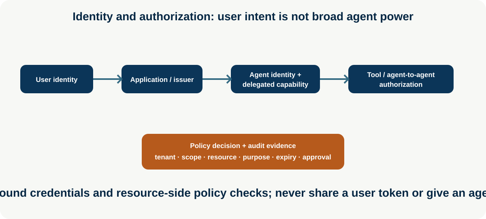
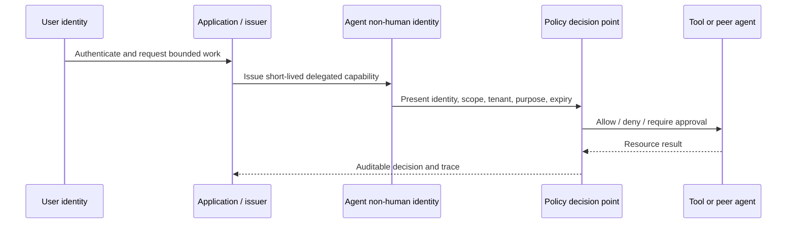

# Agent Identity and Authorization

**Level:** Advanced · **Time:** 60 min · **Prerequisites:** None

**Enterprise Agent · 11** · **Notebook:** [`agent_identity_authorization.ipynb`](agent_identity_authorization.ipynb) · **Implementation:** [`lab.py`](lab.py)

Transactions require more than a user session and a persuasive prompt. A production agent needs a distinct non-human identity, a narrow delegated authority, an authenticated resource-side decision, and an attributable audit trail. User identity answers who requested work; agent identity answers which workload acted; delegated authority answers precisely what it may do, for whom, to which resource, for how long, and under which approval.

## Scenario and outcomes

Northstar's incident adviser can read Acme checkout status for ten minutes while preparing a proposal. It cannot use a user’s broad token, read Globex data, restart services, or retain a standing admin secret. Learners issue a short-lived capability, validate it at the tool boundary, handle approval-gated transactions, and record the chain of delegation.

## 1. Identity model and delegated authority

| Concept | Meaning | Design rule |
| --- | --- | --- |
| User identity | Human/principal that initiated or owns work | Preserve subject/tenant/consent without handing over a broad user token |
| Agent/non-human identity | Workload/service identity for the agent runtime | Unique, rotatable, discoverable, and independently auditable |
| Delegation | Authority derived from an authorized principal | Bind subject, actor, tenant, resource, action, purpose, expiry, and approval |
| OAuth/OIDC | Common federation/authentication patterns | Validate issuer, audience, signature, expiry, nonce/state as applicable; use provider-specific current guidance |
| Capability | Unforgeable, narrow permission to one operation/resource | Prefer short-lived, audience/resource-bound, least-privilege grants |
| Tool/peer authentication | Resource validates calling workload and delegation | Authenticate both caller and target; do not trust an LLM-declared role |

## 2. Least privilege and policy enforcement

Use workload identities or managed identity for agents; exchange them for short-lived credentials at the resource boundary. Scope credentials by tenant, action, resource, environment, purpose, and time. Avoid shared API keys, user-token forwarding, static admin credentials, and “agent can call any tool” designs. For agent-to-agent calls, authenticate the calling agent, authorize the requested handoff/capability, propagate only the minimum delegation context, and audit both sides.

Policy enforcement belongs at a policy decision point and the target resource. It evaluates identity, tenant, action, resource, risk, data class, approval, time, budget, and context. High-impact operations require explicit approval and idempotency; a model cannot create or broaden its own capability.

## 3. Step-by-step lab, checklist, and references

1. Run `python lab.py`; the Acme agent receives only `read-status` for checkout before expiry.
2. Request another tenant or action and observe deterministic scope denial.
3. Change the action to `restart`; it requires approval even if the capability otherwise matches.
4. Advance time to expire the capability and verify resumption cannot use it.

- Inventory non-human identities, credential issuer/audience, tool/peer scopes, ownership, rotation, revocation, and audit retention.
- Enforce short-lived credentials, resource-side authorization, tenant isolation, purpose binding, approval, idempotency, rate/budget limits, and kill/revoke paths.
- Test token replay, confused deputy, audience/issuer mismatch, cross-tenant access, scope escalation, stale approval, secret leakage, peer impersonation, and revocation propagation.

References: [OAuth 2.0 Security Best Current Practice](https://datatracker.ietf.org/doc/html/draft-ietf-oauth-security-topics), [OpenID Connect Core](https://openid.net/specs/openid-connect-core-1_0.html), [SPIFFE workload identity](https://spiffe.io/docs/latest/spiffe-about/overview/), [MCP enterprise-managed authorization](https://modelcontextprotocol.io/extensions/auth/enterprise-managed-authorization), and [NIST AI RMF](https://www.nist.gov/itl/ai-risk-management-framework).

## Watch For

- **Assumption failure:** The model hallucinates an unsupported parameter.
- **State leak:** Context is incorrectly preserved across runs.
- **Timeout:** The tool takes too long and the agent loops.
- **Auth bypass:** The agent attempts an action it shouldn't.

## Checkpoint

**1. What is the primary purpose of this module?**
- A) To understand the core concept.
- B) To write complex boilerplate.
- C) To ignore system errors.
- D) To bypass security.

**2. How do we mitigate the primary failure mode?**
- A) Retries.
- B) Human approval.
- C) Logging.
- D) Idempotency keys.

