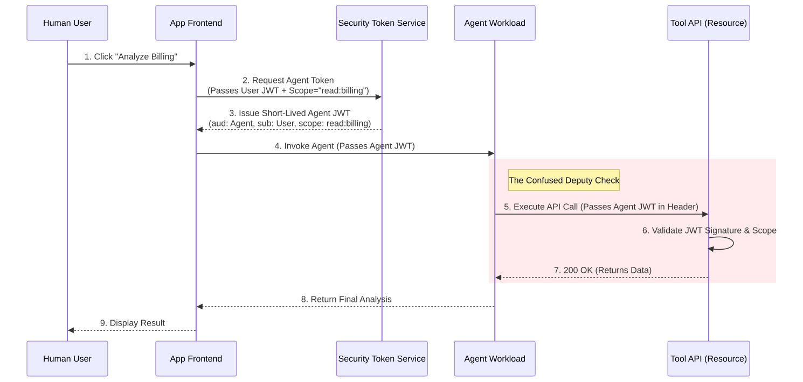

# Agent Identity and Authorization

**Level:** Advanced · **Time:** 60 min · **Prerequisites:** None

**Enterprise Agent · 11** · **Notebook:** [`agent_identity_authorization.ipynb`](agent_identity_authorization.ipynb)

Transactions require more than a user session and a persuasive prompt. A production agent needs a distinct non-human identity, a narrow delegated authority, an authenticated resource-side decision, and an attributable audit trail. 

User identity answers *who requested work*; agent identity answers *which workload acted*; delegated authority answers *precisely what it may do, for whom, to which resource, for how long, and under which approval.*

Because Identity and Authorization are foundational to Agent Security, we have broken this curriculum into three core modules:

1. **[The Core Identity Model](#the-core-identity-model)** (This Page)
2. **[Deep Dive: OAuth 2.0 Token Exchange & Delegation](OAUTH_AND_DELEGATION.md)** (Solving the Confused Deputy)
3. **[Deep Dive: Workload Identity & Agent-to-Agent Auth](WORKLOAD_IDENTITY.md)** (SPIFFE, Cloud IAM, and MCP)

---

## The Core Identity Model

If an agent has the ability to read a user's billing status, how do we guarantee it cannot be tricked into restarting the billing server? We must enforce strict least privilege at the tool boundary.

### Essential Concepts

| Concept | Meaning | Design Rule |
| --- | --- | --- |
| **User Identity** | Human/principal that initiated or owns work | Preserve subject/tenant without handing over a broad user token to the agent. |
| **Agent Identity** | Workload/service identity for the agent runtime | Unique, rotatable, discoverable (e.g., SPIFFE SVID or Cloud IAM Role). |
| **Delegation** | Authority derived from an authorized principal | Bind subject, actor, tenant, resource, action, and expiry into a single cryptographically verifiable token. |
| **OAuth Token Exchange** | RFC 8693 federation pattern | Trade a broad user token for a strictly scoped Agent JWT before invoking the orchestration layer. |
| **Tool Authentication** | Resource validates calling workload and delegation | Tools must validate the JWT signature and scopes natively; do not trust an LLM-declared role. |

### Least Privilege and Policy Enforcement

Use workload identities or managed identities for agents; exchange them for short-lived credentials at the resource boundary. Scope credentials by tenant, action, resource, purpose, and time. 

**Anti-Patterns to Avoid:**
- Shared API keys.
- Forwarding raw User Tokens to the agent.
- Static admin credentials hardcoded in the agent's environment.
- “Agent can call any tool” network designs. 

Policy enforcement belongs at a **Policy Decision Point (PDP)** and the target resource, *not* inside the agent's system prompt. High-impact operations require explicit Human-in-the-Loop (HITL) approval; a model cannot create or broaden its own capability.

---

## Watch For

- **Assumption Failure:** The model hallucinates an unsupported role or permission that the tool boundary immediately rejects.
- **State Leak:** An agent retains an admin capability token in memory and uses it for a subsequent, unprivileged user's request.
- **The Confused Deputy:** An agent with broad privileges is tricked by Prompt Injection into executing a privileged action on behalf of an unprivileged user.

---

## Checkpoint

**1. What is the primary purpose of Agent Workload Identity?**
- A) To log the user's name in the database.
- B) To provide a cryptographically verifiable identity to the running agent software, distinct from the human user.
- C) To make API requests faster.
- D) To prevent the LLM from hallucinating.

Answer

<b>B</b>. Workload Identity (like SPIFFE or IAM) proves *which* agent is making the request, allowing tools to enforce Agent-specific RBAC policies.

**2. Why should you NOT pass a raw User OAuth token directly to an Agent?**
- A) It slows down inference.
- B) The agent will consume too many tokens.
- C) If the agent is hijacked via Prompt Injection (Goal Hijacking), the attacker gains full access to every system the user has access to.
- D) The LLM cannot read JSON Web Tokens.

Answer

<b>C</b>. Handing a broad user token to an agent creates a Confused Deputy. You must use Token Exchange to give the agent a token scoped strictly to the task at hand.

