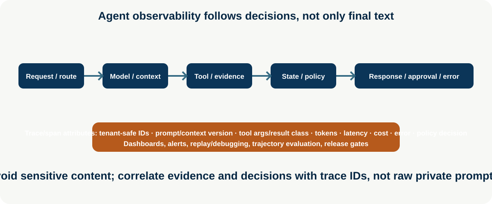

# Agent Observability

**Enterprise Agent · 13** · **Notebook:** [`agent_observability.ipynb`](agent_observability.ipynb) · **Implementation:** [`lab.py`](lab.py)

Agent observability answers **why did the system do that?** A final response is insufficient: production teams need correlated request, route, model/context, tool, state, policy, approval, error, and outcome evidence. Observability must be privacy-aware and safe; it should not become a new route for leaking prompts, secrets, customer data, or credentials.

## Scenario and outcomes

Northstar investigates a 35% EU checkout drop. The trace shows deterministic route selection, a model triage, metrics/log tool calls, state/policy decision, and an approval-ready proposal. Learners instrument spans, inspect trajectory and context metadata, classify failures, replay safely, calculate latency/tokens/cost, and define dashboards/alerts/release gates.

## 1. What to observe

| Signal | Answers | Safe attributes |
| --- | --- | --- |
| Distributed trace / spans | Which services/steps happened and in what order? | trace/run ID, tenant-safe hash, route, component/version |
| Agent trajectory | Why did it choose this tool/next action/stop? | selector/routing reason, tool name, evidence IDs, policy result |
| LLM/context | Was the model given the right bounded information? | model/prompt/context version, token counts, item counts, redacted provenance |
| Tool/state | Did arguments, results, retries, or checkpoints fail? | schema/result class, latency, retry/idempotency, state version—not raw secrets |
| Cost/latency | Is work viable and within SLO? | input/output/reasoning tokens, model/tool cost, p50/p95/p99, queue time |
| Outcome/safety | Did it help without violating policy? | evidence pass, forbidden action, approval, user correction, error class |

## 2. OpenTelemetry and technology landscape

[OpenTelemetry](https://opentelemetry.io/docs/) provides vendor-neutral traces, metrics, logs, semantic conventions, propagation, and exporters; it is a strong baseline for correlating an agent with existing distributed systems. Pair it with an LLM/agent observability layer that understands prompts, tool calls, evaluations, datasets, and replay—such as [LangSmith](https://docs.smith.langchain.com/observability), [Arize Phoenix](https://docs.arize.com/phoenix), [Helicone](https://www.helicone.ai/docs), [MLflow Tracing](https://mlflow.org/docs/latest/genai/tracing/), or your provider’s tracing. Verify deployment, privacy, residency, and SDK support before selection.

## 3. Step-by-step training

1. Define a trace contract: `trace_id`, run/session, tenant-safe correlation, route, component/version, policy decision, and privacy classification.
2. Start a root request span; create child spans for routing, model/context, each tool, state/checkpoint, policy/approval, output, and evaluator.
3. Emit tokens/cost/latency, typed tool arguments/result class, retry/error, evidence IDs, and stop reason. Redact content or use hashes/metadata by default.
4. Classify failures: model/provider, tool/transient, schema, retrieval/evidence, policy/authorization, budget/timeout, state/recovery, or user-corrected outcome.
5. Replay deterministic traces against recorded fixtures; never replay a side effect without idempotency, authorization, and approval.
6. Build dashboards: success/evidence/policy rate; trace/tool latency; token/cost per successful safe task; fallback/retry/error class; approval delay; and route/model drift. Alert on SLO/policy/quality regressions.

Run `python lab.py`, then use the notebook to inspect a complete trace and derive a dashboard/replay plan. References: [OpenTelemetry](https://opentelemetry.io/docs/), [OpenAI Agents tracing](https://openai.github.io/openai-agents-python/tracing/), [LangSmith observability](https://docs.smith.langchain.com/observability), [OpenAI evaluation best practices](https://developers.openai.com/api/docs/guides/evaluation-best-practices).
