# Agent Observability

**Level:** Advanced · **Time:** 60 min · **Prerequisites:** None

**Enterprise Agent · 13** · **Notebook:** [`agent_observability.ipynb`](agent_observability.ipynb)

Agent observability answers the critical production question: **why did the system do that?** 

A final text response from a chatbot is insufficient for production triage. When an agent deletes a file, drops a database table, or gives a customer incorrect pricing, engineering teams need correlated evidence. They need to see the exact prompt, the context retrieved from the vector database, the tool schemas provided to the model, the arguments passed to those tools, the latency of external APIs, and the exact token usage.

Observability must also be privacy-aware and safe; it should not become a new vector for leaking customer PII, HIPAA-protected data, or system credentials into centralized logging dashboards.

---

## 1. Planning Observability for Complex Systems

Before installing an SDK, you must know **what to observe**. In complex multi-agent systems, logging everything leads to astronomical storage costs and alert fatigue. 

**Where to start:**
1. **Identify the Core Questions:** What will wake you up at 2 AM? (e.g., "Did the agent execute an unauthorized tool?" "Are we spending more on LLM tokens than the customer pays us?").
2. **Map the Boundaries:** Instrument the boundaries between systems. Track when data enters the agent (Prompts/RAG) and when it leaves (Tool calls/Responses).
3. **Define the Correlation ID:** Every log, metric, and trace must share a `session_id` or `trace_id`. If a sub-agent triggers a background job in a different microservice, that `trace_id` must be passed along via distributed tracing headers (W3C Trace Context).

---

## 2. The OpenTelemetry (OTel) Trace Hierarchy

State-of-the-art Agent Observability relies on the **OpenTelemetry (OTel)** standard—specifically the emerging semantic conventions for GenAI. OTel organizes data into a strict hierarchy of Traces and Spans. 



### Deep Dive into the Hierarchy
1. **Session (Trace):** The top-level container for a single user interaction (e.g., Resolving Incident-104). This encapsulates the entire lifespan of the request.
2. **Agent / Sub-Agent:** The specific AI entity handling the request. If you use a swarm, each sub-agent gets its own span.
3. **Workflow (Chain):** The orchestration loop or reasoning path (e.g., ReAct loop, Plan-and-Execute).
4. **Spans:** The actual atomic operations.
   - **LLM Spans:** Contains the prompt, completion, model name, temperature, and token counts.
   - **Tool Spans:** Contains the tool arguments, return values, and network latency.

### Example Telemetry Log (OTel Span)
When an LLM span completes, the observability SDK emits a structured log similar to this:
```json
{
  "trace_id": "4bf92f3577b34da6a3ce929d0e0e4736",
  "span_id": "00f067aa0ba902b7",
  "name": "chat.completions.create",
  "attributes": {
    "llm.system": "openai",
    "llm.model": "gpt-4o-2024-05-13",
    "llm.request.temperature": 0.2,
    "llm.usage.prompt_tokens": 4092,
    "llm.usage.completion_tokens": 128,
    "llm.usage.total_tokens": 4220,
    "llm.prompts.0.content": "You are a database admin. Generate SQL to find... [REDACTED PII]",
    "llm.completions.0.content": "SELECT * FROM users WHERE..."
  },
  "start_time": "2026-08-13T10:00:00.000Z",
  "end_time": "2026-08-13T10:00:02.150Z"
}
```

---

## 3. Key Performance Indicators (KPIs) Expanded

You cannot improve what you cannot measure. Production teams must track these metrics via dashboards:



### A. Performance & Latency
- **TTFT (Time to First Token):** Critical for streaming UX. If this exceeds 1-2 seconds, users abandon the session.
- **Token Generation Rate:** Tokens per second. Helps identify if the LLM provider is throttling you.
- **Tool Execution Latency:** If an agent takes 15 seconds to reply, is it the LLM thinking, or is the `QueryDatadog` tool incredibly slow? Tool span latency isolates the bottleneck.

### B. Cost & Efficiency
- **Cost per Session:** Calculated by multiplying `prompt_tokens` and `completion_tokens` by the model's pricing sheet. 
- **Reasoning Step Count:** How many times did the agent loop before answering? High step counts indicate a confused agent or failing tools.
- **Token Spikes (Infinite Loops):** The most common autonomous failure. If a tool returns a `Syntax Error`, the agent retries. If it fails 10 times, the prompt context grows exponentially with each failure until the context window explodes.

### C. Behavioral & Quality (Evals)
- **Task Success Rate:** Did the agent achieve the goal? Measured via user feedback (Thumbs up/down) or programmatic checks.
- **Tool Error Rate:** How often do tools reject the LLM's arguments (e.g., `400 Bad Request`)? High rates mean you need to rewrite your tool descriptions/schemas.
- **Hallucination / Groundedness:** Measured asynchronously using "LLM-as-a-Judge". A secondary, cheaper LLM reviews the trace in the background to ensure the final answer is grounded in the retrieved RAG context.

---

## 4. State of the Art: Technology Review

The landscape for Agent Observability is divided into two approaches:

### Native LLM Observability Platforms
These platforms are purpose-built for Agents. They provide UI features like "Trace Replay", prompt playgrounds, and built-in LLM-as-a-judge evaluators.
- **LangSmith:** Deeply integrated with LangChain/LangGraph. Excellent for tracking state machines and complex orchestrations.
- **AgentOps:** Highly focused on autonomous agents (AutoGen, CrewAI). Great out-of-the-box tracking for tool execution and cost limits.
- **Arize Phoenix:** Open-source. Excellent for RAG (Retrieval-Augmented Generation) observability and tracing vector search relevance.
- **Helicone:** Focuses heavily on LLM gateway proxying, caching, and rate limiting alongside observability.

### Traditional APM (Application Performance Monitoring)
Tools like **Datadog, New Relic, and Dynatrace** have adopted OpenTelemetry. 
- **Pros:** You view your Agent traces in the exact same dashboard as your database metrics and Kubernetes logs.
- **Cons:** Their UIs are built for microservices, making it harder to read long multi-turn chat transcripts or replay complex reasoning loops compared to native LLM tools.

---

## Watch For (Critical Anti-Patterns)

- **PII Leakage in Prompts:** When you log the `llm.prompts.0.content`, you are logging the exact text sent to the model. You must use redaction layers (like Microsoft Presidio) *before* emitting the OTel span to scrub PII.
- **Alert Fatigue:** Do not page on-call engineers every time an agent makes a single bad tool call. Agents are stochastic; they retry and self-correct. Only alert on aggregate SLO drops (e.g., "Task Success Rate fell below 90%").
- **Logging Context Limits:** APM platforms often truncate span payloads at 64KB. If your agent's context window contains 100,000 tokens of RAG documents, the trace will be silently truncated, making debugging impossible. You must configure payload offloading (saving large prompts to an S3 bucket and logging the URI).
- **Silent Failures:** Relying only on HTTP 200 codes. An LLM API will return a 200 OK even if the text it generated is a complete hallucination. You must monitor semantic success, not just network success.

---

## Checkpoint

**1. What is the primary purpose of defining a `trace_id` (Correlation ID) across a multi-agent system?**
- A) To encrypt the prompts before sending them to the LLM.
- B) To ensure that all logs, metrics, and spans from a single user interaction can be tied together, even across different microservices.
- C) To speed up Time to First Token (TTFT).
- D) To prevent the LLM from entering an infinite loop.

<details>
<summary>Answer</summary>
<b>B</b>. A Correlation ID (Trace ID) is passed via headers to ensure you can reconstruct the entire timeline of a request, no matter how many sub-agents or backend APIs it touches.
</details>

**2. You notice a massive spike in "Input Tokens" on your dashboard, but the "Task Success Rate" is 0%. What is the most likely cause?**
- A) The LLM API is down.
- B) The agent is caught in an infinite retry loop due to a failing tool.
- C) The user is typing very long messages.
- D) The Checkpointer failed.

<details>
<summary>Answer</summary>
<b>B</b>. When an agent fails to use a tool correctly, it often tries again. If the tool keeps failing, the agent appends the failure to its context and resubmits it, causing the input tokens to grow exponentially until it crashes.
</details>
