# Human-Agent Collaboration

**Level:** Advanced · **Time:** 60 min · **Prerequisites:** None

**Enterprise Agent · 14** · **Notebook:** [`human_agent_collaboration.ipynb`](human_agent_collaboration.ipynb)

Human-agent collaboration is an **authority and interaction design problem**, not just a button labelled "human in the loop". People need timely, comprehensible evidence; agents need explicit autonomy boundaries, intervention paths, and feedback contracts.

Oversight must be meaningful. An overwhelmed reviewer rubber-stamping opaque proposals is not a safety control—it is a liability.

---

## Risk Framework

When designing agent workflows, map the autonomy of the agent to the risk of the action.

| Risk | Oversight Paradigm | Example |
| --- | --- | --- |
| **Low** | **Human Out-of-the-Loop** (Agent acts within narrow reversible scope; human can inspect later) | Format a status report from approved data |
| **Medium** | **Human On-the-Loop** (Monitoring and intervention) | Investigate an incident and notify on-call with evidence |
| **High** | **Human In-the-Loop** (Explicit approval for an exact proposal) | Disable a feature flag or draft customer communication |
| **Critical** | **Human Decision Only** (Agent provides analysis only) | Production database rollback with material customer/legal/safety impact |

---

## Implementation Mechanisms

Modern orchestration frameworks (like LangGraph) expose specific primitives to handle Human-in-the-Loop workflows.

### The Checkpointer (Persistence)
Before you can pause an agent, you must be able to **save its state**. A Human-in-the-Loop pause might take 2 minutes or 2 days. The orchestrator must checkpoint the exact state of the graph (memory, variables, pending tool calls) to a database so the workflow can safely sleep and resume later without restarting.

### Static Breakpoints (`interrupt_before` / `interrupt_after`)
A configuration-based approach where the graph is hard-coded to pause before executing a specific node (e.g., an `ExecuteTool` node).
- **Best for:** Final safety checks (e.g., "Always pause before the `commit_transaction` tool").

### Dynamic Escalation (`interrupt()`)
A runtime approach where the Agent itself (or a conditional routing node) decides it is confused, lacks confidence, or needs feedback, and explicitly pauses execution to ask the human a question.
- **Best for:** Co-authoring (e.g., "Here is a draft of the email, please edit it before I send").

---

## The Handoff Contract

When a system pauses for human review, the "Handoff Packet" must be explainable. It must contain:
1. **The Exact Proposed Action**: e.g., `DELETE /users/123`.
2. **The Reason**: Why the agent thinks this is the correct action.
3. **The Evidence (Provenance)**: The exact logs, metrics, or documents that led to the conclusion.
4. **Alternatives & Confidence**: What else was considered?

---

## Comprehensive Incident Use Case

In the Northstar Incident scenario, we can apply different collaboration levels:
1. **Low Risk (Out-of-the-loop):** The agent autonomously formats the raw PagerDuty alert into a structured Slack message.
2. **Medium Risk (On-the-loop):** The agent autonomously pulls logs and metrics, while the Incident Commander watches the stream.
3. **High Risk (In-the-loop):** The agent proposes rolling back `deploy-842` but **must** hit an `interrupt_before` breakpoint. The IC can `approve`, `reject`, or provide `feedback` to modify the proposal.

---

## Watch For

- **State Leakage:** When an agent pauses for human review, the human might take hours to respond. If the orchestration framework does not persist the exact state (including memory, tool outputs, and local variables) to a database, the server will drop the process from RAM. When the human finally responds, the agent wakes up with total amnesia, leading to repeated work or outright failures. Always use a durable checkpointer.
- **Rubber Stamping:** This occurs when the "Handoff Packet" (the UI the human sees) lacks sufficient context, provenance, or alternatives. If the human is presented with a button that just says "Approve Rollback" without showing *why* the agent chose it, the human will eventually blindly click approve out of fatigue. This negates the safety boundary of HITL entirely.
- **Polling vs. Event-Driven Wakeups:** A system should not require humans to constantly "poll" a dashboard to see if an agent needs help. Instead, the agent's pause node should emit an event (e.g., sending a Slack message or an email with an approval link). Conversely, the agent should not sit in a `while True: sleep()` loop consuming CPU while waiting; it should yield execution back to the orchestrator completely until an event wakes it up.

---

## Checkpoint

**1. What is the primary architectural requirement before you can implement a long-running Human-in-the-Loop pause?**
- A) A faster LLM (e.g., GPT-4o).
- B) A persistent State Checkpointer (e.g., MemorySaver, Postgres).
- C) A custom user interface.
- D) A Webhook.

Answer

<b>B</b>. Without a persistent State Checkpointer, the graph's memory will be lost when the process sleeps or the server restarts while waiting for the human.

**2. Which LangGraph pattern is best for a scenario where the agent dynamically realizes it needs human help to clarify a confusing user request?**
- A) Static `interrupt_before`
- B) `Command(resume=...)`
- C) Dynamic `interrupt()` inside the node
- D) `Human On-the-loop`

Answer

<b>C</b>. A dynamic `interrupt()` allows the agent to pause execution from *within* its reasoning logic when it detects confusion, rather than relying on a hardcoded static breakpoint.

