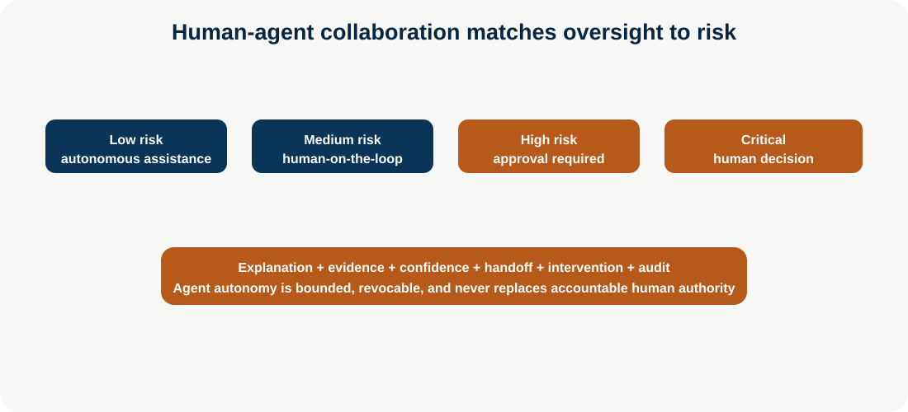

# Human-Agent Collaboration

**Enterprise Agent · 14** · **Notebook:** [`human_agent_collaboration.ipynb`](human_agent_collaboration.ipynb) · **Implementation:** [`lab.py`](lab.py)

Human-agent collaboration is an authority and interaction design problem, not a button labelled “human in the loop.” People need timely, comprehensible evidence; agents need explicit autonomy boundaries, intervention paths, and feedback contracts. Oversight must be meaningful: an overwhelmed reviewer rubber-stamping opaque proposals is not a safety control.

## Risk framework

| Risk | Oversight | Example |
| --- | --- | --- |
| Low | Agent acts within narrow reversible scope; human can inspect later | Format a status report from approved data |
| Medium | Human-on-the-loop monitoring and intervention | Investigate an incident and notify on-call with evidence |
| High | Human-in-the-loop approval for an exact proposal | Disable a feature flag or draft customer communication |
| Critical | Human decision; agent provides analysis only | Production rollback with material customer/legal/safety impact |

## Concepts and implementation

**Human-in-the-loop** pauses before a consequential action for approve/modify/reject. **Human-on-the-loop** monitors a bounded autonomous run and can intervene/revoke. **Human-out-of-the-loop** is appropriate only for narrow, low-risk, reversible operations with monitoring and kill controls. Mixed-initiative systems let either human or agent propose the next step; handoffs must include goal, context/evidence, uncertainty, pending decisions, scope, deadline, and owner.

Use confidence-based escalation only as one signal: combine evidence coverage, policy/risk, novelty, disagreement, tool health, and user impact. Explainable actions show the exact proposed action, target, reason, evidence/provenance, confidence/limitations, alternatives, expected impact, approval expiry, and rollback/verification plan. Trust calibration means users learn both when the system is reliable and when it is not—not simply increasing trust.

## Comprehensive incident use case

Northstar’s assistant formats a low-risk status autonomously; monitors an ambiguous EU issue; prepares a high-risk feature-flag proposal for approval; and sends a critical rollback decision to the incident commander with evidence and alternatives. The notebook tests confidence-driven escalation, human modify/reject, intervention/cancel, handoff packet, and audit.

Run `python lab.py`. Production controls: named human authority, tenant/identity verification, exact-action fingerprint, expiry/idempotency, notification/accessibility design, workload/cognitive-load monitoring, cancellation/revocation, audit, feedback capture, and evaluation of correct escalation/intervention—not just task success.

References: [NIST AI RMF](https://www.nist.gov/itl/ai-risk-management-framework), [OpenAI practical agent guide](https://openai.com/business/guides-and-resources/a-practical-guide-to-building-ai-agents/), [human-AI interaction guidelines](https://arxiv.org/abs/1902.04623), [Anthropic effective agents](https://www.anthropic.com/engineering/building-effective-agents).
