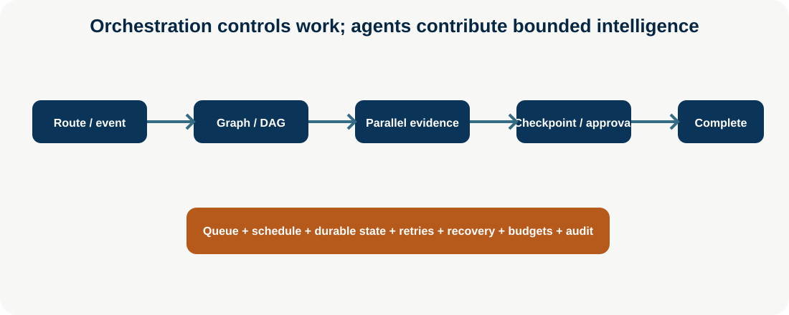
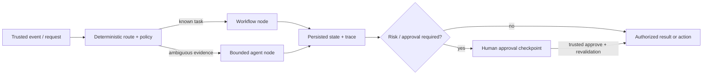

# Agent Orchestration

**Level:** Advanced · **Time:** 60 min · **Prerequisites:** None

**Enterprise Agent · 15** · **Notebook:** [`agent_orchestration.ipynb`](agent_orchestration.ipynb) · **Implementation:** [`lab.py`](lab.py)

Agent intelligence chooses or synthesizes within a bounded step. Workflow orchestration decides what runs next, which dependencies are ready, how state persists, when to wait, how to recover, and who approves an action. Production systems need both; neither is a substitute for the other.

## Core concepts

| Concept | Purpose | Example |
| --- | --- | --- |
| Orchestrator/router | Selects workflow/agent/team from task contract | Known status → workflow; ambiguous evidence → agent |
| State machine/graph | Explicit states, branches, terminal/retry paths | triage → evidence → approval → complete |
| DAG | Executes dependency-ready work | metrics/logs/deployment reads join before analysis |
| Event/queue/schedule | Wakes durable work without polling models | deployment webhook, delayed retry, daily reconciliation |
| Checkpoint/durable execution | Resume after crash or approval | persist pending proposal and action fingerprint |
| Parallel execution | Reduce wall time for independent reads | logs and tickets with concurrency limit |
| Human approval node | Pauses exact consequential proposal | approve/modify/reject with expiry/idempotency |
| Recovery | Handles timeout, duplicate, partial failure | retry safe read; reconcile write; escalate terminal failure |

## A decision boundary, not a framework choice

An **agent** is a bounded reasoning component: given approved context and tools, it may classify, plan, select a read, or synthesize a proposal. An **orchestrator** is the deterministic control plane around that reasoning: it validates an event, picks an eligible route, records state, waits, retries, rate-limits, joins work, invokes approval, and records an auditable stop reason. Never let a model message become a graph transition, queue message, credential, or production action by itself.

Use a workflow when the path, dependencies, and failure handling are known. Put a bounded agent inside one graph node when evidence selection or synthesis is genuinely variable. Use a team only when specialization improves a measured outcome enough to pay the coordination cost. A queue, scheduler, or workflow engine is not intelligence; it is the reliability substrate that makes a long-running system recoverable.

## Design the durable contract first

Before selecting LangGraph, Temporal, a data orchestrator, or an agent framework, write the run contract. At minimum record a stable `run_id`, tenant/owner, allowed route, state version, deadline, budget, cancellation flag, idempotency keys, evidence references, approval/action fingerprint, retry count, and terminal reason. Persist references or redacted summaries rather than silently duplicating sensitive prompt/context data.

For the Northstar incident, `metrics`, `logs`, and `deployments` are independent **read** tasks. They may run in parallel with a bounded concurrency limit. The graph joins only when all required evidence is present; it then lets an agent produce a *proposal*. An exact fingerprint such as `proposal:rollback:checkout:deploy-842` is checkpointed. A later approval must match that fingerprint, tenant, policy version, expiration, and user identity before any action service is called.

## Build it step by step

### 1. Route with application rules

Routes should depend on explicit task class, risk, user/tenant scope, and service health—not an agent's unsupported confidence. A deterministic lookup can go straight to a workflow. An ambiguous incident can enter a bounded investigation node. A high-impact request should create a proposal only. Record the selected route so evaluation can reveal misrouting.

### 2. Model state machines and DAGs separately

A state machine expresses legal lifecycle transitions such as `route → evidence → approval → complete`, plus `cancelled` and `escalated` terminals. A DAG expresses dependency-ready work inside one state: metrics, logs, and deployment history can start together and join before analysis. Keep both explicit: a DAG alone does not define approval expiry or recovery; a state machine alone does not expose parallel dependencies.

### 3. Use events, queues, and schedules deliberately

Events wake work when something changes: a deployment webhook, approval decision, or ticket update. Queues absorb bursts and provide backpressure; consumers must deduplicate messages with idempotency keys. Schedules create a new bounded run or wake an existing run for reconciliation—never an unbounded background model loop. Timers should transition a stale approval to `expired` and escalate it instead of assuming silence means consent.

### 4. Checkpoint and resume safely

Checkpoint before every wait, external side effect, or expensive branch. On resume, reload durable state and revalidate scope, policy version, deadline, budget, cancellation, event provenance, idempotency, and the exact proposal fingerprint. A checkpoint is not authorization carried forward forever. In Temporal terminology, durable workflow code can replay; in graph frameworks, nodes may replay. Therefore record non-deterministic outputs and make external calls idempotent.

### 5. Recover by failure class

Retry only operations that are safe to repeat, normally bounded read requests with exponential backoff and jitter. Do not retry a mutation because a response was lost; reconcile using its idempotency key or query the action system. Treat schema failure, permission denial, stale approval, budget exhaustion, and unknown external effect as terminal escalation paths. Emit the reason and preserve evidence so a human can continue without rediscovering the incident.

### 6. Make approvals graph nodes

An approval packet needs a summary, evidence IDs, proposed action and fingerprint, risk, requester/owner, policy decision, expiry, and modify/reject/cancel options. A human approval is an event from an authenticated source; it is not a string in the chat history. Re-run deterministic authorization at the action boundary even after approval.

## Technology selection

| Technology | Best fit | Strength | Boundary to keep application-owned |
| --- | --- | --- | --- |
| [LangGraph](https://docs.langchain.com/oss/python/langgraph/overview) | Agentic state graphs | Conditional edges, interrupts, persistence, graph visibility | identity, policy, action authorization, idempotency |
| [Temporal](https://docs.temporal.io/workflows) | Durable minutes-to-days workflows | Retries, timers, signals, replay, queues, worker recovery | agent prompts, tenant policy, business authorization |
| [Prefect](https://docs.prefect.io/) / [Dagster](https://docs.dagster.io/) / [Airflow](https://airflow.apache.org/) | Data-heavy scheduled DAGs | Dependency graphs, schedules, observability | interactive approval and agent policy semantics |
| [OpenAI Agents SDK](https://openai.github.io/openai-agents-python/) | Managed bounded agent loops | Tools, handoffs, sessions, tracing | durable business workflow and consequential action control |
| [CrewAI Flows](https://docs.crewai.com/en/concepts/flows) / [AutoGen](https://microsoft.github.io/autogen/) | Agent-centric flows or collaboration | Flow/team primitives and routing | approval, queue semantics, identity and audit enforcement |

## Production checklist and exercises

- Can every transition be explained from a trace and durable state record?
- Does every external write have an idempotency key and reconciliation path?
- Are concurrency, deadlines, token/action budgets, retries, and cancellation bounded?
- Can a restart, duplicate queue message, stale event, or expired approval create an unauthorized action? It must not.
- Does every scheduled/long-running run have an owner, lease/heartbeat, recovery plan, and terminal retention rule?

Run `python lab.py`, then execute the notebook. Extend the lab with: (1) a deadline timer that expires approval; (2) an exponential-backoff read retry; (3) a queue duplicate test; and (4) a second route that uses a workflow instead of an agent. Defend which transitions remain deterministic and why.

## Step-by-step incident use case

1. Route tenant-scoped incident request using deterministic risk/known-path rules.
2. Create a durable state record with deadline, budget, owner, evidence gaps, and cancellation.
3. Run independent read-only evidence tasks in parallel; join only after required artifacts arrive.
4. Use a bounded agent node to synthesize evidence and select a proposal—not to control the graph or action service.
5. Persist a checkpoint and enter an approval node for high-risk mitigation.
6. Resume only on a trusted approval event; revalidate identity, policy, freshness, action fingerprint, and idempotency.
7. Emit trace/state/queue/latency/cost metrics, recover safe reads, and escalate unrecoverable failures.

## Technologies and state of the art

[LangGraph](https://docs.langchain.com/oss/python/langgraph/overview) is strong for explicit state graphs, interrupts, persistence, and durable agent workflows. [Temporal](https://docs.temporal.io/workflows) is a durable-workflow engine for retries, timers, signals, queues, and long-running execution. [Prefect](https://docs.prefect.io/), [Dagster](https://docs.dagster.io/), and [Airflow](https://airflow.apache.org/) are data/workflow orchestration options. [OpenAI Agents SDK](https://openai.github.io/openai-agents-python/) offers managed agent loops/tracing; [CrewAI Flows](https://docs.crewai.com/en/concepts/flows) and [AutoGen](https://microsoft.github.io/autogen/) offer agent-focused orchestration patterns. Choose by state/durability, event/queue needs, visibility, deployment, identity, and operational constraints.

Run `python lab.py`; the notebook covers route, graph/DAG, parallel join, checkpoint, approval, event resume, recovery, scheduling, and long-running budgets. References: [LangGraph durable execution](https://docs.langchain.com/oss/python/langgraph/durable-execution), [Temporal](https://docs.temporal.io/workflows), [OpenAI practical guide](https://openai.com/business/guides-and-resources/a-practical-guide-to-building-ai-agents/).

## Watch For

- **Assumption failure:** The model hallucinates an unsupported parameter.
- **State leak:** Context is incorrectly preserved across runs.
- **Timeout:** The tool takes too long and the agent loops.
- **Auth bypass:** The agent attempts an action it shouldn't.

## Checkpoint

**1. Which responsibilities belong to deterministic agent orchestration rather than a model's free-form reasoning?**
- A) Persisting state, checkpoints, and terminal reasons
- B) Routing, queue/event handling, scheduling, and bounded retries
- C) Approving its own high-impact action from a chat message
- D) Idempotency, cancellation, recovery, and revalidation on resume
- E) Joining dependency-ready parallel work before a proposal node

