# Agent Orchestration

**Level:** Advanced · **Time:** 60 min · **Prerequisites:** None

**Enterprise Agent · 15** · **Notebook:** [`agent_orchestration.ipynb`](agent_orchestration.ipynb)

An agent's intelligence dictates *how* it synthesizes information or chooses a tool within a bounded step. However, **workflow orchestration** dictates *what* runs next, which dependencies are ready, how state persists, when to sleep, how to recover from crashes, and who approves an action. 

Production systems need both; neither is a substitute for the other. Never let a model message become a queue event, a production action, or a state transition by itself without a deterministic orchestration layer validating it.

---

## Core Orchestration Concepts

To move agents from prototype to production, you must understand three core architectural components of orchestration:

### 1. Directed Acyclic Graphs (DAGs)
A DAG executes dependency-ready work in a strict, predictable pipeline. 
- **Use Case:** Executing tasks that can run in parallel and must eventually join. For example, simultaneously fetching metrics, logs, and deployment history before passing them to an agent for analysis.
- **Limitation:** DAGs cannot loop. They do not naturally handle autonomous retries or dynamic routing driven by an LLM.

### 2. State Machines (Graphs)
State machines express explicit lifecycle transitions (e.g., `Initialize → Execute → Review → Complete`). The current state is preserved, and conditional logic dictates the next state.
- **Use Case:** Building cyclic agent loops where an LLM yields a tool call, the tool executes, and the system routes back to the LLM until a condition is met.
- **Limitation:** A state machine defines transitions, but without a durability layer, it will lose all memory if the server process crashes mid-execution.

### 3. Durable Execution (Persistence & Checkpointing)
Durable execution guarantees that if a workflow is interrupted (due to a timeout, power loss, or waiting for a human), it can resume exactly where it left off without re-running expensive steps.
- **Use Case:** "Human-in-the-Loop" approvals, polling asynchronous APIs, or multi-day workflows. The system checkpoints state to a database and puts the workflow to sleep (consuming zero CPU).
- **Limitation:** Requires strict deterministic code (no random number generators or hidden side effects inside the workflow logic) so the execution history can be accurately replayed.

---

## Technology Selection Matrix

Modern agent orchestration relies on choosing the right framework for the right problem. Do not build a distributed durable execution engine from scratch.

| Technology | Architectural Focus | Best Fit | Boundary to Keep Application-Owned |
| --- | --- | --- | --- |
| **[LangGraph](https://docs.langchain.com/oss/python/langgraph/overview)** | Agentic State Graphs | Stateful agent loops, conditional edges, memory persistence, interrupts | Identity, action authorization, idempotency |
| **[Temporal](https://docs.temporal.io/workflows)** | Durable Execution Engine | Mission-critical reliability, multi-day workflows, robust retries, cron jobs | Agent prompts, LLM reasoning logic |
| **[LlamaIndex Workflows](https://docs.llamaindex.ai/en/stable/module_guides/workflow/)** | Event-Driven RAG Pipelines | Complex data ingestion, advanced RAG routing | Interactive UI approvals, external state |
| **[Airflow / Dagster](https://airflow.apache.org/)** | Scheduled Data DAGs | Batch processing, analytics ETL, strict dependencies | Autonomous agent policies and reasoning |

*Note: In enterprise architectures, these are frequently combined. For instance, **LangGraph** is used to define the agent's internal loop (the "brain"), while **Temporal** wraps the LangGraph execution to provide enterprise-grade durability and retry semantics (the "nervous system").*

---

## Applied Use Case: Northstar Incident Triage

Before selecting a framework, design the durable contract. For the Northstar EU Checkout Incident, we use a hybrid approach:

1. **Route (Deterministic):** A webhook triggers the orchestrator. The orchestrator checks if the incident is `Severity 1`.
2. **DAG (Parallel Execution):** The orchestrator spawns three independent tasks (Metrics, Logs, Deployments). They run in parallel with a concurrency limit. 
3. **State Machine (Agent Synthesis):** The DAG joins. The Orchestrator passes the evidence to the bounded Agent Node. The agent cycles in a state machine until it produces a proposed rollback action.
4. **Durable Execution (Approval Checkpoint):** The orchestrator checkpoints an exact fingerprint (e.g., `proposal:rollback:checkout:deploy-842`). The workflow goes to sleep.
5. **Resume (Revalidation):** A human clicks "Approve". The workflow wakes up, revalidates the exact fingerprint, ensures the policy hasn't expired, and executes the action.

---

## Production Checklist & Best Practices

- **Idempotency:** Does every external write have an idempotency key? If a Temporal workflow crashes and retries, you must not accidentally charge a customer twice.
- **Timeouts & Dead-Letters:** Does every wait state have a timeout? (e.g., If a human doesn't approve in 24 hours, route to a dead-letter queue or auto-reject).
- **Rate Limiting:** Are your parallel reads bounded? An unconstrained DAG can easily trigger rate limits on your external APIs or LLM provider.
- **Traceability:** Can every state transition be explained from a trace? Never let an agent silently overwrite the state history.

---

## Watch For

- **State Leakage:** Re-using global variables instead of passing explicit State objects between graph nodes.
- **Non-Deterministic Workflows:** Putting `datetime.now()` or `uuid.uuid4()` directly inside a durable workflow function (it will break the replay history when recovering from a crash).
- **Over-Agentification:** Using an LLM to decide which dependency to run next when a strict programmatic DAG would be 100x faster and 100% reliable.

---

## Checkpoint

**1. Which framework is best suited for guaranteeing that a multi-day agent workflow can pause for human approval, survive a server crash, and resume perfectly?**
- A) Standard Python `while` loop
- B) Directed Acyclic Graph (DAG) without persistence
- C) Temporal (Durable Execution)
- D) LangGraph without a checkpointer

Answer

<b>C</b>. Temporal is specifically designed to persist execution state and handle multi-day durable execution and crash recovery natively.

**2. Why is a standard DAG (Directed Acyclic Graph) often insufficient on its own for complex Agent orchestration?**
- A) It cannot run tasks in parallel.
- B) It cannot support cycles/loops (like an agent self-correcting its output).
- C) It is too difficult to implement.
- D) It requires a local LLM to execute.

Answer

<b>B</b>. DAGs are strictly acyclic, meaning they cannot support the loops/cycles necessary for an agent to review and correct its own work before proceeding.

