# Agent Communication and Coordination

**Level:** Advanced · **Time:** 60 min · **Prerequisites:** None

**Enterprise Agent · 16** · **Notebook:** [`agent_communication_coordination.ipynb`](agent_communication_coordination.ipynb)

Multi-agent systems do not become reliable simply because several models are prompted to "talk to each other." They become useful only when explicit roles, communication contracts, scoped shared states, task ownership, bounded convergence, and independent evaluation improve a measured outcome over a well-designed single-agent baseline.

In this module, we explore the foundational architectures of Multi-Agent Systems (MAS), examine the core patterns of agent coordination, and apply them to an enterprise incident response scenario.

---

## Foundations: How Agents Communicate

At the lowest level, multi-agent systems rely on two foundational paradigms for communication and state management:

### 1. The Actor Model (Message Passing)
In the Actor model, every agent is an independent entity with a private state. Agents cannot directly read or modify another agent's memory. Instead, they communicate exclusively through asynchronous message passing (e.g., placing a task payload into another agent's "mailbox").
- **Pros:** High concurrency, strong fault isolation, and location transparency (agents can be on different servers).
- **Cons:** Tracing the global state of the system can be difficult.

### 2. The Blackboard Pattern (Shared Memory)
In a Blackboard architecture, agents do not communicate directly with each other. Instead, they read from and write to a centralized, shared workspace (the "Blackboard"). 
- **Pros:** Excellent for complex problem-solving where diverse specialists incrementally add findings without needing to know about each other.
- **Cons:** The blackboard can become a bottleneck or a source of truth contention if writes are not strictly managed and versioned.

---

## Core Architectural Patterns

When designing a multi-agent system, the architecture acts as the performance ceiling. Choosing the right pattern is critical.

### 1. Sequential (Pipeline)
The output of one agent serves as the direct input for the next. This is the simplest and most predictable pattern.

- **Best For:** Linear workflows with strict dependencies (e.g., ETL pipelines, code generation followed by code testing).
- **Frameworks:** Readily built with CrewAI's default sequential processes or simple LangGraph chains.

### 2. Hierarchical (Supervisor / Orchestrator)
A top-level "Supervisor" agent decomposes a complex objective into sub-tasks and delegates them to specialized "Worker" agents, aggregating their responses.

- **Best For:** Complex, multi-domain problems that require dynamic routing and clear accountability.
- **Frameworks:** LangGraph (Supervisor topologies), AutoGen, CrewAI (Hierarchical mode).

### 3. Swarm (Decentralized Peer-to-Peer)
Agents interact dynamically without a central orchestrator. They discover each other, negotiate tasks, and hand off control freely based on the context of the conversation.

- **Best For:** Highly creative tasks, brainstorming, or open-ended simulations where rigid structures stifle capability.
- **Frameworks:** AutoGen (GroupChat), Swarm architectures.

---

## Pattern Comparison Matrix

| Pattern | Primary Strength | Main Failure Mode | Production Controls |
| :--- | :--- | :--- | :--- |
| **Sequential** | High predictability & low overhead | Brittle; fails if an early step produces garbage | Enforce strict JSON schemas between steps |
| **Hierarchical** | Scalable delegation & accountability | Supervisor becomes a bottleneck or hallucinates routing | Bounded worker budgets, deterministic routing where possible |
| **Blackboard** | Asynchronous synthesis | Stale, poisoned, or unowned shared state | Provenance tagging, versioning, strict ACLs |
| **Swarm** | Flexibility & emergent problem solving | Endless loops, collusion, lost accountability | Max-turn limits, TTLs, explicit termination conditions |

---

## Applied Use-Case: Northstar Incident Response

Let's see how these patterns solve a real enterprise problem.

**The Scenario:** Northstar’s EU checkout conversion falls 31% shortly after a deployment. 

A single agent would struggle with the context length and diverse tool permissions required to investigate. Instead, we use a **Hierarchical Blackboard** pattern:

1. **Routing:** A deterministic router identifies the severity and triggers the MAS.
2. **Specialists (Workers):** An Observability Specialist, a Deployment Specialist, and an Impact Specialist are spun up in parallel. 
3. **The Blackboard:** They cannot talk to each other directly. Instead, they write their findings (with exact log lines and metric IDs as provenance) to a shared incident Blackboard.
4. **The Critic (Supervisor Synthesis):** A Critic agent reads the Blackboard. If evidence is missing, it delegates a follow-up task. If complete, it drafts a mitigation proposal.
5. **Human-in-the-Loop:** The system never executes the mitigation without human approval.

### Success Criteria for the Team
Success means every claim on the blackboard has an owner and a source; the team converges or escalates before budgets expire; and comparison shows the team improves quality or latency enough to justify its coordination overhead compared to a single agent.

---

## Production Controls & State of the Art

### Delegation vs. Handoff
- **Delegation (Hierarchical):** Assigns a bounded deliverable while the delegator retains accountability. The delegator pauses until the worker returns.
- **Handoff (Swarm):** Transfers interaction control entirely. It must carry a minimized context package and explicitly define who has authority next.

### Tools and Frameworks
- **[LangGraph](https://docs.langchain.com/oss/python/langchain/multi-agent/index):** State-of-the-art for building deterministic graph-based workflows, subgraphs, and supervisor architectures.
- **[CrewAI](https://www.crewai.com/):** Highly opinionated framework that excels at Sequential and Hierarchical role-playing processes.
- **[AutoGen](https://microsoft.github.io/autogen/):** Excels at conversational, decentralized Swarm patterns and complex negotiation.

### Best Practices
- **Never rely on free-form group chats for production.** Give every message a schema, tenant/owner, capability scope, correlation ID, and idempotency key.
- **Put hard limits** on team size, delegation depth, concurrency, message count, and total spend.
- **First improve the single agent** with narrower tools or dynamic context. Promote to a team *only* if an evaluation shows higher evidence-supported accuracy at an acceptable cost.

---

## Checkpoint

**1. Which pattern is most appropriate for a complex problem where diverse specialists must incrementally add findings without needing to know about each other's internal states?**
- A) Swarm
- B) Sequential
- C) Blackboard
- D) Single Agent

Answer

<b>C</b>. The Blackboard pattern provides asynchronous, decoupled shared memory that is perfect for incremental synthesis.

**2. What is a critical production control when deploying a decentralized Swarm architecture?**
- A) Ensuring all agents use the same LLM provider.
- B) Forcing all agents to execute sequentially.
- C) Implementing maximum turn limits and explicit termination conditions to prevent endless loops.
- D) Giving all agents full administrative access to tools.

Answer

<b>C</b>. Decentralized swarms are prone to endless negotiation or loops; strict termination limits are required for production safety.

