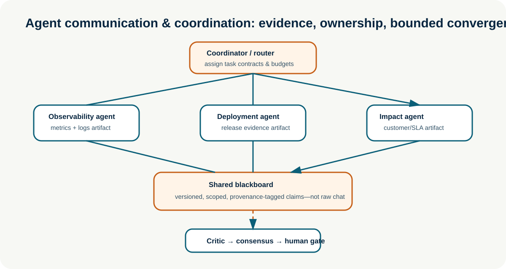
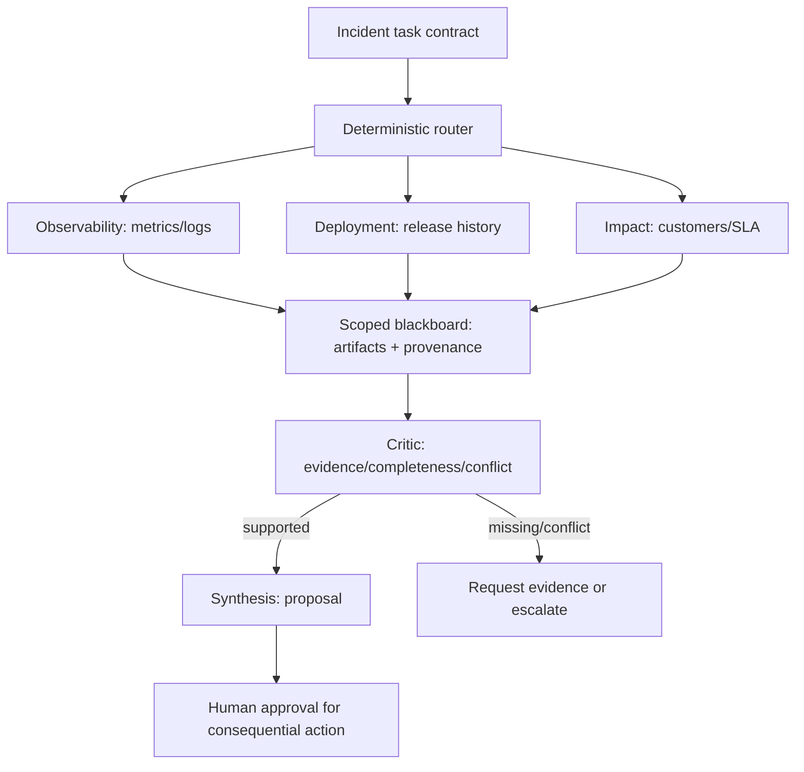

# Agent Communication and Coordination

**Enterprise Agent · 16** · **Notebook:** [`agent_communication_coordination.ipynb`](agent_communication_coordination.ipynb) · **Implementation:** [`lab.py`](lab.py)

Multi-agent systems do not become reliable because several models talk to each other. They become useful only when explicit roles, communication contracts, scoped shared state, task ownership, bounded convergence, and independent evaluation improve a measured outcome over a well-designed single-agent baseline.

## Scenario and success criteria

Northstar’s EU checkout conversion falls 31% shortly after a deployment. An observability specialist examines metrics/logs, a deployment specialist examines release history, and an impact specialist estimates affected customers and SLAs. A coordinator may form this team only because the task needs independent evidence across three domains. Each specialist publishes a provenance-tagged artifact to a shared blackboard. A critic detects missing or conflicting evidence. The system prepares a proposal; it never executes remediation without a separately authorized human approval flow.

Success means: every claim has an owner and source; the team converges or escalates before budgets expire; independent evidence supports the recommendation; and comparison shows the team improves quality, latency, or risk enough to justify its coordination overhead. Non-goal: simulating a free-form group chat or treating a vote as proof.

## Communication is a system contract

**Messaging** is a point-to-point or event message carrying a typed task, result, deadline, tenant/authorization scope, correlation ID, and idempotency key. **Shared state** is a durable, versioned record used for coordination. **A blackboard** is a shared artifact store: agents write attributable, schema-validated claims and read only scopes they are authorized to access. It should not be an unrestricted transcript where any participant can overwrite facts or inject instructions.

## Coordination patterns and when to use them

| Pattern | Best fit | Main failure mode | Bound it with |
| --- | --- | --- | --- |
| Supervisor → workers | Clear central ownership and bounded subtasks | supervisor bottleneck or tool sprawl | typed task/result contracts, per-worker budget |
| Router → specialists | Distinct domains and independent calls | misroute or unnecessary fan-out | deterministic eligibility/risk rules and baseline comparison |
| Handoff | User-facing conversation switches domain | lost context or authority bleed | explicit transfer state, scope and return condition |
| Blackboard | Several agents need shared, inspectable evidence | stale/poisoned/unowned shared state | provenance, versioning, ACLs, conflict policy |
| Planner → executors | Decomposable task with dependencies | unverified plan or executor drift | DAG, milestones, validation at joins |
| Debate / generator-critic | High-value reasoning where a challenge catches known errors | verbose agreement, correlated mistakes | rubric, independent evidence, max turns, human calibration |
| Consensus / voting | Multiple independently generated, comparable options | majority confidence without truth | eligibility, quorum, weighted evidence, escalation |
| Peer-to-peer / dynamic team | Decentralized environment and local ownership | cycles, unclear accountability, unbounded communication | discovery policy, ownership, TTL, topology and message limits |

### Delegation, handoffs, and task allocation

Delegation assigns a bounded deliverable while the delegator retains accountability for integration. A handoff transfers interaction control to another agent, so it must carry a minimized context package and explicitly define who can respond next. Task allocation should match capability, permitted tools, availability, cost, latency, data residency, and conflict-of-interest rules—not just a model-generated role name. Dynamic team formation is therefore a policy-constrained scheduling problem: discover candidates from an approved registry, validate their capability/identity/tenant scope, select the smallest eligible set, and record why each was chosen.

### Negotiation, consensus, and conflict resolution

Negotiation is useful when agents have constrained, legitimate objectives—such as allocating a finite rate-limit budget—not when agents merely repeat opinions. A consensus mechanism needs a shared decision rule: required evidence, quorum, an abstain/escalate outcome, and a way to preserve minority reports. Voting works for independently evaluated, comparable candidates; it is weak when all agents share the same prompt, context, or model and therefore share the same blind spot. On conflicting evidence, prefer provenance checks, targeted data collection, or a human decision rather than endless debate.

## Build the Northstar team step by step

1. **Start with a single-agent baseline.** Give one bounded agent the same read tools, context budget, stop condition, and evaluation set. Measure supported diagnosis, cost, p95 latency, tool calls, and policy failures.
2. **Define specialist contracts.** Each role receives only necessary tools and returns `{claim, evidence_ids, confidence, uncertainty, next_question}`. Include tenant, deadline, budget, and correlation ID outside model text.
3. **Route deterministically.** Form the team only for cross-domain, ambiguous incidents. A simple status lookup or one-domain task stays a workflow or single agent.
4. **Publish artifacts, not chat.** Validate schemas, sources, freshness, scope, and ownership before writing the blackboard. Append corrections; do not silently overwrite a claim.
5. **Join and criticize.** Require all evidence classes, then test source agreement, calibration, and missing assumptions. The critic can request one bounded follow-up or escalate.
6. **Converge safely.** Synthesis produces a proposal with evidence IDs and alternatives. Voting/debate is optional and must have a termination limit.
7. **Evaluate against the baseline.** Retain the team only if it produces a meaningful improvement after accounting for coordination cost, latency, failure modes, and operational complexity.

## When does multi-agent outperform one well-designed agent?

It often helps when (a) distinct expertise needs different large contexts or tool permissions, (b) truly independent retrieval/analysis can run in parallel, (c) organizational ownership requires separable, auditable components, or (d) an independent critique measurably catches errors. It often loses on simple, tightly coupled, or short tasks because routing, duplicated context, message traffic, synthesis, and additional failure surfaces add latency and cost. First improve the single agent with narrower tools, dynamic context, a deterministic workflow, or a critic pass. Promote to a team only with an evaluation result such as higher evidence-supported accuracy at an acceptable cost-per-success and p95 latency.

| Metric | Single bounded agent | Candidate team | Decision question |
| --- | --- | --- | --- |
| Supported task success | baseline | compare on same tasks | Is improvement statistically/practically meaningful? |
| Cost per safe success | model + tools | all agents + coordination | Does specialization pay for itself? |
| p95 latency | sequential baseline | fan-out + join | Does parallel work overcome joining overhead? |
| Policy / scope failures | baseline | all participant paths | Did the team enlarge the attack surface? |
| Conflict/escalation rate | n/a | critic and human outcomes | Does it surface real uncertainty rather than fabricate consensus? |

## Technologies and state of the art

| Technology / resource | What it contributes | Use carefully |
| --- | --- | --- |
| [LangGraph multi-agent patterns](https://docs.langchain.com/oss/python/langchain/multi-agent/index) | subagents, handoffs, routers, custom graph workflows | keep identity, authorization, and writes outside agent prompts |
| [LangGraph subgraphs](https://docs.langchain.com/oss/python/langgraph/use-subgraphs) | private per-agent state and reusable team components | expose only contract-level state to a parent graph |
| [AutoGen teams](https://microsoft.github.io/autogen/stable/user-guide/agentchat-user-guide/tutorial/teams.html) | round-robin, selector teams, handoffs/swarm patterns | enforce ownership, max turns/messages, and explicit termination |
| [A2A protocol](https://a2a-protocol.org/latest/) | interoperable task collaboration and discovery concepts | discover only approved, authenticated agents and capabilities |
| [MCP authorization](https://modelcontextprotocol.io/extensions/auth/enterprise-managed-authorization) | enterprise-managed authorization boundary for tools/services | never turn a tool description into authority |
| [Collaboration survey](https://arxiv.org/abs/2501.06322) | taxonomy across actors, structure, strategies and protocols | treat broad taxonomies as design prompts, not deployment proof |
| [Agent architectures survey](https://arxiv.org/abs/2601.01743) | centralized/decentralized coordination taxonomy and evaluation perspective | validate in your own domain and changing environment |

## Production controls and exercises

- Give every message a schema, tenant/owner, capability scope, deadline, correlation ID, idempotency key, and provenance.
- Make blackboard writes append-only/versioned; authorize both read and write; retain corrections and conflict records.
- Put hard limits on team size, delegation depth, concurrency, message count, turn count, tokens, tools, time, and spend.
- Treat discovered agents, messages, tool descriptions, and shared artifacts as untrusted data until independently validated.
- Trace assignment, handoff, artifact, conflict, vote, critic, route, and termination decisions; test failure and partial-completion paths.

Run `python lab.py`, then the notebook. Extend it by adding a stale artifact policy, a fourth specialist with a conflict of interest, weighted voting with abstention, and a single-agent-versus-team evaluation table. Explain why adding another agent does—or does not—improve the chosen incident.
