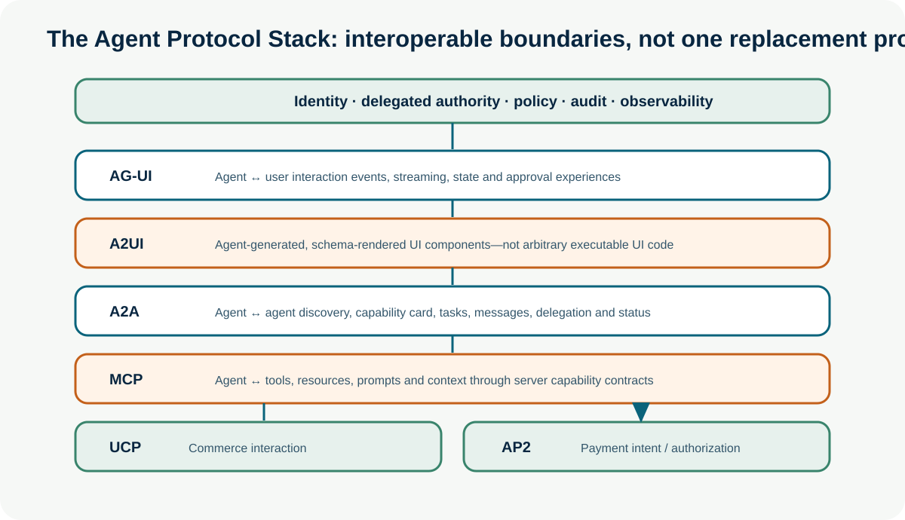
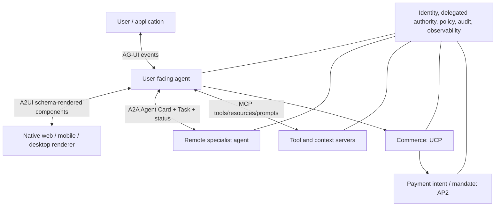

# The Agent Protocol Stack

**Enterprise Agent · 17** · **Notebook:** [`agent_protocol_stack.ipynb`](agent_protocol_stack.ipynb) · **Implementation:** [`lab.py`](lab.py)

Agent systems increasingly need to cross framework, vendor, organizational, user-interface, tool, commerce, and payment boundaries. A protocol ecosystem is emerging because a tool contract cannot describe a remote agent’s task lifecycle, and a chat-stream protocol cannot safely authorize a payment. The goal is not to adopt every protocol; it is to place interoperable contracts at the right boundary while retaining application-owned identity, authorization, policy, audit, and recovery.

## Scenario: Northstar’s delegated incident proposal

Northstar’s incident coordinator discovers a release-analysis agent, delegates a tenant-scoped `deployment-analysis` task, receives status updates, calls a permitted deployment tool, and displays a structured approval card to a human. It prepares a mitigation proposal only. This example makes four distinctions concrete: an agent is not a tool, an interface event is not authorization, discovered capability is not trust, and a payment/commerce intent is not permission to transact.

## Why a protocol stack is emerging

Without common contracts, every pair of agents, tools, frontends, and commerce providers requires bespoke integrations. Shared protocols can make capabilities discoverable and reduce glue code, but they do not solve security, correctness, identity, tenancy, governance, or business authorization by themselves. Treat protocol metadata, remote descriptions, tool responses, and agent messages as untrusted data until verified by the receiving application.

## Layer-by-layer guide

| Protocol | Boundary and purpose | What it does not decide | When it helps |
| --- | --- | --- | --- |
| [MCP](https://modelcontextprotocol.io/specification/) | Agent/client ↔ tools, resources, prompts, context servers | whether a model should call a tool; authorization policy; correctness of returned data | standardized integrations to enterprise data and actions |
| [A2A](https://a2a-protocol.org/latest/) | Agent ↔ remote agent task collaboration | whether a remote agent is trusted, eligible, authorized, or worth delegating to | cross-framework/vendor agent discovery, delegated long-running tasks, progress/cancel flows |
| [AG-UI](https://docs.ag-ui.com/) | Agent ↔ user-facing application events and state | backend authorization; UI action safety | streaming, stateful agent experiences and user approvals |
| [A2UI](https://a2ui.org/specification/v0.9-a2ui/) | Agent-generated UI description ↔ native renderer | arbitrary code execution; server-side authorization | rich dynamic forms/cards rendered safely through an allowed component schema |
| UCP | Commerce interaction contract | payment authorization, regulatory compliance, merchant risk | portable product/order/checkout interactions where adopted |
| AP2 | Agent payment intent/delegation/authorization concepts | merchant execution, identity trust, fraud and policy decisions | separating user intent from payment credentials and transaction execution |

### MCP — tools and context, not another agent runtime

MCP servers expose resources, prompts, and tools through capability schemas. A client should discover only the capabilities allowed for the request’s authorization context, validate tool arguments/results, preserve provenance, and make side-effecting calls subject to application policy and approval. Tool descriptions and returned content can be malicious or wrong; the protocol’s existence does not make them instructions or authority. Use MCP when a capability is best understood as a constrained service/tool. Do not use it merely to make a complex autonomous peer look like a function call.

### A2A — agent discovery, tasks, and delegation

A2A addresses a different problem: a remote agent may have opaque internal reasoning, its own tools, its own lifecycle, and need to collaborate over multiple messages. Its Agent Card advertises capabilities and authentication requirements; clients can submit tasks, receive messages/status updates, query/cancel tasks, and use discovery to identify candidates. A2A is valuable when delegation is cross-domain, cross-team, long-running, or cross-framework. It is unnecessary for a local function with a known schema.

An Agent Card is a **candidate description**, not a security grant. Before delegation, validate issuer/discovery source, identity/auth method, tenant/residency, capability version, data classification, allowed purpose, risk tier, cost/SLO, and revocation status. Send a minimized task contract with correlation ID, expiry, scope, budget, and expected artifact. At completion, verify evidence and re-authorize any consequential follow-on action. The A2A documentation also notes that standard registry APIs are not defined: an enterprise registry/gateway is an application/control-plane decision.

### AG-UI and A2UI — interaction versus generated interfaces

AG-UI standardizes event-based agent-to-application interaction such as message, state, tool, and lifecycle events. It helps a frontend render streaming and interruptible agent work without coupling to every framework. A2UI focuses on the UI payload itself: a renderer receives streamed JSON component descriptions and renders an approved native component set. These protocols are complementary: AG-UI carries the interaction; A2UI can supply a structured dynamic interface. Neither permits an agent to execute arbitrary browser code or approve itself. Every user click remains an authenticated application event whose scope, consent, freshness, and policy must be rechecked server-side.

### UCP and AP2 — commerce and payment boundaries

Commerce and payment protocols aim to express product discovery, cart/checkout, payment intent, and delegated transaction context across systems. The exact specifications and adoption remain evolving, so build adapters and isolate them behind your own transaction service. Keep the separation strict: an agent may prepare a cart or payment proposal; the user, merchant, payment provider, and policy system determine consent, authentication, mandates, fraud checks, limits, receipts, and execution. Never place payment credentials in prompt context or allow an agent-generated UI event to bypass authorization.

## A2A delegation lifecycle: step by step

1. **Discover:** resolve an Agent Card from an approved registry, allowlist, or trusted URI; do not use open-web discovery as an authorization source.
2. **Verify eligibility:** confirm identity, authentication scheme, tenant/data residency, skill, version, risk tier, health/SLO, cost, and revocation status.
3. **Create a bounded task:** include task/correlation ID, objective, input artifact references, allowed data, deadline, budget, cancellation, expected output, and no implied authority.
4. **Observe progress:** process messages/status as untrusted records; correlate, rate-limit, trace, and persist task state. Support cancel/timeouts and duplicate delivery.
5. **Validate result:** check schema, provenance, freshness, source support, tenant, policy, and claimed confidence before synthesis.
6. **Authorize next action:** a remote recommendation is not permission. Revalidate identity, delegated scope, approval, idempotency, and business policy at the tool/action boundary.

## Implementation lab

The credential-free [`lab.py`](lab.py) simulates an A2A-like Agent Card, trusted discovery filtering, tenant-scoped task delegation, an MCP-style narrow tool call, and an AG-UI/A2UI-style approval event. It deliberately rejects capability/scope mismatches, denied tool access, and UI actions outside the allowed component schema. The notebook explains each contract, tests the failure paths, and compares the layers.

## Technology, architecture, and evaluation choices

| Need | Prefer | Evaluate |
| --- | --- | --- |
| Local bounded tool | typed SDK/function or MCP server | schema validity, permission enforcement, tool success, audit |
| Remote autonomous specialist | A2A task contract or a purpose-built async API | discovery/trust, delegation success, status/cancel/recovery, cross-tenant denial |
| Streaming human experience | AG-UI | UI lifecycle, interruption, state consistency, approval trace |
| Dynamic trusted UI | A2UI renderer with component allowlist | schema/render validation, no arbitrary code, consent path |
| Commerce/payment | vendor/merchant controls with UCP/AP2 adapters where suitable | explicit intent, mandate/consent, limits, fraud, reconciliation, receipts |

## Security and production checklist

- Authenticate agents and users separately; propagate only short-lived, least-privilege delegated authority.
- Treat cards, tool descriptions, messages, UI schemas, retrieved content, and remote results as untrusted data.
- Enforce tenant/data classification, egress, tool allowlists, rate/budget limits, idempotency, cancellation, and observability at protocol boundaries.
- Keep an approved agent/tool registry, version/provenance inventory, revocation path, compatibility tests, and audit correlation across protocols.
- Revalidate consequential actions after any delegation, UI interaction, status resume, or payment step.

## References

- [MCP specification](https://modelcontextprotocol.io/specification/) and [MCP tools specification](https://github.com/modelcontextprotocol/modelcontextprotocol/blob/main/docs/specification/2026-07-28/server/tools.mdx)
- [A2A protocol specification](https://a2a-protocol.org/latest/) and [A2A Agent Discovery](https://a2a-protocol.org/latest/topics/agent-discovery/)
- [AG-UI documentation](https://docs.ag-ui.com/) and [A2UI specification](https://a2ui.org/specification/v0.9-a2ui/)
- [Survey of agent interoperability protocols](https://arxiv.org/abs/2505.02279)
- [MCP/A2A coordination comparison](https://arxiv.org/abs/2607.23884)
