# The Agent Protocol Stack

**Level:** Advanced · **Time:** 60 min · **Prerequisites:** None

**Enterprise Agent · 17** · **Notebook:** [`agent_protocol_stack.ipynb`](agent_protocol_stack.ipynb)

Agent systems increasingly need to cross framework, vendor, organizational, user-interface, tool, commerce, and payment boundaries. A protocol ecosystem is emerging because a simple tool contract cannot describe a remote agent’s task lifecycle, and a chat-stream protocol cannot safely authorize a payment. The goal is not to adopt every protocol—it is to place interoperable contracts at the right boundary while retaining application-owned identity, authorization, policy, audit, and recovery.

## Why a Protocol Stack is Emerging

Without common contracts, every pair of agents, tools, frontends, and commerce providers requires bespoke integrations. The AI landscape is shifting from monolithic frameworks to a loosely coupled network of specialized models, sandboxed execution environments, and autonomous agents. 

Shared protocols make capabilities discoverable, reduce glue code, and prevent vendor lock-in. However, **protocols do not solve security, correctness, identity, tenancy, governance, or business authorization by themselves**. Treat protocol metadata, remote descriptions, tool responses, and agent messages as untrusted data until verified by the receiving application.

## The Modern Agent Protocol Stack

## Layer-by-Layer Guide

### 1. Tool & Context Layer (Model Context Protocol - MCP)
**Standard by:** Anthropic (2024)

The **Model Context Protocol (MCP)** acts as a "USB-C" for AI models. It uses JSON-RPC 2.0 to standardize how AI applications (Hosts) communicate with data sources and tools (Servers).

MCP servers expose three distinct capabilities:
- **Resources:** Data and context (e.g., local files, database records, GitHub repositories).
- **Tools:** Actionable functions the AI can execute (e.g., calculators, API actions).
- **Prompts:** Templated messages and workflows.

**When to use:** Use MCP when connecting an LLM to internal business tools or enterprise databases. It eliminates the need to write custom integration code for every new LLM or tool.
**Important:** A tool description or returned content can be malicious. MCP defines the *format* of the tool, but your application must enforce authorization policies on side-effecting calls.

### 2. Client-to-Agent Execution Layer (Agent Protocol)
**Standard by:** AI Engineer Foundation (AIEF)

The **Agent Protocol** is a framework-agnostic REST/HTTP specification designed to standardize how clients interact with agents. It defines primitives like **Runs**, **Tasks**, **Steps**, and **Artifacts**, creating a predictable lifecycle for how agents process and report their activities.

**When to use:** Use the Agent Protocol when you are orchestrating an agent within a cloud execution environment (like E2B sandboxes) or building a frontend that needs to reliably query the step-by-step progress of an agent built on arbitrary frameworks (AutoGPT, LangChain, etc.).

### 3. Agent-to-Agent Collaboration Layer (A2A)
**Standard by:** Linux Foundation (Originally Google, 2025)

The **Agent2Agent (A2A) Protocol** addresses peer-to-peer delegation between autonomous agents. A remote agent may have opaque internal reasoning, its own tools, its own lifecycle, and a need to collaborate over multiple messages. 

A2A allows agents to publish **Agent Cards**—a manifest advertising their capabilities, required credentials, and accepted data formats. Clients can submit tasks, receive status updates, query/cancel tasks, and discover candidates.

**When to use:** Use A2A when delegation is cross-domain, cross-team, long-running, or cross-framework. 
**Important:** An Agent Card is a *candidate description*, not a security grant. Always verify identity, tenant residency, and cost/SLO before delegating a task.

### 4. Realtime & Multimodal Layer (WebRTC / Live APIs)
With the advent of fast, multimodal models, stateless HTTP is often insufficient for fluid voice-to-voice or vision-to-voice interaction.

Modern agents leverage protocols like **WebRTC** or persistent WebSockets (e.g., OpenAI Realtime API, Gemini Live API) to stream bidirectional audio and video. These protocols handle latency, jitter, Server Voice Activity Detection (VAD), and interruptibility, allowing humans to literally converse with agents.

**When to use:** Use when building voice assistants, live vision processing, or any interface where sub-second latency and interruption handling are critical.

### 5. UI & Presentation Layer (AG-UI & Generative UI)
**AG-UI** standardizes event-based agent-to-application interactions, handling states, tool invocations, and lifecycle events seamlessly without coupling to a specific framework.

Alternatively, **Generative UI protocols** (e.g., Vercel AI SDK, A2UI) focus on streaming rich, native UI components directly from the agent. The renderer receives streamed JSON descriptions and safely renders interactive components (like dynamic approval cards or charts).

**When to use:** When you want an agent to render dynamic data (like a stock chart or a confirmation form) rather than just vomiting markdown text.

### 6. Commerce & Identity Layer (UCP / AP2)
Commerce (UCP) and payment (AP2) protocols aim to express product discovery, cart/checkout, payment intents, and delegated transactions across systems. 

**Important:** Never place payment credentials in prompt context. An agent may *prepare* a cart or payment proposal, but the user and payment provider must determine consent, authentication, and execution.

---

## Protocol Comparison Matrix

| Protocol | Boundary & Purpose | Transport | When to Choose |
| :--- | :--- | :--- | :--- |
| **MCP** | Agent ↔ Tools, Resources, Data | JSON-RPC | When connecting an agent to enterprise data, databases, or local file systems. |
| **Agent Protocol** | Client ↔ Agent Lifecycle | REST / HTTP | When you need a unified API to start, monitor, and retrieve artifacts from agent runs (e.g., UI to backend agent). |
| **A2A** | Agent ↔ Agent Delegation | JSON-RPC + SSE | When an agent needs to delegate a complex, long-running task to another specialized agent. |
| **Live APIs / WebRTC** | User ↔ Agent Multimodal | WebSockets / WebRTC | When building low-latency, bidirectional voice and vision experiences. |
| **AG-UI / GenUI** | Agent ↔ Native UI Renderer | SSE / JSON streams | When rendering rich, interactive React/native components dynamically from agent outputs. |

---

## Scenario: Northstar’s Delegated Incident Proposal

To make this concrete, imagine an incident response at Northstar Corporation:
1. The **User** tells their Voice Agent (via **WebRTC**) that the production site is down.
2. The Voice Agent uses **Agent Protocol** to spin up an Incident Coordinator agent.
3. The Coordinator discovers a specialized Release-Analysis agent via an **A2A** registry and delegates a tenant-scoped `deployment-analysis` task.
4. The Release-Analysis agent uses **MCP** to query the company's internal GitHub and Jira databases.
5. The Coordinator agent aggregates the findings and streams a structured mitigation proposal back to the User's dashboard using a **Generative UI** component.
6. The user clicks "Approve Mitigation", triggering a strict, out-of-band authorization flow.

*This example makes three distinctions concrete: an agent is not a tool (MCP vs A2A), an interface event is not authorization, and discovered capability is not trust.*

---

## Security and Production Checklist

- **Least Privilege:** Authenticate agents and users separately; propagate only short-lived, least-privilege delegated authority.
- **Zero Trust:** Treat agent cards, tool descriptions, messages, UI schemas, retrieved content, and remote results as untrusted data.
- **Boundaries:** Enforce tenant/data classification, egress, tool allowlists, rate/budget limits, idempotency, cancellation, and observability at every protocol boundary.
- **Registry:** Keep an approved agent/tool registry, version/provenance inventory, revocation path, compatibility tests, and audit correlation across protocols.
- **Revalidation:** Always revalidate consequential actions after any delegation, UI interaction, status resume, or payment step.

---

## Watch For

- **Assumption failure:** The model hallucinates an unsupported parameter in an MCP tool call.
- **State leak:** Context is incorrectly preserved across Agent Protocol runs.
- **Timeout:** An A2A task takes too long, failing to send SSE heartbeats, and the orchestrator loops or retries destructively.
- **Auth bypass:** The agent attempts an action it shouldn't, bypassing the backend policy engine.

---

## Checkpoint

**1. Which protocol-layer pairings are correctly described?**
- A) A2A: Remote agent discovery, tasks, messages, delegation, and status.
- B) Agent Protocol: Standardizing client-to-agent lifecycle (runs, tasks, steps).
- C) MCP: A standard for agent-to-agent collaboration and task delegation.
- D) WebRTC: A standard for connecting LLMs securely to enterprise SQL databases.
- E) Generative UI: Schema-rendered dynamic interface descriptions.

Answer

<b>A, B, and E</b> are correct. C is incorrect (MCP is for tools/resources, not agent delegation). D is incorrect (WebRTC is for realtime streaming voice/video, not databases).

---

## References

- [MCP Specification](https://modelcontextprotocol.io/specification/)
- [Agent Protocol (AI Engineer Foundation)](https://agentprotocol.ai/)
- [A2A Protocol Specification](https://a2a-protocol.org/latest/)
- [Survey of agent interoperability protocols](https://arxiv.org/abs/2505.02279)
- [MCP/A2A coordination comparison](https://arxiv.org/abs/2607.23884)
