# 01 — AI Agents: Foundations

**Level:** Beginner · **Time:** 60 min · **Prerequisites:** None

**Scenario:** Northstar, a SaaS support team, wants to reduce time-to-resolution for checkout questions. They need a system that can look up orders, search logs, and read runbooks to diagnose the issue, without giving an untrusted system permission to change production data.

**Notebook:** [`01_agent_foundations.ipynb`](01_agent_foundations.ipynb)

## Outcomes

After this lesson you can distinguish an LLM, chatbot, assistant, agent, and agentic system; select deterministic automation, a workflow, RAG, or an agent for a problem; identify the control boundary; and explain why reliability is a system property rather than a prompt property.

## 1. What is an LLM?
An **LLM (Large Language Model)** predicts the next token based on its training data and context window. It has no intrinsic capability to execute code, browse the web, or perform actions.

## 2. What is a chatbot/assistant?
A **chatbot** exposes that model through a conversational UI. An **assistant** adds useful instructions, context, and perhaps a bounded retrieval or single tool call, but relies heavily on the user for direction.

## 3. What is an agent?
An **agent** is a system where a model is given a goal, instructions, and permitted tools, and then dynamically selects which step or tool to use next, observes the result, and continues in a loop until a completion or safety condition is met.

## 4. What is an agentic system?
An **agentic system** includes the agent plus the surrounding application code (the harness) that enforces identity, authorization, state, evaluation, observability, budgets, and human oversight. 



## 5. What actually makes execution agentic?

An agent needs more than text generation. It requires:
- A goal
- A model
- Instructions
- Permitted tools/capabilities
- State
- Environmental observations
- Model-directed next-step selection
- A bounded control loop
- Explicit stop/escalation conditions
- An external runtime/harness enforcing policy

A useful test is: *can the model change the path of execution based on new evidence?* If not, it is likely a deterministic workflow with an LLM component—not an autonomous agent.

## 6. Deterministic automation vs workflow vs RAG vs agent

| Need | Strong default | Why |
| --- | --- | --- |
| Copy known fields between systems | Traditional automation | Predictable, cheap, auditable |
| Produce a daily status report | Deterministic workflow | Steps and outputs are known |
| Answer policy questions with citations | RAG | Retrieve evidence; do not grant action authority |
| Investigate an ambiguous incident | Bounded agent | Evidence path is not known in advance |
| Reconcile a high-risk account | Workflow + human approval | Ambiguity does not justify unrestricted action |

RAG is a context mechanism, not an agent by itself. It becomes part of an agentic system when a model dynamically chooses retrieval, evaluates evidence, and continues within an explicitly bounded control loop.

## 7. The agent loop

This is the core mental model for a bounded agent:

> **Goal → Observe → Reason → Plan → Act → Observe → Adapt → Complete**

“Reason” and “plan” may be one model call or an explicit state-graph node. 



## 8. Agent runtime/harness

Beginners often incorrectly think: **LLM + tools = agent**.
In reality, the **Runtime/Harness** is responsible for:
- Model invocation
- Tool schema exposure
- Tool dispatch
- Validation
- State
- Retries
- Terminal conditions
- Authorization
- Budgets
- Tracing
- Human escalation

The golden rule: **The model proposes; the application/runtime authorizes.**



## 9. Tools and environment

A tool exposes a capability to the model. Good tool contracts feature:
- A clear name
- A narrow purpose
- Typed inputs and outputs
- Predictable errors
- Explicit read vs. write distinctions
- Idempotency where relevant

For example:
```python
# HIGH RISK - Unbounded execution
def execute_anything(command: str): ...

# SAFE - Bounded read-only operation
class OrderLookup(BaseModel):
    order_id: str = Field(..., description="The ID of the order to look up")

def get_order(args: OrderLookup): ...
```
Why? `execute_anything` is impossible to safely authorize or audit. `get_order` is strongly typed and verifiable.

## 10. State and memory

- **State:** Information needed for the current run/workflow (e.g., thread state, tool results, checkpoints).
- **Memory:** Information retained across interactions/runs (e.g., long-term preferences, past incident resolutions).

Memory is not automatically ground truth. Model-generated memory requires the same validation and retention rules as any database write.

## 11. Control boundaries

Do not require hidden chain-of-thought: record observable decisions, tool inputs, tool outputs, policy results, and terminal reasons explicitly. The application, not the model, remains the authority for side effects.

## 12. Side effects and authorization

Side effects (writing to a database, sending an email) must be isolated. An agent proposing a write should trigger an authorization check (and potentially a human approval step) in the runtime, not immediately execute the action.

## 13. Terminal conditions

An agent must know when to stop. Terminal conditions include:
- The goal is successfully met (and validated).
- The maximum step or spend budget is exhausted.
- A tool continuously fails (looping).
- A policy violation occurs.
- The agent explicitly abstains or escalates to a human.

## 14. Reliability

LLMs can select an irrelevant tool, invent confidence, stop too early, loop, mis-handle ambiguous instructions, or encounter stale and adversarial tool output. Reliability comes from layers around the model:

- **Invalid tool arguments:** The runtime catches schema errors and prompts a retry.
- **Tool failure:** The runtime logs the error and allows the agent to re-plan.
- **Empty retrieval:** The agent should observe the empty result and abstain.
- **Looping:** The runtime enforces max steps and escalates.
- **Authorization failure:** The runtime rejects the action and stops execution.

Explicitly teach: **Not every failure should be retried.** Sometimes stopping is the safest action.

## 15. Evaluation/observability

Agents must be evaluated on multiple dimensions.

### Beginner Evaluation Metrics
| Metric | Description |
| --- | --- |
| Task Success | Did the agent arrive at the correct final answer? |
| Valid Tool Arguments | What percentage of tool calls matched the JSON schema? |
| Number of Steps | Did it loop inefficiently or reach the answer directly? |
| Policy Violations | Did it attempt blocked actions? |
| Latency & Cost | Time and money spent per run. |

### Observability
An observable trajectory looks like this:
`Request → Model Decision → Tool Call → Tool Result → Model Decision → Final Outcome`
Storing observable decisions and tool calls is crucial for debugging and continuous evaluation. OpenTelemetry is the production standard for this.

## 16. When not to use an agent

Do not use one when the path is stable, errors are expensive or irreversible, the required data/tool permissions are unavailable, success cannot be measured, or latency/cost exceeds the value of flexibility. Start with a direct API call, rules, a workflow, retrieval, or a human queue. A clever demo is not evidence that an agent is the right production architecture.

## 17. Enterprise architecture example (Northstar)

**Scenario:** A user asks why checkout is failing.
- **Available tools:** `get_order`, `search_checkout_logs`, `get_runbook` (all read-only).
- **Forbidden actions:** modify production, restart services, change configuration.

The agent should:
1. Inspect the request.
2. Decide what evidence is missing.
3. Use read-only tools to gather evidence.
4. Observe the results.
5. Stop when evidence is sufficient.
6. Return a grounded diagnosis/recommendation.



## 18. State-of-the-art tooling landscape

| Framework | Abstraction Level | Best Fit | Observability |
| :--- | :--- | :--- | :--- |
| **Raw Python / APIs** | Very Low | Learning the fundamental agent loop. | Manual |
| **OpenAI Agents SDK** | Medium | Simple tool routing, handoffs, and tracing within the OpenAI ecosystem. | Built-in |
| **PydanticAI** | Medium | Strongly typed schema validation and execution. | Integrations |
| **LangGraph** | High | Durable workflows, explicit state graphs, human-in-the-loop. | Integrations |
| **Google ADK** | High | Focused on orchestration, evaluation, and observability. | Built-in |
| **LlamaIndex** | High | Retrieval-heavy agent architectures. | Integrations |
| **MCP** | Protocol | Interoperable tool/context exposure (not an orchestrator). | N/A |
| **AutoGen / CrewAI** | Very High | Multi-agent team coordination (adopt only when single agents fail). | Varies |

*(Note: Temporal is often used alongside these frameworks for durable enterprise execution, and OpenTelemetry is the standard for tracing. A2A interoperability is emerging for cross-agent communication.)*

## 19. Practical design checklist

Apply this checklist to a proposed AI feature:
1. Write the user goal and a measurable success condition.
2. List facts the model may observe and separate them from instructions.
3. Write the smallest set of read-only tools; name every possible side effect.
4. Choose automation, workflow, RAG, or an agent and justify the decision.
5. State the maximum steps, tool calls, cost, and elapsed time.
6. Define completion, abstention, escalation, and rollback paths.
7. Test a normal case, missing-evidence case, tool-failure case, and malicious instruction case.
8. Measure success and trajectory quality before increasing autonomy.

## Hands-on Exercises

After completing the notebook, challenge yourself with:
1. **Agent vs Workflow:** Review an existing script that uses an LLM. Is it a deterministic workflow or an agent? Justify your answer based on whether the model controls the path of execution.
2. **Tool Design:** You need an agent to check inventory. Which tool should be exposed? `run_sql_query(query: str)` or `check_stock(sku: str)`? Why?
3. **Failure Handling:** A tool times out. Should this failure trigger a retry, or should the agent escalate? 

## Watch For

- **Assumption failure:** The model hallucinates an unsupported parameter.
- **State leak:** Context is incorrectly preserved across runs.
- **Timeout:** The tool takes too long and the agent loops.
- **Auth bypass:** The agent attempts an action it shouldn't.

## Checkpoint

**1. Which are core components of a practical AI agent?**
- A) A model that chooses the next action
- B) Instructions that define goals and boundaries
- C) Tools that expose controlled operations
- D) A fashionable chat interface
- E) State, environmental observations, and a bounded control loop

**2. Which are appropriate terminal conditions for an agent run?**
- A) A deterministic validator accepts the result
- B) The turn or spend budget is exhausted
- C) A policy requires human escalation
- D) The agent has called at least one tool
- E) No useful safe action remains

**3. What does the Runtime/Harness do?**
- A) Interleaves reasoning with actions and observations
- B) Uses observations to update subsequent decisions
- C) Controls execution, validation, authorization, and dispatch
- D) Lets tools gather information from an environment
- E) Guarantees that every trajectory is correct

**4. Which properties improve an agent-facing tool contract?**
- A) A narrow, unambiguous purpose
- B) Typed input and output schemas
- C) Useful errors and explicit risk metadata
- D) A single tool that performs every available operation
- E) Idempotency or preview support for risky writes

**5. What is the difference between an Agentic Workflow and a Bounded Agent?**
- A) Workflows are 100% predictable; agents hallucinate.
- B) Workflows allow the model to route between fixed nodes; agents let the model choose from narrow tools in a loop.
- C) Workflows don't use LLMs.
- D) Agents require multi-agent orchestration.
- E) There is no difference.

## References

- [OpenAI: A practical guide to building agents](https://openai.com/business/guides-and-resources/a-practical-guide-to-building-ai-agents/) — agent definition, core components, tool categories, and incremental orchestration.
- [Anthropic: Building effective agents](https://www.anthropic.com/engineering/building-effective-agents) — workflow/agent distinction and the “simplest system” principle.
- [ReAct paper](https://arxiv.org/abs/2210.03629) — interleaving reasoning and actions with environmental observations.
- [LangGraph overview](https://docs.langchain.com/oss/python/langgraph/overview) — stateful orchestration concepts.
- [Model Context Protocol](https://modelcontextprotocol.io/) — interoperable tool/context integration; apply authorization independently.

## Further Deep Dives

Explore industry-standard architectural patterns and enterprise implementation details:

- [Autonomy vs. Determinism: The Spectrum of Control](DEEP_DIVE_AUTONOMY_VS_DETERMINISM.md)
- [Selecting Models for Agentic Systems](DEEP_DIVE_SOTA_MODELS.md)
