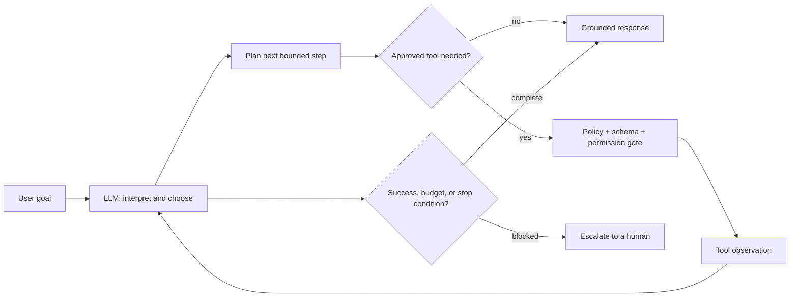
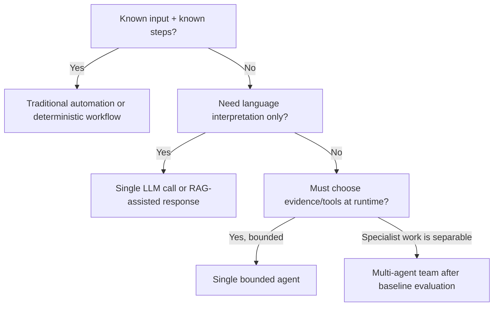

# 01 — AI Agents: Foundations

**Level:** Beginner · **Time:** 60 min · **Prerequisites:** None

**Scenario:** Northstar, a SaaS support team wants to reduce time-to-resolution for
checkout questions without giving an untrusted system permission to change
production data.
**Notebook:** [`01_agent_foundations.ipynb`](01_agent_foundations.ipynb)
**Runnable lab:** [`lab.py`](lab.py)

## Outcomes

After this lesson you can distinguish an LLM, chatbot, assistant, agent, and
agentic system; select deterministic automation, a workflow, RAG, or an agent
for a problem; identify the control boundary; and explain why reliability is a
system property rather than a prompt property.

## 1. The architecture ladder

An **LLM** predicts the next token. A **chatbot** exposes that model through a
conversation interface. An **assistant** adds useful instructions, context,
and perhaps a bounded retrieval or tool call. An **agent** lets the model decide
which permitted step or tool to use next, observes the result, and continues
until a completion or safety condition. An **agentic system** includes the agent
plus the surrounding application code that enforces identity, authorization,
state, evaluation, observability, budgets, and human oversight.

The word *agentic* should not mean “more autonomous.” It describes a system
where the model participates in choosing a path through tools and state. The
application, not the model, remains the authority for side effects.

This is the core mental model:

> **Goal → Observe → Reason → Plan → Act → Observe → Adapt → Complete**

“Reason” and “plan” may be one model call or an explicit state-graph node. Do
not require hidden chain-of-thought: record observable decisions, tool inputs,
tool outputs, policy results, and terminal reasons instead.

## 2. What makes a system agentic?

An agent needs more than text generation. It needs a goal, model-directed
next-step selection, bounded capabilities, environmental feedback, state, and
explicit terminal conditions. A useful test is: *can the model change the path
of execution based on new evidence?* If not, it is likely a deterministic
workflow with an LLM component—not an autonomous agent.

| Capability | LLM/chatbot | Assistant | Agent | Agentic system |
| --- | --- | --- | --- | --- |
| Produces language | Yes | Yes | Yes | Yes |
| Uses supplied context | Sometimes | Yes | Yes | Yes |
| Chooses a tool/next step | No | Usually fixed | Yes, within bounds | Yes, within application policy |
| Observes environment | No | Limited | Yes | Yes, with trace/audit |
| Can cause side effects | No | Only fixed code | Potentially | Only after authorization and approvals |
| Reliability controls | Prompt only | Some validation | Budgets/stops | Evals, permissions, monitoring, rollback |

## 3. Autonomy is a design choice

Use the lowest autonomy level that reliably meets the goal.

Autonomy levels are not maturity badges:

1. **Automation** — fixed code invokes a fixed action.
2. **Deterministic workflow** — fixed graph; an LLM may classify or draft at
   defined points.
3. **Agentic workflow** — a model makes a small number of bounded routing or
   planning decisions inside a graph.
4. **Bounded agent** — the model chooses from narrow tools in a loop with
   budget, policy, and terminal controls.
5. **Agent team** — specialists coordinate; use only if a measured single-agent
   baseline is insufficient.

## 4. Workflows, RAG, agents, and automation

| Need | Strong default | Why |
| --- | --- | --- |
| Copy known fields between systems | Traditional automation | Predictable, cheap, auditable |
| Produce a daily status report | Deterministic workflow | Steps and outputs are known |
| Answer policy questions with citations | RAG | Retrieve evidence; do not grant action authority |
| Investigate an ambiguous incident | Bounded agent | Evidence path is not known in advance |
| Reconcile a high-risk account | Workflow + human approval | Ambiguity does not justify unrestricted action |

RAG is a context mechanism, not an agent by itself. It becomes part of an
agentic system when a model dynamically chooses retrieval, evaluates evidence,
and continues within an explicitly bounded control loop.

## 5. When *not* to use an agent

Do not use one when the path is stable, errors are expensive or irreversible,
the required data/tool permissions are unavailable, success cannot be measured,
or latency/cost exceeds the value of flexibility. Start with a direct API call,
rules, a workflow, retrieval, or a human queue. A clever demo is not evidence
that an agent is the right production architecture.

## 6. Reliability: the agent problem is a systems problem

LLMs can select an irrelevant tool, invent confidence, stop too early, loop,
mis-handle ambiguous instructions, or encounter stale and adversarial tool
output. Reliability comes from layers around the model:

- **Instructions and tool contracts:** clear purpose, schemas, failure modes,
  and examples.
- **Application policy:** authentication, authorization, allowlists, rate
  limits, budgets, idempotency, and side-effect isolation.
- **State:** thread-scoped evidence versus long-term memory with retention and
  correction rules.
- **Control:** max steps, max tool calls, cost/time budgets, retries, safe
  fallback, and human escalation.
- **Evidence:** source identifiers, citation requirements, abstention when
  evidence is insufficient.
- **Evaluation and observability:** outcome, trajectory, policy compliance,
  latency, cost, and trace review.

## 7. Step-by-step design exercise

Work through the notebook, then apply this checklist to a proposed AI feature:

1. Write the user goal and a measurable success condition.
2. List facts the model may observe and separate them from instructions.
3. Write the smallest set of read-only tools; name every possible side effect.
4. Choose automation, workflow, RAG, or an agent and justify the decision.
5. State the maximum steps, tool calls, cost, and elapsed time.
6. Define completion, abstention, escalation, and rollback paths.
7. Test a normal case, missing-evidence case, tool-failure case, and malicious
   instruction case.
8. Measure success and trajectory quality before increasing autonomy.

## Technology map

- **Direct model APIs:** use to understand the loop before abstractions.
- **OpenAI Agents SDK:** managed tools, handoffs, sessions, guardrails, and
  tracing; use when its runtime model fits your control needs.
- **LangGraph:** explicit state, conditional edges, persistence, and
  human-in-the-loop; useful when durable workflow control matters.
- **MCP:** a protocol for exposing tools/context; it does not replace
  authorization or tool policy.
- **AutoGen and CrewAI:** team-oriented abstractions; adopt after a single-agent
  baseline proves coordination is needed.

## Watch For

- **Assumption failure:** The model hallucinates an unsupported parameter.
- **State leak:** Context is incorrectly preserved across runs.
- **Timeout:** The tool takes too long and the agent loops.
- **Auth bypass:** The agent attempts an action it shouldn't.

## Checkpoint

**1. Which are core components of a practical AI agent?**
- A) A model that chooses the next action
- B) Instructions that define goals and boundaries
- C) Tools that expose controlled operations
- D) A fashionable chat interface
- E) State and a bounded control loop

**2. Which are appropriate terminal conditions for an agent run?**
- A) A deterministic validator accepts the result
- B) The turn or spend budget is exhausted
- C) A policy requires human escalation
- D) The agent has called at least one tool
- E) No useful safe action remains

**3. What does a ReAct-style loop do?**
- A) Interleaves reasoning with actions and observations
- B) Uses observations to update subsequent decisions
- C) Requires model-weight updates after every tool call
- D) Lets tools gather information from an environment
- E) Guarantees that every trajectory is correct

**4. Which properties improve an agent-facing tool contract?**
- A) A narrow, unambiguous purpose
- B) Typed input and output schemas
- C) Useful errors and explicit risk metadata
- D) A single tool that performs every available operation
- E) Idempotency or preview support for risky writes

**5. Which controls are appropriate for long-term agent memory?**
- A) Store provenance for memory writes
- B) Scope memory by user and tenant
- C) Allow inspection and deletion
- D) Treat every model-generated memory as verified truth
- E) Apply validation and retention rules

## References

- [OpenAI: A practical guide to building agents](https://openai.com/business/guides-and-resources/a-practical-guide-to-building-ai-agents/) — agent definition, core components, tool categories, and incremental orchestration.
- [Anthropic: Building effective agents](https://www.anthropic.com/engineering/building-effective-agents) — workflow/agent distinction and the “simplest system” principle.
- [ReAct paper](https://arxiv.org/abs/2210.03629) — interleaving reasoning and actions with environmental observations.
- [LangGraph overview](https://docs.langchain.com/oss/python/langgraph/overview) — stateful orchestration concepts.
- [Model Context Protocol](https://modelcontextprotocol.io/) — interoperable tool/context integration; apply authorization independently.
