# Deep Dive: The ReAct Pattern

Before the ReAct (Reason + Act) pattern, LLMs were strictly conversational. If you asked an LLM to solve a complex math problem or query a database, it would attempt to output the final answer immediately in a single inference pass.

The ReAct pattern, introduced by researchers at Princeton and Google, introduced the idea of interleaving model reasoning and action selection with environmental observations, allowing later decisions to incorporate external feedback.



---

## 1. Historical ReAct Formulation

The original [ReAct paper](https://arxiv.org/abs/2210.03629) formulated a strict syntax where the LLM's output must contain:

1. **Thought:** The LLM explains its reasoning and decides what to do next.
2. **Action:** The LLM specifies a tool to use and the arguments to pass to it.
3. **Observation:** *[The LLM halts. The execution framework runs the tool and injects the raw result back into the prompt as the Observation.]*

This repeats until the LLM can formulate a final answer.

---

## 2. Production Adaptation & Observable Traces

The research implementation relied heavily on extracting `Thought` text via regex and appending the entire raw text trace to the context window. 

**Do NOT teach that ReAct requires exposing hidden chain-of-thought in production.**

For production systems, the focus is on observable execution records. You do not need to require or log hidden private reasoning. Instead, maintain an observable decision trace:

- decision
- action/tool
- arguments
- observation
- state change
- terminal reason

```json
{
  "step": 2,
  "decision": "inspect regional logs",
  "tool": "query_checkout_logs",
  "arguments": {"region": "eu-west"},
  "status": "success",
  "observation_summary": "Found 45 timeouts matching pattern.",
  "state_transition": "INVESTIGATE → INVESTIGATE"
}
```

This trace provides the audit log for explainability, rather than depending on raw unconstrained model "thoughts".

---

## 3. The Limits of Grounding

A common misconception is that using tools and observations mathematically prevents hallucination. **This is false.**

Tools and retrieval *can* improve grounding by providing factual evidence, but an agent can still:

- Choose the wrong tool entirely.
- Provide incorrect arguments.
- Misinterpret the observation text.
- Ignore evidence that contradicts its bias.
- Invent unsupported conclusions.
- Combine multiple pieces of evidence incorrectly.
- Stop too early before verifying the fix.

**Takeaway:** 
- Tool use != correctness.
- Observation != correct interpretation.
- Structured output != correct decision.

Grounding reduces some failure modes; it does not eliminate them.

---

## 4. Structured Tool Calling vs Regex

Early ReAct relied on regex to parse `Action: execute_sql(query="...")`. If the LLM output `Action :`, it failed.

Today, we use **Native Structured Tool Calling** (JSON schema). 
- It reduces syntactic and parsing failures.
- It provides typed and structured tool requests.
- It makes schema validation easier.
- It avoids fragile regex.
- It simplifies application dispatch.

However, native tool calling does **not** guarantee the correct tool is picked, the action is authorized, or the execution will succeed safely. Semantic validation and authorization must still occur in the application runtime.
