# Deep Dive: Modern Agent Execution Patterns

While early agent loops relied on simple, rigid `while` loops parsing unstructured text, modern runtimes make state and transitions far more explicit. The conceptual iteration (decide → execute → observe) still exists, but the architecture around it has matured.

---

## 1. The Full Execution Path

Structured outputs (native JSON tool calling) fix parsing errors, but they do not guarantee correctness or safety. The modern execution path looks like this:

`model tool proposal` → `schema validation` → `semantic/business validation` → `authorization` → `execution` → `observation`

---

## 2. Pattern Comparisons

Instead of declaring one framework as the ultimate SOTA, it's important to understand the different architectural patterns available today.

### A. Imperative Loops (Custom Code)
- **State:** In-memory variables or simple databases.
- **Next Step:** Custom python code (e.g. `while not done:`).
- **Strengths:** Maximum flexibility, zero dependencies.
- **Weaknesses:** Hard to inspect, pause, or resume.
- **Good For:** Small, simple, isolated agents.

### B. Graph / State-Machine Execution (e.g., LangGraph)
- **State:** Explicit typed state object passed between nodes.
- **Next Step:** Defined by conditional edges routing between nodes.
- **Strengths:** Explicit transitions, inspectability, easy human-in-the-loop (HITL) pausing, testability.
- **Weaknesses:** Can become overly complex for simple tasks.
- **Good For:** Controlled orchestration of multi-step workflows.

*(Note: State-machine/graph execution is an architectural pattern. LangGraph is just one popular implementation of this pattern.)*

### C. Event-Driven Execution
- **State:** Durable state tied to a case ID or event ID.
- **Next Step:** Triggered asynchronously by external events (e.g., webhook, message queue).
- **Strengths:** Scalable, responsive to environment.
- **Weaknesses:** Duplicate events, stale data.
- **Good For:** Systems that must wait on humans or long-running external processes.

### D. Durable Workflows (e.g., Temporal)
- **State:** Persisted durably by an orchestration engine.
- **Next Step:** Workflow orchestrator guarantees execution progression.
- **Strengths:** Crash recovery, durable timers, reliable retries.
- **Weaknesses:** Heavy infrastructure requirements.
- **Good For:** When tasks run for a long time, workers might restart, or you need guaranteed crash recovery.

---

## 3. Checkpointed Execution

One major benefit of modern state machines and graphs is **Checkpoints**. 

Because the state is explicitly defined, the framework can automatically serialize the state at every transition (e.g., saving to Postgres). 
- If an agent hits an error at step 4, you can resume from step 4 instead of restarting from step 1.
- You can introduce "time travel debugging" by querying the database to see exactly what the agent knew at a specific point in time.
