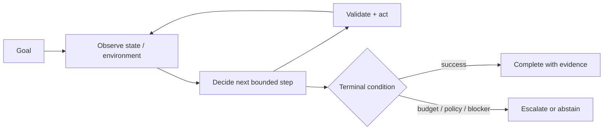
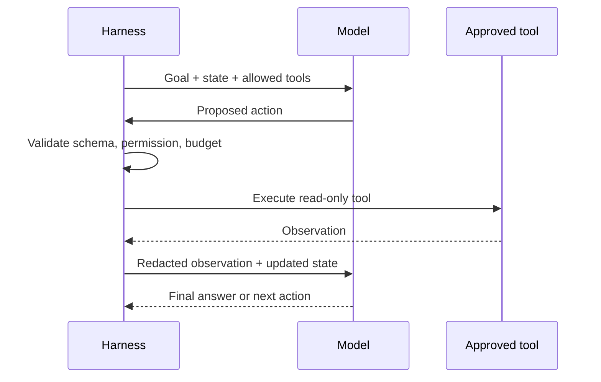
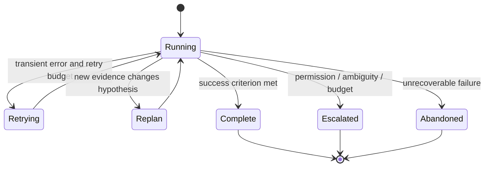

# 02 — The Agent Loop

**Notebook:** [`agent_loop.ipynb`](agent_loop.ipynb)
**Run:** [`lab.py`](lab.py)

An agent is not a magical prompt. It is a bounded execution loop in which a
model proposes a next step, the application validates and performs permitted
work, the environment returns an observation, and the system either adapts or
stops. This lesson uses a fictional checkout incident to evolve from a tiny
state machine to a traceable tool-using investigator.

## Outcomes

You will be able to model the agent execution loop, distinguish observations
from instructions, select ReAct, Plan-and-Execute, reflection, and event-driven
patterns, specify termination and recovery rules, and design an agent harness
that cannot run forever.

## 1. The execution contract

The model may choose *among* approved next steps. Application code owns tool
schema validation, authorization, state updates, retries, budgets, idempotency,
tracing, and termination. Treat tool output, retrieved text, and user input as
observations—not privileged instructions.

| Element | Question | Example |
| --- | --- | --- |
| Goal | What counts as success? | Identify supported checkout response |
| State | What must persist? | Evidence, attempts, costs, pending approval |
| Action | What may happen? | Read service health; never restart directly |
| Observation | What changed? | Timeout spike, tool failure, new customer reply |
| Policy | What is blocked? | Production restart without human approval |
| Terminal rule | When do we stop? | Evidence supports answer, budget reached, or escalation |

## 2. Thought/action/observation cycles

The **ReAct** pattern interleaves a visible decision/action record with an
environmental observation. The key engineering lesson is feedback: an action
without an observation cannot correct a mistaken plan. Record a concise trace
such as `hypothesis → allowed tool → arguments → result → next decision`; do
not depend on hidden reasoning as an audit log.

The original [ReAct paper](https://arxiv.org/abs/2210.03629) showed that
interleaving reasoning and actions can improve interactive task behavior and
make trajectories easier to inspect. In production, that insight becomes a
bounded state transition system, not an invitation to expose private reasoning.

## 3. Pattern selection

| Pattern | Use it when | Guardrail |
| --- | --- | --- |
| ReAct | The next evidence/tool depends on the previous observation | Step/tool/cost budgets |
| Plan-and-Execute | A coarse plan improves coordination for a longer task | Replan only when evidence invalidates a plan step |
| Reflection loop | There is a concrete rubric or test to improve output | Cap revisions; evaluator does not authorize actions |
| Event-driven agent | Work resumes on a ticket, callback, or approval event | Idempotency key and durable state |
| Deterministic state machine | States and transitions are known | Keep model decisions out of critical routing |

Plan-and-Execute is not always better than ReAct: a fixed plan can become stale.
Use it when planning reduces uncertainty, then make replanning an explicit state
transition triggered by evidence—not an endless “think again” loop.

## 4. Termination, recovery, and runaway prevention

Every run needs multiple terminal paths: success, evidence-insufficient
abstention, policy block, human escalation, timeout, step limit, tool-call
limit, cost limit, and unrecoverable tool error. Retrying is appropriate only
for defined transient failures. Invalid arguments require correction;
permission denials require escalation; repeated observations or actions should
terminate rather than accumulate cost.

Practical runaway controls: monotonic budget counters, duplicate-action
detection, no-progress threshold, deadline, idempotency keys for events,
bounded retries with backoff, a kill switch, and traces that make the stop
reason observable.

## 5. The agent harness

The **harness** is the application runtime around a model: state store, tool
registry/dispatcher, input-output validation, policy enforcement, event queue,
trace collector, evaluator hooks, and human handoff. Frameworks such as the
[OpenAI Agents SDK](https://openai.github.io/openai-agents-python/),
[LangGraph](https://docs.langchain.com/oss/python/langgraph/overview), and
[Temporal](https://temporal.io/) can help, but none removes the need to define
authority and termination in your application.

## Step-by-step lab

1. Run `python curriculum/beginner/02-agent-loop/lab.py` and inspect the tiny
   `FoundationState` trace.
2. Run the checkout investigator and identify the model, tool, observation, and
   application-policy boundary.
3. Lower a step, tool, or cost budget; explain the safe terminal outcome.
4. Trigger the “keep investigating” case and verify that it terminates.
5. Add a transient tool failure with one retry, then compare it with a
   permission denial that must escalate.
6. Write a no-progress rule for repeated tool calls.
7. Decide whether your own use case needs ReAct, a state graph, or a fixed
   workflow, and justify the choice with a measurable success criterion.

## References

- [ReAct: Synergizing Reasoning and Acting in Language Models](https://arxiv.org/abs/2210.03629)
- [OpenAI: A practical guide to building agents](https://openai.com/business/guides-and-resources/a-practical-guide-to-building-ai-agents/)
- [Anthropic: Building effective agents](https://www.anthropic.com/engineering/building-effective-agents)
- [LangGraph overview](https://docs.langchain.com/oss/python/langgraph/overview)
- [Agent survey: the landscape of LLM agents](https://arxiv.org/abs/2309.07864)
