# 02 — The Agent Loop

**Level:** Beginner · **Time:** 60 min · **Prerequisites:** None

**Scenario:** Northstar, a SaaS support team, wants to automate incident diagnosis. Specifically, "European customers cannot complete checkout." They need a system that can look up orders, search logs, and read runbooks to diagnose the issue, without giving an untrusted system permission to change production data.

**Notebook:** [`02_agent_loop.ipynb`](02_agent_loop.ipynb)

An agent is not a magical prompt. It is a bounded execution loop in which a model proposes a next step, the application validates and performs permitted work, the environment returns an observation, and the system either adapts or stops. This lesson uses the Northstar checkout incident to evolve from a naive while-loop to a traceable, typed, tool-using execution loop.

## Outcomes

You will be able to model the agent execution loop, distinguish observations from instructions, select the right execution pattern (ReAct, Plan-and-Execute, reflection, event-driven, or graph execution), specify termination and recovery rules, and design an agent harness that prevents infinite runaway loops.



## 1. The Execution Contract

**HOW DOES AN AGENT ACTUALLY EXECUTE?**

The central mental model you must adopt is:

`Goal` → `State` → `Model proposes next action` → `Runtime validates + authorizes` → `Tool/environment executes` → `Observation` → `State update` → `Continue / replan / retry / stop / escalate`

The model may choose *among* approved next steps. **Application code (the runtime)** owns tool schema validation, authorization, state updates, retries, budgets, idempotency, tracing, and termination. Treat tool output, retrieved text, and user input as *observations*—not privileged instructions.

## 2. Typed Agent State and Transitions

An agent's state is not just a raw list of chat messages. A professional agent requires a typed state using `Pydantic` or `TypedDict` to track progression, evidence, and bounds.

```python
class AgentState(BaseModel):
    goal: str
    evidence: list[Evidence]
    steps: int
    tool_calls: int
    retries: int
    cost_usd: float
    seen_actions: set[str]
    current_hypothesis: str | None
    terminal_reason: str | None
```

### Explicit State Transitions
Instead of letting the LLM output whatever it wants, we enforce transition guards. For an incident flow like `TRIAGE → INVESTIGATE → RECOMMEND → COMPLETE`, the transitions are explicitly checked:

- `TRIAGE → INVESTIGATE`: Only if evidence is insufficient.
- `INVESTIGATE → RECOMMEND`: Only if the evidence threshold is met.
- `INVESTIGATE → ESCALATE`: If permission is required or no progress is made.

## 3. Pattern Selection Taxonomy

Agents can execute using different architectural patterns depending on the task. These patterns can also be combined.

| Pattern | Who chooses next step? | Best for | Main risk | Key control |
| --- | --- | --- | --- | --- |
| **Fixed workflow** | Code | Known process | Brittleness | Explicit transitions/tests |
| **ReAct-style loop** | Model | Evidence gathering | Loops/wrong tool | Step/tool/cost budgets |
| **Plan-and-Execute** | Planner + executor | Longer tasks | Stale plan | Evidence-triggered replan |
| **Reflection** | Model/evaluator | Revisable outputs | Endless revision | Rubric + revision cap |
| **Event-driven** | Event + state | Long-running work | Duplicates/stale events | Durable state + idempotency |
| **Graph/state machine**| Graph + bounded model | Controlled orchestration | Complexity | Explicit state + transitions |

## 4. Termination Conditions

A loop must terminate safely. "The model emitted a final answer" is not always sufficient. For enterprise systems, success may also require output validation and policy checks. 

Define explicit terminal states:
- `SUCCESS`: Goal met and validated.
- `INSUFFICIENT_EVIDENCE`: Exhausted all avenues but cannot conclude.
- `POLICY_BLOCK`: An action violated business rules.
- `HUMAN_ESCALATION`: Required permission or edge case detected.
- `TOOL_FAILURE`: An external system is unrecoverably down.
- `STEP_BUDGET_EXHAUSTED` / `COST_BUDGET_EXHAUSTED`: Hard limit hit.
- `NO_PROGRESS`: The agent is stuck in a loop.



## 5. No-Progress Detection & Runaway Prevention

An unbounded `while` loop is dangerous. To prevent an agent from repeatedly issuing the same bad arguments:
```text
search logs → same result → search logs → same result → search logs
```
We track a fingerprint of `(tool_name, normalized_arguments)`. If this is seen multiple times without the state significantly changing, we hit the `NO_PROGRESS` terminal condition and escalate.

## 6. Error Classification, Retry, and Idempotency

Retry is a policy decision, not a universal error handler.

- **Timeout**: Backoff + retry if budget allows.
- **HTTP 429**: Backoff + retry.
- **Temporary 5xx**: Bounded retry.
- **Malformed arguments**: Correct once or replan.
- **Permission denied**: Do NOT retry. Escalate immediately.
- **Resource not found**: Obtain new evidence or stop.
- **Deterministic 400**: Do not blindly retry.

### Idempotency
Retrying `get_service_health()` is safe (read-only). Retrying `charge_credit_card()` or `restart_server()` is not. Use idempotency keys and distinguish read-only operations from non-idempotent writes.

## 7. The Agent Harness (Frameworks)

The **harness** is the application runtime around a model. Frameworks such as the [OpenAI Agents SDK](https://openai.github.io/openai-agents-python/), [LangGraph](https://docs.langchain.com/oss/python/langgraph/overview), [PydanticAI](https://pydantic.ai/), or [Google ADK](https://github.com/google/agent-development-kit) can help manage this state, but none removes the need to define authority and termination in your application.

**LangGraph** is one implementation of the state-machine/graph execution pattern. It helps provide explicit state and conditional transitions, but it is not automatically "production ready" without authorization, idempotency, and security.

**Temporal** is primarily a durable workflow orchestration system, not an agent framework. It is useful when tasks run for a long time, workers may restart, or humans/events interrupt execution.

## Checkpoint

1. **A tool returns `PermissionDenied`. What should the loop do?**
   - *Answer: Escalate or Stop. Retrying a hard permission denial is a waste of budget.*
2. **The same tool and arguments are executed three times with the same result. What control should activate?**
   - *Answer: No-Progress detection should terminate the run or force a replan to prevent an infinite loop.*
3. **A new deployment invalidates the original diagnosis plan. Retry or replan?**
   - *Answer: Replan. The evidence has changed the world state.*
4. **Does structured tool calling (JSON) guarantee correct tool choice?**
   - *Answer: No. It reduces parsing errors, but the model can still choose the wrong tool or hallucinate semantically invalid arguments.*
5. **When should Plan-and-Execute be preferred over ReAct?**
   - *Answer: When a coarse plan improves coordination for a longer task, reducing the uncertainty of immediate next steps.*
6. **Why is an event ID useful in event-driven agents?**
   - *Answer: It provides an idempotency key to prevent duplicate work if an event is redelivered.*

## Practical Design Checklist

- [ ] Is the goal explicit?
- [ ] Is state typed (e.g., Pydantic/TypedDict)?
- [ ] Are actions constrained to a registry?
- [ ] Are tool inputs validated with a schema?
- [ ] Is authorization outside the model?
- [ ] Are terminal conditions explicit (Success, Escalate, Budget)?
- [ ] Are step, tool, and cost budgets defined?
- [ ] Are retries classified (transient vs deterministic)?
- [ ] Is no-progress detected?
- [ ] Are side effects idempotent where needed?
- [ ] Is an observable trace produced?
- [ ] Can the run safely abstain or escalate?

## Further Deep Dives

To truly master the agent loop in an enterprise context, review the following expanded topics:

- [The ReAct Pattern Deep Dive](DEEP_DIVE_REACT_PATTERN.md)
- [Modern Agent Execution Patterns](DEEP_DIVE_SOTA_LOOPS.md)

## References

- [ReAct: Synergizing Reasoning and Acting in Language Models](https://arxiv.org/abs/2210.03629)
- [Anthropic: Building effective agents](https://www.anthropic.com/engineering/building-effective-agents)
- [OpenAI: A practical guide to building agents](https://openai.com/business/guides-and-resources/a-practical-guide-to-building-ai-agents/)
- [LangGraph overview](https://docs.langchain.com/oss/python/langgraph/overview)
- [Temporal](https://temporal.io/)
