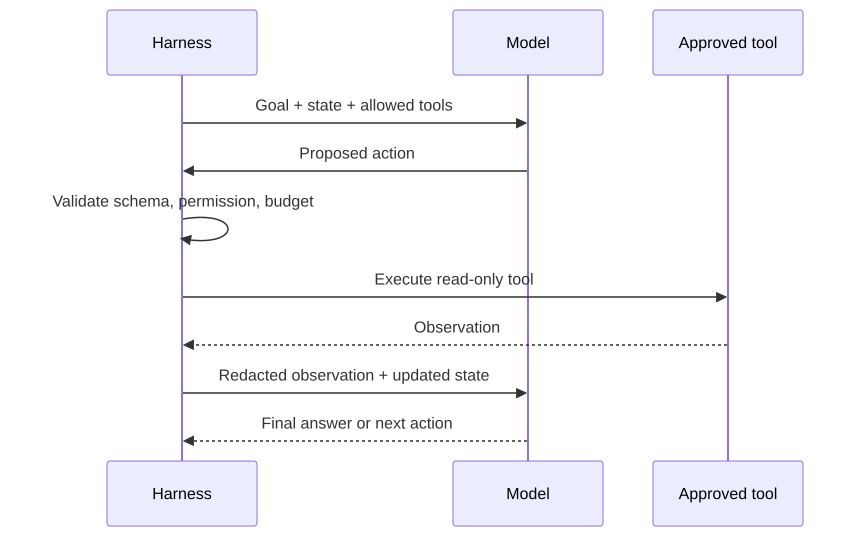

# 02 — The Agent Loop

**Level:** Beginner · **Time:** 60 min · **Prerequisites:** None

**Scenario:** Northstar, a SaaS support team, is integrating this concept into their agentic workflow.

**Notebook:** [`02_agent_loop.ipynb`](02_agent_loop.ipynb)

An agent is not a magical prompt. It is a bounded execution loop in which a
model proposes a next step, the application validates and performs permitted
work, the environment returns an observation, and the system either adapts or
stops. This lesson uses a fictional checkout incident to evolve from a tiny
state machine to a traceable tool-using investigator.

## Outcomes

You will be able to model the agent execution loop, distinguish observations
from instructions, select ReAct, Plan-and-Execute, reflection, and event-driven
patterns, specify termination and recovery rules, and design an agent harness
that cannot run forever.



## 1. The execution contract

The model may choose *among* approved next steps. Application code owns tool
schema validation, authorization, state updates, retries, budgets, idempotency,
tracing, and termination. Treat tool output, retrieved text, and user input as
observations—not privileged instructions.

| Element | Question | Example |
| --- | --- | --- |
| Goal | What counts as success? | Identify supported checkout response |
| State | What must persist? | Evidence, attempts, costs, pending approval |
| Action | What may happen? | Read service health; never restart directly |
| Observation | What changed? | Timeout spike, tool failure, new customer reply |
| Policy | What is blocked? | Production restart without human approval |
| Terminal rule | When do we stop? | Evidence supports answer, budget reached, or escalation |

## 2. Thought/action/observation cycles

The **ReAct** pattern interleaves a visible decision/action record with an
environmental observation. The key engineering lesson is feedback: an action
without an observation cannot correct a mistaken plan. Record a concise trace
such as `hypothesis → allowed tool → arguments → result → next decision`; do
not depend on hidden reasoning as an audit log.



The original [ReAct paper](https://arxiv.org/abs/2210.03629) showed that
interleaving reasoning and actions can improve interactive task behavior and
make trajectories easier to inspect. In production, that insight becomes a
bounded state transition system, not an invitation to expose private reasoning.

## 3. Pattern selection

| Pattern | Use it when | Guardrail |
| --- | --- | --- |
| ReAct | The next evidence/tool depends on the previous observation | Step/tool/cost budgets |
| Plan-and-Execute | A coarse plan improves coordination for a longer task | Replan only when evidence invalidates a plan step |
| Reflection loop | There is a concrete rubric or test to improve output | Cap revisions; evaluator does not authorize actions |
| Event-driven agent | Work resumes on a ticket, callback, or approval event | Idempotency key and durable state |
| Deterministic state machine | States and transitions are known | Keep model decisions out of critical routing |

Plan-and-Execute is not always better than ReAct: a fixed plan can become stale.
Use it when planning reduces uncertainty, then make replanning an explicit state
transition triggered by evidence—not an endless “think again” loop.

## 4. Termination, recovery, and runaway prevention

Every run needs multiple terminal paths: success, evidence-insufficient
abstention, policy block, human escalation, timeout, step limit, tool-call
limit, cost limit, and unrecoverable tool error. Retrying is appropriate only
for defined transient failures. Invalid arguments require correction;
permission denials require escalation; repeated observations or actions should
terminate rather than accumulate cost.



Practical runaway controls: monotonic budget counters, duplicate-action
detection, no-progress threshold, deadline, idempotency keys for events,
bounded retries with backoff, a kill switch, and traces that make the stop
reason observable.

## 5. The agent harness

The **harness** is the application runtime around a model: state store, tool
registry/dispatcher, input-output validation, policy enforcement, event queue,
trace collector, evaluator hooks, and human handoff. Frameworks such as the
[OpenAI Agents SDK](https://openai.github.io/openai-agents-python/),
[LangGraph](https://docs.langchain.com/oss/python/langgraph/overview), and
[Temporal](https://temporal.io/) can help, but none removes the need to define
authority and termination in your application.

## 6. Worked examples: every loop pattern

All examples use the same support request: “European customers cannot complete
checkout.” They are deliberately small; production implementations add typed
schemas, authorization, tracing, and tests around the same transitions.

### Agent execution loop

```python
state = {"goal": "diagnose checkout", "evidence": [], "steps_left": 4}
while state["steps_left"] and not state.get("done"):
    action = decide_next_step(state)       # model-assisted, bounded choice
    observation = dispatch_if_allowed(action)
    state["evidence"].append(observation)
    state["done"] = evidence_is_sufficient(state["evidence"])
    state["steps_left"] -= 1
```

### Thought/action/observation (ReAct)

```text
Decision: “Health is degraded; inspect active checkout incidents.”
Action:   search_incidents("active checkout")
Observation: INC-1042 reports payment gateway timeouts.
Next decision: retrieve the checkout runbook, then prepare a support response.
```

The trace records the decision and evidence, not hidden private reasoning.

### Termination conditions

```python
if supported_answer_ready(state): stop("success")
elif state.tool_calls >= 10: stop("tool_budget_exhausted")
elif state.cost_usd >= 0.05: stop("cost_budget_exhausted")
elif state.repeated_actions >= 2: stop("no_progress_escalate")
```

### State machine

```python
TRANSITIONS = {
    "triage": {"need_evidence": "investigate", "safe": "complete"},
    "investigate": {"evidence_found": "recommend", "blocked": "escalate"},
    "recommend": {"approved": "complete"},
}
```

Unlike an unstructured while-loop, a state machine makes permitted transitions
reviewable and testable.

### Event-driven agent

```python
def on_customer_reply(event):
    if event.id in processed_event_ids:  # idempotency prevents duplicate work
        return "already processed"
    processed_event_ids.add(event.id)
    return resume_case(event.case_id, new_observation=event.message)
```

Use this for a ticket reply, approval callback, or deployment event—not a
polling loop that wakes indefinitely.

### Plan-and-Execute

```python
plan = ["check health", "inspect deployment", "query regional logs", "recommend"]
for step in plan:
    result = execute(step)
    if contradicts_plan(result):
        plan = replan_from(result)  # record why this plan changed
```

This is useful when the work has a coherent outline. A small incident usually
does not need a costly planner before every tool call.

### Reflection loop

```python
draft = recommend(evidence)
for _ in range(2):
    critique = check(draft, rubric="claims must cite evidence; no production action")
    if critique.passed: break
    draft = revise(draft, critique)
```

Reflection needs a rubric and a revision limit. “Reflect until perfect” is a
runaway-loop instruction, not a control.

### Retry and recovery

```python
try:
    logs = query_logs()
except ToolTimeout:
    logs = retry_once_with_backoff(query_logs)
except PermissionDenied:
    return escalate("on-call approval required")
except InvalidArguments:
    return correct_or_stop("tool schema error")
```

Retry only failures that are plausibly transient. Never retry an unauthorized
write in the hope that it will become authorized.

### Dynamic replanning

```python
if observation["latest_deploy"] != assumed_deploy:
    state["hypothesis"] = "release regression possible"
    state["replan_reason"] = "new deployment evidence"
    next_action = "inspect_deployment_diff"
```

Replanning is a response to a changed world state, not a synonym for asking the
model to think longer.

### Harness boundary

```python
proposal = model.choose_action(state, ALLOWED_TOOL_SCHEMAS)
validated = validate_schema(proposal)
authorize(current_user, validated.tool, validated.arguments)
trace.append(validated.redacted())
result = execute(validated)  # only this layer touches an external system
```

### Preventing runaway/infinite loops

```python
fingerprint = (action.name, freeze(action.arguments))
if fingerprint in state.seen_actions:
    return escalate("repeated action without new evidence")
state.seen_actions.add(fingerprint)
```

Combine this duplicate-action guard with step/time/cost limits, a no-progress
counter, deadlines, kill switches, and human escalation.

## Step-by-step lab

1. Run `python curriculum/beginner/02-agent-loop/lab.py` and inspect the tiny
   `FoundationState` trace.
2. Run the checkout investigator and identify the model, tool, observation, and
   application-policy boundary.
3. Lower a step, tool, or cost budget; explain the safe terminal outcome.
4. Trigger the “keep investigating” case and verify that it terminates.
5. Add a transient tool failure with one retry, then compare it with a
   permission denial that must escalate.
6. Write a no-progress rule for repeated tool calls.
7. Decide whether your own use case needs ReAct, a state graph, or a fixed
   workflow, and justify the choice with a measurable success criterion.

## Watch For

- **Assumption failure:** The model hallucinates an unsupported parameter.
- **State leak:** Context is incorrectly preserved across runs.
- **Timeout:** The tool takes too long and the agent loops.
- **Auth bypass:** The agent attempts an action it shouldn't.

## Checkpoint

**1. What is the primary purpose of this module?**
- A) To understand the core concept.
- B) To write complex boilerplate.
- C) To ignore system errors.
- D) To bypass security.

**2. How do we mitigate the primary failure mode?**
- A) Retries.
- B) Human approval.
- C) Logging.
- D) Idempotency keys.

## References

- [ReAct: Synergizing Reasoning and Acting in Language Models](https://arxiv.org/abs/2210.03629)
- [OpenAI: A practical guide to building agents](https://openai.com/business/guides-and-resources/a-practical-guide-to-building-ai-agents/)
- [Anthropic: Building effective agents](https://www.anthropic.com/engineering/building-effective-agents)
- [LangGraph overview](https://docs.langchain.com/oss/python/langgraph/overview)
- [Agent survey: the landscape of LLM agents](https://arxiv.org/abs/2309.07864)

## Deep Dives & State of the Art

To truly master the agent loop in an enterprise context, review the following expanded topics:

- **[The ReAct Pattern Deep Dive](DEEP_DIVE_REACT_PATTERN.md)**
- **[State of the Art (SOTA) Agent Loops (Reflexion, Plan-and-Solve)](DEEP_DIVE_SOTA_LOOPS.md)**


## SOTA Deep Dives
Explore industry-standard architectural patterns and enterprise implementation details:

- [React Pattern](DEEP_DIVE_REACT_PATTERN.md)
- [Sota Loops](DEEP_DIVE_SOTA_LOOPS.md)
