# 03 — Agent or Workflow?

**Level:** Beginner · **Time:** 60 min · **Prerequisites:** None

**Scenario:** Northstar - European customers report checkout failures. Is a status report,
runbook workflow, bounded investigator, or specialist team warranted?
**Notebook:** [`03_workflow_or_agent.ipynb`](03_workflow_or_agent.ipynb)

## Outcomes

Choose the least autonomous reliable architecture; describe the difference
between deterministic workflows, agentic workflows, agents, and teams; and
justify that decision with uncertainty, risk, observability, cost, latency, and
evaluation criteria rather than with novelty.

## The design rule

Start with the simplest system that reliably solves a representative task. A
workflow is not inferior to an agent: it is usually cheaper, easier to test,
and easier to audit when the path is known. Add model-directed choice only where
fixed routing cannot handle meaningful variation.



## Architecture vocabulary

| Architecture | Who controls the path? | Best fit | Example |
| --- | --- | --- | --- |
| Traditional automation | Deterministic code | Stable, structured trigger/action | Copy customer tier to ticket |
| Deterministic workflow | Explicit graph/code | Known stages with clear branches | Health check → format daily report |
| Agentic workflow | Graph is fixed; model decides a bounded node | A few local judgments | If unhealthy, summarize the relevant runbook |
| Bounded agent | Model selects next approved tool from state | Investigation path discovered by evidence | Diagnose Europe-only checkout failures |
| Multi-agent team | Coordinator/specialists coordinate | Context or work is truly separable | Observability + deployment + customer impact review |

## Three worked tasks

### Task A — known status report: no agent

```python
status = get_service_status("checkout")
report = format_status_report(status)
```

The steps are known. An LLM might polish wording, but it should not control
execution. Measure freshness, correctness, latency, and formatting validity.

### Task B — bounded unhealthy-check workflow

```python
status = get_service_status("checkout")
if status["health"] != "healthy":
    runbook = get_runbook("checkout")
    return summarize_for_support(runbook, status)
return "Checkout is healthy; no incident response is needed."
```

The branch is predetermined. A model can summarize the runbook but does not
choose whether to restart, deploy, or search arbitrary systems.

### Task C — dynamic regional investigation: bounded agent

```text
observe service health
  → inspect recent incidents
  → inspect latest deployment
  → query Europe logs
  → retrieve the relevant runbook
  → recommend or escalate
```

The correct next evidence source depends on what has already been observed.
Use narrow read-only tools, explicit budgets, and an evidence requirement before
concluding a cause.

## Decision dimensions

| Dimension | Workflow signal | Agent signal |
| --- | --- | --- |
| Path uncertainty | Steps are enumerable | Evidence determines next step |
| Risk | Action can be coded and validated | Need policy gates, budgets, and escalation |
| Evaluation | Output/branch assertions | Outcome **and** trajectory/tool-use assertions |
| Latency/cost | Predictable | Variable; must earn the increase |
| Debugging | Trace fixed nodes | Inspect state, tool calls, observations, and stop reason |
| Change rate | Stable process | Frequent exceptions/unstructured inputs |

## When *not* to use an agent

Avoid an agent where rules or APIs can directly solve the task, actions are
irreversible, environment feedback is weak, success is unmeasurable, permissions
are too broad, or an acceptable fixed workflow already exists. Retrieval is
often enough for “answer from current documents.” A human approval workflow is
often safer for a consequential action even if an agent prepared the evidence.

## Technology choices

- **Python/direct API:** start here to make the graph and policy visible.
- **LangGraph:** use when explicit state, conditional edges, checkpoints, or
  durable resumes clarify the workflow.
- **OpenAI Agents SDK:** use for a managed single-agent loop with tools,
  guardrails, sessions, and tracing; retain application authorization.
- **Temporal or a queue/workflow engine:** use for long-running, event-driven,
  retryable business processes; an LLM does not replace durable orchestration.
- **AutoGen/CrewAI:** only after evaluation demonstrates that specialist
  coordination beats a single-agent or workflow baseline.

## Step-by-step training

1. Run the lab and trace Tasks A, B, and C.
2. Identify every deterministic transition in Task B.
3. For Task C, list the allowed tools, prohibited actions, and stop criteria.
4. Change the service status to healthy; verify the workflow avoids needless
   retrieval and model calls.
5. Inject conflicting deployment evidence; write the agent’s replan rule.
6. Compare a single-agent and multi-agent proposal on success, latency, cost,
   tool calls, and coordination overhead.
7. Create a release gate: correct outcome, no forbidden action, supported
   recommendation, bounded trajectory, and acceptable cost.

## Watch For

- **Assumption failure:** The model hallucinates an unsupported parameter.
- **State leak:** Context is incorrectly preserved across runs.
- **Timeout:** The tool takes too long and the agent loops.
- **Auth bypass:** The agent attempts an action it shouldn't.

## Checkpoint

**1. Which statements correctly distinguish workflows from agents?**
- A) A workflow follows code-defined paths
- B) An agent dynamically directs its process and tool use
- C) A workflow can still contain model decisions
- D) Every multi-step model application is automatically an agent
- E) A fixed workflow may be preferable for predictable tasks

**2. Which practices make a long-running agent loop more reliable?**
- A) Checkpoint meaningful state
- B) Represent failures as typed states
- C) Retry every write after any timeout
- D) Cap turns, time, tokens, tool calls, and spend
- E) Record a clear termination reason

**3. What makes a human-approval checkpoint effective?**
- A) It occurs before the consequential side effect
- B) It shows the exact action, target, evidence, and expected effect
- C) It supports approve, edit, reject, or redirect outcomes
- D) It asks only a context-free 'Approve?' question
- E) The workflow checkpoints state while waiting

**4. When can a multi-agent design be justified?**
- A) Independent subtasks benefit from parallel execution
- B) Specialists need distinct context, tools, or policies
- C) Evaluation shows a meaningful gain over a simpler baseline
- D) The architecture looks more impressive in a demo
- E) An orchestrator can define clear delegation contracts

## References

- [Anthropic: Building effective agents](https://www.anthropic.com/engineering/building-effective-agents) — workflow/agent distinction and incremental complexity.
- [OpenAI: A practical guide to building agents](https://openai.com/business/guides-and-resources/a-practical-guide-to-building-ai-agents/) — agent definition, tools, orchestration, and guardrails.
- [LangGraph overview](https://docs.langchain.com/oss/python/langgraph/overview) — stateful graph orchestration.
- [ReAct](https://arxiv.org/abs/2210.03629) — evidence-driven reasoning/action cycles.
- [The Landscape of Emerging AI Agent Architectures](https://arxiv.org/abs/2309.07864) — survey context for planning, tools, memory, and feedback.

## Deep Dives & State of the Art

To understand when to build an agent vs a workflow, review these expanded topics:

- **[DAGs vs Agents: An Architectural Deep Dive](DEEP_DIVE_DAGS_VS_AGENTS.md)**
- **[State of the Art Framework Comparison (LangGraph vs AutoGen)](DEEP_DIVE_FRAMEWORK_COMPARISON.md)**


## SOTA Deep Dives
Explore industry-standard architectural patterns and enterprise implementation details:

- [Dags Vs Agents](DEEP_DIVE_DAGS_VS_AGENTS.md)
- [Framework Comparison](DEEP_DIVE_FRAMEWORK_COMPARISON.md)
