# 03 — Agent or Workflow?

**Level:** Beginner · **Time:** 60 min · **Prerequisites:** None

**Scenario:** Northstar — European customers report checkout failures. Is a status report, runbook workflow, bounded investigator, or specialist team warranted?

**Notebook:** [`03_workflow_or_agent.ipynb`](03_workflow_or_agent.ipynb)

## Outcomes

You will be able to justify architectural choices using evidence rather than novelty. You will learn to choose the **least autonomous reliable architecture**, describe the difference between a workflow, an LLM-enhanced workflow, an agentic workflow, a bounded agent, and a multi-agent system, and evaluate them based on path uncertainty, risk, cost, and observability.

---

## 1. The Design Rule

**START WITH THE SIMPLEST ARCHITECTURE THAT RELIABLY SOLVES THE REPRESENTATIVE TASK.**

More autonomy does not mean more advanced engineering. An agent is not the default architecture for every LLM application. A deterministic workflow is often superior: it is usually cheaper, easier to test, and easier to audit when the execution path is known. Add model-directed choice only where fixed routing cannot handle meaningful variation.

## 2. The Architecture Spectrum

The following 6-level spectrum defines how much control the application code has vs the model.



### Level 0 — Deterministic Code
Application code controls everything.
*Example:* `status = get_service_status(); return format_report(status)`

### Level 1 — Deterministic Workflow
Branches are explicitly coded.
*Example:* `health check → if unhealthy → retrieve runbook → create ticket`

### Level 2 — Workflow with LLM Nodes
The model performs a bounded cognitive task but does not own the overall process.
*Example:* `retrieve ticket → classify intent with LLM → route using structured output → deterministic downstream workflow`
*(Note: LLM usage != agent!)*

### Level 3 — Agentic Workflow
The macro process is controlled, but a model may decide locally which evidence source to inspect or which bounded subtask to execute.

### Level 4 — Bounded Agent
The model dynamically chooses the next approved action from state. The runtime still enforces available tools, authorization, budgets, and terminal conditions.

### Level 5 — Multi-Agent System
Multiple independent agents collaborate. Used *only* where specialization, parallelism, context isolation, or organizational boundaries justify the immense coordination overhead.

---

## 3. Architecture Decision Framework

How do you choose? Answer these questions to measure your path uncertainty, risk, and budget constraints:

1. **Can the valid path be reasonably enumerated?** (If yes → Workflow)
2. **Does the next step depend on evidence discovered at runtime?** (If yes → Agent)
3. **Is success objectively measurable?** (If no → Reconsider automating)
4. **Are failures reversible?** (If no → Strict Workflow / Human Gate)
5. **Would adaptive behavior materially improve success?** (If yes → Agent)
6. **Does multi-agent decomposition have a measurable advantage?** (If no → Single Agent)

### The Decision Tree

```text
Can deterministic code solve it?
  ├── Yes → Use deterministic code
  └── No  → Can the process path be enumerated?
              ├── Yes → Use workflow
              └── No  → Does an LLM only need to perform a local judgment?
                          ├── Yes → Use workflow + LLM node
                          └── No  → Does runtime evidence dictate the next step?
                                      ├── Yes → Consider bounded agent
                                      └── Then: Can the problem be decomposed into independently valuable specialists?
                                                  ├── No  → Single agent
                                                  └── Yes → Evaluate multi-agent if outcomes justify cost
```

---

## 4. Burden Models: The Cost of Complexity

Complexity must earn its place. As you move up the spectrum, operational burdens increase:

- **Cost:** Deterministic workflows have predictable costs. Agents introduce variable token usage. Multi-agent systems multiply model calls and coordination overhead.
- **Evaluation Burden:** Evaluating a workflow means testing inputs against expected branches. Evaluating an agent requires testing the *trajectory*, tool selection, arguments, and terminal conditions.
- **Observability Burden:** Workflow tracing is simple (node, branch, error). Agent tracing requires capturing state, model decisions, tool calls, and stop reasons. Multi-agent tracing adds delegation, identity, and handoffs.

---

## 5. When NOT to use an Agent

Do not build an agent just to avoid writing business rules. Avoid agents when:
- The workflow is already known.
- Success requires strict deterministic ordering.
- A single API call solves the problem.
- Retrieval + synthesis is enough (RAG is not an agent).
- Actions are irreversible and authorization cannot be safely bounded.
- The environment provides weak feedback.
- Latency requirements are extremely strict.

### When NOT to use Multi-Agent
Avoid multi-agent systems when:
- One agent can access all required context/tools.
- Specialization is artificial.
- Subtasks are tightly coupled.
- Communication overhead dominates.
- Evaluation does not show a measurable improvement over a single agent baseline.

---

## 6. Enterprise Lesson: Hybrid Architecture (Autonomy Budgets)

Instead of asking "Agent or workflow?", ask "Where should model autonomy exist?" 

Budget your autonomy. Human language interpretation can have high flexibility. Production deployment should have very low autonomy. Most enterprise systems use a hybrid approach:



---

## Checkpoint

**1. Incoming support emails need classification into four known workflows. Agent or workflow+LLM?**
- *Answer: Workflow+LLM (Level 2). The model only needs to perform a local classification judgment.*

**2. Checkout diagnosis requires choosing evidence sources dynamically based on earlier findings. Workflow or bounded agent?**
- *Answer: Bounded Agent (Level 4). Path uncertainty requires dynamic tool selection.*

**3. A refund requires strict eligibility and financial controls. Where, if anywhere, should an LLM be used?**
- *Answer: Nowehere for execution. The LLM could parse the refund request (Level 2), but the execution must be Level 0/1 deterministic code.*

**4. Three specialist agents cost 4× more but improve task success from 91% to 91.5%. Is multi-agent justified?**
- *Answer: No. The complexity must earn its place. A 0.5% gain does not justify 4x cost and increased operational/observability burden.*

**5. The execution path is known but one step requires summarizing a document. Does that make the system an agent?**
- *Answer: No. Tool usage and multi-step LLM applications do not necessarily equal an agent.*

**6. A high-risk action is prepared by an agent. What should execute the final action?**
- *Answer: A deterministic workflow with a human approval gate.*

---

## Design Exercise

Justify the architecture (Level 0 - Level 5) for the following cases:
- Invoice field extraction.
- Root-cause investigation of a network outage.
- Insurance claim settlement.
- Software incident remediation (restarting servers).

*(Tip: Measure path uncertainty, reversibility, and evaluation burden.)*

---

## References

- [Anthropic: Building effective agents](https://www.anthropic.com/engineering/building-effective-agents)
- [OpenAI: A practical guide to building agents](https://openai.com/business/guides-and-resources/a-practical-guide-to-building-ai-agents/)
- [LangGraph overview](https://docs.langchain.com/oss/python/langgraph/overview)

## Further Deep Dives

To understand when to build an agent vs a workflow, review these expanded topics:
- **[Workflows vs Agents: Architectural Trade-offs](DEEP_DIVE_DAGS_VS_AGENTS.md)**
- **[Choosing an Agent/Workflow Framework](DEEP_DIVE_FRAMEWORK_COMPARISON.md)**
