# 04 — Tools, Structured Outputs & Safe Boundaries

**Level:** Beginner · **Time:** 60 min · **Prerequisites:** [Workflows vs Agentic Workflows vs Agents](../03-workflow-or-agent/README.md)

**Scenario:** A customer asks, "I received a damaged order. Can you refund $50?" Your system must fetch order details, determine eligibility, and issue a refund securely without allowing the model to override business rules.
**Notebook:** [`04_tools_and_structured_outputs.ipynb`](04_tools_and_structured_outputs.ipynb)

## Overview

The most important boundary in AI engineering is this: **The model does not call your backend directly.**
Tool calling gives a model the ability to *request* or *propose* an action. 

**Model proposes -> Application validates -> Application authorizes -> Application executes.**

This module teaches you how to design these boundaries, enforce strict JSON schemas with Pydantic, and execute tools safely.

## 1. Structured Output vs. Tool Calling

These two concepts are often confused:

**Structured Output:** The model returns application data conforming to a defined structure. (e.g. `{ "severity": "high" }`). *No external action is performed.*
**Tool Calling:** The model proposes a structured payload meant to be executed by an external function (e.g. `{ "tool": "get_order", "arguments": {"order_id": "ORD-123"} }`).

*(Note: Tool calling != Agent. A model making one deterministic tool call is just a workflow!)*

## 2. The Validation Funnel

Do not assume a model's output is safe just because it matches a JSON Schema. The payload must pass through multiple strict layers before execution.

- **JSON / Structure:** Is the payload valid JSON?
- **Pydantic / Schema:** Does it match the expected data types? (e.g. `amount` is an integer).
- **Semantic Rules:** Does the payload make sense? (e.g. `amount` > 0).
- **Business Rules:** Is it allowed? (e.g. `amount` cannot exceed the order total).
- **Authorization:** Is the *user* allowed to do this? (e.g. Customer can't refund someone else's order).

## 3. Designing Tools as APIs

Tools are contracts between the model and the application. A good tool has narrow responsibility, a clear description, and typed arguments.

**Bad Tool:** `execute(command: str)` (Too broad, impossible to authorize safely)
**Good Tool:** `calculate_refund_eligibility(order_id: str)` (Narrow, explicit, easy to authorize)

Use appropriate data types. **Do not use floats for currency.** Use `int` for minor units (e.g., cents) or `Decimal`.

## 4. Execution Context & Authorization

The model must *never* be the source of truth for authorization. 

If the model proposes `issue_refund(order_id="ORD-123", amount_cents=5000)`, the application must look up the *trusted* `ExecutionContext` (which contains the current `user_id` and `tenant_id`) and authorize the action before executing it.

## 5. Read vs. Write Tools

Tools should be categorized by their impact:
- **Read-Only:** `get_order`. Low risk.
- **Reversible Write:** `update_ticket_tag`. Moderate risk.
- **Consequential Write:** `issue_refund`. High risk. Requires idempotent design and often a deterministic human approval gate.

## 6. Error Taxonomy and Bounded Correction

When a tool call fails, you must classify the error:
- **Schema/Format Error:** You can return the validation error to the model and allow a *bounded* retry (e.g., max 2 retries).
- **Business/Semantic Error:** Do not repeatedly ask the model to force an invalid operation (e.g. refunding too much).
- **Authorization Error:** **Do not retry.** Escalate or stop immediately.
- **Tool Failure:** Retry at the application network layer, not by prompting the model again.

Always **sanitize tool errors** before sending them to the model. Do not leak stack traces or SQL errors.

## 7. Multiple Tools and Registries

Throwing dozens of tools at a model does not make a better agent. Too many tools increase ambiguity, degrade selection accuracy, and increase token cost. Keep tools focused.

Your application should maintain a **Tool Registry** (a whitelist of approved tools). If a model hallucinates a tool name, the application must **fail closed** and reject it.

## Checkpoint

**1. A tool call is valid JSON but requests a $5,000 refund on a $50 purchase. Which validation layer should reject it?**
*Answer: Business Validation.*

**2. The model requests a tool that is not in the approved registry. What should happen?**
*Answer: The application must fail closed and reject the request.*

**3. Why should `tenant_id` not be a model-generated argument?**
*Answer: The model is untrusted. The application must provide trusted identity via an Execution Context.*

**4. Does structured output mean an external action occurred?**
*Answer: No. It simply formats the model's response as data.*

**5. When should a validation error be sent back to the model for correction?**
*Answer: Only for correctable schema/formatting errors, and only with a strict retry limit.*

**6. Should PermissionDenied be retried?**
*Answer: No. Authorization failures should never be retried by the model.*

**7. Why is `execute(command: str)` a dangerous tool design?**
*Answer: It is too generic to validate semantically or authorize safely.*

**8. What is the difference between Pydantic validation and authorization?**
*Answer: Pydantic checks if the request is shaped correctly. Authorization checks if the caller is allowed to execute it.*

## Production Checklist

- [ ] Is the tool narrowly scoped?
- [ ] Are arguments typed?
- [ ] Are unknown fields rejected when appropriate?
- [ ] Are business rules independent of the model?
- [ ] Is authorization independent of the model?
- [ ] Is trusted identity passed outside model arguments?
- [ ] Is the tool read or write?
- [ ] Is the write idempotent where needed?
- [ ] Are tool errors normalized?
- [ ] Are retries bounded?
- [ ] Are tool results structured?
- [ ] Is every executed tool from an approved registry?
- [ ] Is tool usage traced?
- [ ] Are tool-selection and argument-validity evaluations present?

## References

- [OpenAI: Function Calling](https://platform.openai.com/docs/guides/function-calling)
- [OpenAI: Structured Outputs](https://platform.openai.com/docs/guides/structured-outputs)
- [Pydantic v2 Documentation](https://docs.pydantic.dev/latest/)
- [JSON Schema](https://json-schema.org/)

## Further Deep Dives

- **[Tool Contract Design](DEEP_DIVE_TOOL_CONTRACTS.md)**
- **[Structured Outputs vs Tool Calling](DEEP_DIVE_STRUCTURED_OUTPUTS.md)**
