# 05 — Agent development frameworks

**Level:** Beginner · **Prerequisites:** [the agent loop](../02-agent-loop/README.md) and [workflow or agent?](../03-workflow-or-agent/README.md)

**Scenario:** Northstar, a SaaS support team, is integrating this concept into their agentic workflow.
**Primary scenario:** an operations assistant for the fictional Northstar Commerce SaaS platform

## Why this course exists

An agent framework is not an agent architecture. A framework packages recurring engineering work—model turns, tool schemas, state, tracing, streaming, routing, or approvals—so a team can spend more time on product policy and evaluation. It does **not** decide which tools are safe, whether a task needs autonomy, how much a run may cost, or when a human must approve an action.

This course takes one bounded business domain—investigating checkout and support issues—and implements different slices with frameworks chosen for their natural strengths. The deterministic lab stays runnable without credentials. Each notebook also includes an optional real-framework implementation that you can enable locally with the framework and provider credentials named in that lesson.

## Learning outcomes

After completing the notebooks, you should be able to:

1. distinguish framework-owned runtime mechanics from application-owned safety and product policy;
2. choose a framework based on a concrete architecture requirement, not popularity or a provider preference;
3. implement an agent-facing tool contract and a typed result without granting unbounded external authority;
4. compare a managed loop, typed agent, state graph, and compositional agent runtime using the same evidence-first scenario; and
5. design an evaluation that compares success, policy compliance, tool path, latency, and cost across implementations.

## Before choosing a framework

Start from the system boundary, then select the smallest useful runtime:

| Question | If yes | Design implication |
| --- | --- | --- |
| Is the path fully known? | A normal function or workflow is enough. | Do not introduce an agent framework. |
| Must the model choose among narrow tools? | You need a managed agent loop. | Keep tool schemas and budgets explicit. |
| Must output become a validated business object? | A typed-output-first library helps. | Validate again at the action boundary. |
| Does work pause, branch, retry, or resume? | A state graph/durable runtime helps. | Model state and idempotency before coding nodes. |
| Do specialists collaborate through explicit roles? | A composition/team runtime may help. | Compare against one bounded agent first. |
| Does an action affect customers or production? | Human approval is required. | Enforce it in code, regardless of framework. |

## Technology comparison

This is a practical comparison, not a benchmark. Version, model provider, deployment environment, and team skill all change the answer. Follow the linked official documentation before shipping a design.

| Technology | Core strength | Best-fit scenario in this course | Advantages | Trade-offs / avoid when | Official documentation |
| --- | --- | --- | --- | --- | --- |
| **OpenAI Agents SDK** | Managed tools, handoffs, guardrails, sessions, HITL, and tracing. | A bounded support-triage agent that selects read-only incident tools and produces a trace. | Few core primitives; Python function tools; built-in tracing; natural fit for OpenAI models. | Avoid if you need a wholly provider-neutral stack or a highly explicit long-lived state graph. It still requires application-owned auth, budgets, and policy. | [Overview](https://openai.github.io/openai-agents-python/), [tools](https://openai.github.io/openai-agents-python/tools/), [tracing](https://openai.github.io/openai-agents-python/tracing/) |
| **Pydantic AI** | Python typing, validated structured output, dependency injection, and model/provider choice. | A compliance caseworker that returns a schema-valid review decision with evidence IDs. | Strong fit for Pydantic/FastAPI-shaped domains; typed dependencies and outputs; broad provider support. | Validation is not factual correctness. You still need evidence checks, authorization, and tests. | [Overview](https://ai.pydantic.dev/), [agents](https://ai.pydantic.dev/agents/), [output](https://ai.pydantic.dev/output/) |
| **LangGraph** | Explicit state, conditional edges, persistence, interrupts, and replayable long-running workflows. | A remediation planner that pauses for a human before a high-impact action. | Makes graph state and routing reviewable; useful for recovery and approval flows; model-provider flexible. | More orchestration surface than a short single-agent assistant; do not use a graph to hide a simple function. | [Overview](https://docs.langchain.com/oss/python/langgraph/overview), [persistence](https://docs.langchain.com/oss/python/langgraph/persistence), [interrupts](https://docs.langchain.com/oss/python/langgraph/interrupts) |
| **Google ADK** | Agent composition, tools, sessions, evaluation, and Google ecosystem integration. | A customer-impact coordinator that composes specialist findings into a constrained action plan. | Designed for composable agents; supports tools, sessions, evaluation, and deployment paths in the Google ecosystem. | Do not choose it only for multi-agent novelty; coordination must outperform a simpler baseline. | [ADK documentation](https://adk.dev/), [agents](https://adk.dev/agents/), [tools](https://adk.dev/tools/) |
| **Microsoft Agent Framework** | Microsoft agent/workflow runtime for Python and .NET. | A support escalation that mixes deterministic stages, function tools, and an agent-created draft. | Agents, tools, workflow builder/execution, state, hosting, and Microsoft ecosystem integration. | Verify current API maturity; it never replaces application identity, approvals, or workflow tests. | [Microsoft Learn](https://learn.microsoft.com/en-gb/agent-framework/), [Python guide](https://github.com/microsoft/agent-framework/tree/main/python) |
| **CrewAI** | Agents + Tasks + Crews, with Flows around controlled collaboration. | An incident crew that produces bounded specialist artifacts for a commander. | Clear role/task model; processes, flows, tools, knowledge/memory, guardrails, and observability. | A crew adds coordination cost; constrain delegation, memory, tools, and terminal conditions. | [Docs](https://docs.crewai.com/), [agents](https://docs.crewai.com/concepts/agents), [flows](https://docs.crewai.com/concepts/flows) |
| **AutoGen** | Conversational multi-agent patterns and team coordination. | Advanced-course selector-team comparison. | Clear group-chat/team abstractions and flexible coordination patterns. | Coordination increases cost and can create loops; use after a single-agent baseline. | [AgentChat](https://microsoft.github.io/autogen/stable/user-guide/agentchat-user-guide/index.html) |
| **CrewAI** | Role/task/crew model with deterministic flows around collaboration. | Advanced-course incident specialist crew. | Approachable mapping from role to task to deliverable. | Keep process ownership, tool permissions, and recovery explicit. | [Documentation](https://docs.crewai.com/) |

## Notebook track

| Notebook | Scenario and framework fit | What to learn | Optional installation |
| --- | --- | --- | --- |
| [04a OpenAI Agents SDK — incident triage](04_openai_agents_sdk_incident_triage.ipynb) | A support request needs read-only tools, a managed turn loop, and trace review. | Function tools, managed turns, trace events, guardrail boundaries, handoff decision. | `pip install openai-agents` |
| [04b Pydantic AI — compliance caseworker](04_pydanticai_compliance_caseworker.ipynb) | A decision must become a schema-valid object before it can be routed. | Typed dependencies, output contracts, retries, evidence validation, model portability. | `pip install pydantic-ai` |
| [04c LangGraph — remediation approval](04_langgraph_remediation_approval.ipynb) | A proposal must branch, pause for approval, and resume safely. | State schemas, conditional routing, interrupts, idempotency, durable-workflow design. | `pip install langgraph` |
| [04d Google ADK — customer-impact coordination](04_google_adk_customer_impact.ipynb) | Specialists contribute bounded findings to a customer-impact plan. | Agent composition, tool boundaries, session context, evaluation criteria, coordination costs. | `pip install google-adk` |
| [04e Microsoft Agent Framework — support escalation](04_microsoft_agent_framework_support_escalation.ipynb) | A deterministic escalation workflow needs narrow tools and an agent-created draft. | Agents, function tools, workflow builder/execution, state, middleware/observability, hosting considerations. | Follow [Microsoft Learn](https://learn.microsoft.com/en-gb/agent-framework/) for current API setup. |
| [04f CrewAI — incident response crew](04_crewai_incident_response_crew.ipynb) | Specialists produce bounded artifacts for an incident commander in a flow. | Agents, tasks, crews, processes, flows, tools, memory/knowledge boundaries, guardrails, observability. | `pip install crewai` |

### Suggested order

1. Open `05_agent_development_frameworks.ipynb` to see the same deterministic evidence and policy boundary used by every notebook.
2. Complete **04a** first. It is the closest continuation of the manual loop.
3. Complete **04b** when typed, machine-consumed outputs are the central risk.
4. Complete **04c** when a run needs stateful branching or an approval pause.
5. Complete **04d** when separate bounded perspectives might improve a customer-impact decision; compare the cost against the single-agent baseline.
6. Complete **04e** for a Microsoft agent/workflow architecture, then **04f** to compare CrewAI’s role/task/crew model with the same baseline.

## Step-by-step framework selection exercise

**Step 1 — Name the irreversible action.** In the Northstar scenario, a restart, rollback, notification, or account change is irreversible enough to require explicit policy and approval.

**Step 2 — State the evidence contract.** A recommendation must cite service status, incident history, deployment evidence, or customer-impact data. A framework trace is not proof of correctness.

**Step 3 — Select the control-flow shape.** A single read-only investigation fits a managed loop. A compliant decision object fits typed output. A pause-and-resume remediation flow fits a state graph. Specialist coordination needs an explicit comparison against a simpler baseline.

**Step 4 — Add deterministic gates.** Validate identity, tenant scope, tool arguments, estimated spend, retries, and approval tokens outside the prompt.

**Step 5 — Evaluate the trajectory.** Record outcome quality, citations, tool calls, forbidden actions, time, tokens, cost, and recovery behavior.

## Cross-framework production checklist

- Give the agent only narrow, typed, authorized tools. Never expose an `admin_api(command: str)` escape hatch.
- Treat tool output, retrieved documents, and user content as untrusted data.
- Put tenant checks, permission checks, budgets, and approval rules in deterministic application code.
- Attach source IDs to evidence; do not allow a model to invent authority.
- Set limits for turns, tool calls, retries, time, tokens, and estimated spend.
- Record traces with redaction and retention controls; evaluate trajectories as well as final answers.
- Make side-effecting operations idempotent and require an approval token bound to the exact proposed action.
- Start with the least autonomous architecture that reliably solves the task.

## Watch For

- **Assumption failure:** The model hallucinates an unsupported parameter.
- **State leak:** Context is incorrectly preserved across runs.
- **Timeout:** The tool takes too long and the agent loops.
- **Auth bypass:** The agent attempts an action it shouldn't.

## Checkpoint

**1. What is the primary purpose of this module?**
- A) To understand the core concept.
- B) To write complex boilerplate.
- C) To ignore system errors.
- D) To bypass security.

**2. How do we mitigate the primary failure mode?**
- A) Retries.
- B) Human approval.
- C) Logging.
- D) Idempotency keys.

## References

- [OpenAI Agents SDK documentation](https://openai.github.io/openai-agents-python/)
- [Pydantic AI documentation](https://ai.pydantic.dev/)
- [LangGraph documentation](https://docs.langchain.com/oss/python/langgraph/overview)
- [Google Agent Development Kit documentation](https://adk.dev/)
- [Anthropic: Building effective agents](https://www.anthropic.com/engineering/building-effective-agents)
- [ReAct: Synergizing reasoning and acting in language models](https://arxiv.org/abs/2210.03629)
- [OWASP Top 10 for LLM Applications](https://genai.owasp.org/)

## Deep Dives & State of the Art

To understand the rapidly evolving landscape of agent frameworks, review these expanded topics:

- **[The Framework Landscape Deep Dive](DEEP_DIVE_FRAMEWORK_LANDSCAPE.md)**

## SOTA Deep Dives
Explore industry-standard architectural patterns and enterprise implementation details:

- [Framework Landscape](DEEP_DIVE_FRAMEWORK_LANDSCAPE.md)
