# 05 — Agent Development Frameworks

**Level:** Beginner · **Time:** 60 min · **Prerequisites:** [The Agent Loop](../02-agent-loop/README.md) and [Tools & Structured Outputs](../04-tools-and-structured-outputs/README.md)

**Scenario:** Northstar Commerce needs a support incident investigator. The user request: "Checkout failures increased in Europe after today's release. Investigate what happened and recommend the next safe action." You must choose how to implement the agent that orchestrates this task.
**Notebook:** [`05_agent_development_frameworks.ipynb`](05_agent_development_frameworks.ipynb)

## Why this course exists

An agent framework is **not** an agent architecture. 

A framework packages recurring engineering work—such as managing model turns, defining tool schemas, managing state, or setting up tracing—so your team can spend more time on product policy. A framework does **not** decide which tools are safe, whether a task needs autonomy, how much a run may cost, or when a human must approve an action.

## 1. What a Framework Does (and Doesn't) Do

One of the most important lessons in AI engineering is understanding the boundary between the framework and your application.

Your application **must** continue to own authentication, authorization, business rules, and budgets. If you choose a framework because it "has a human-in-the-loop feature", you must still verify that the feature securely blocks unauthorized API calls in your backend.

## 2. The Runtime Abstraction Spectrum

Frameworks are best categorized by how much of the runtime they abstract away, rather than subjective terms like "magic" or "industry standard."

1. **Raw Model API:** You own the loop, state, and execution.
2. **Managed Agent Runtime:** The framework owns the loop and tool execution.
3. **Graph / Workflow Runtime:** The framework owns state transitions and branching.
4. **Team / Composition Runtime:** The framework owns delegation and specialist routing.
5. **Durable Workflow Infrastructure:** The framework guarantees crash survival and long-running timers.

*Note: Sometimes the correct framework choice is **no framework** (Raw API).*

## 3. Technology Comparison

This is a neutral, capability-based comparison based on current official documentation. It is not a benchmark. Choose the smallest framework that meets your runtime requirements.

| Framework/Runtime | Primary Abstraction | Owns Agent Loop? | State/Session | Best Fit For... |
| --- | --- | --- | --- | --- |
| **Raw Responses API** | The API Call | No | Application | Single bounded turns; maximum transparency. |
| **OpenAI Agents SDK** | Agent, Runner | Yes | Yes (Sessions) | Managed turns, built-in tracing, native OpenAI fit. |
| **PydanticAI** | Typed Agent | Yes | Yes | Typed dependency injection, guaranteed schema compliance. |
| **LangGraph** | State Graph | Yes | Checkpointers | Explicit branching, pause/resume, inspectable paths. |
| **Google ADK** | Composable Agents | Yes | Sessions | Specialist composition inside the Google Cloud ecosystem. |
| **Microsoft Agent** | Agents / Workflows | Yes | Memory / State | Escaping simple turns into managed multi-stage workflows. |
| **AutoGen** | Conversational Agents | Yes | Event-driven | Team coordination patterns, debugging interactions. |
| **CrewAI** | Crew / Role / Task | Yes | Memory | Content generation pipelines using structured roles. |
| **Temporal** | Durable Execution | No | Durable | Multi-day human wait states and crash recovery. |
| **DSPy** | Signatures / Optimizer | N/A | N/A | Optimizing LM programs programmatically (not an orchestrator). |

*(Note: Always check official docs for preview/experimental API tags before shipping.)*

## 4. Framework Lock-in and Portability

Every framework introduces some lock-in. If you build your entire business model into a framework's proprietary `State` object, migrating will be painful.

**Portability Principle:** Keep your domain models and business authorization logic outside of framework-specific classes wherever possible. The framework should route the request; your code should authorize and execute it.

## 5. Notebook Track

Open **[`05_agent_development_frameworks.ipynb`](05_agent_development_frameworks.ipynb)**.

Rather than providing six unrelated tutorials, the single comprehensive notebook builds the Northstar Incident scenario using a **Raw Framework-Neutral Baseline** first. Then, it maps the exact same scenario to:
1. **OpenAI Agents SDK** (Managed Runtime)
2. **PydanticAI** (Typed Runtime)
3. **LangGraph** (Graph Runtime)

The notebook concludes with a real, executable **OpenAI Agents SDK** implementation.

## Checkpoint

**1. You need one model call and two read-only tools. Do you need a graph runtime?**
*Answer: No. A raw SDK or a simple managed runtime is sufficient. A graph adds unnecessary orchestration surface.*

**2. A workflow must pause for human approval and resume tomorrow. Which framework capability matters most?**
*Answer: Durable persistence/checkpoints.*

**3. You require strongly typed application outputs but simple control flow. Which framework characteristic matters?**
*Answer: Typed output enforcement (e.g., PydanticAI).*

**4. A framework provides HITL (Human-in-the-Loop). Does that mean your authorization policy is solved?**
*Answer: No. The application must still enforce tenant isolation and permissions during tool execution.*

**5. A multi-agent framework makes specialist teams easy. When should you still choose one agent?**
*Answer: Always compare against a single-agent baseline first. Multi-agent coordination increases latency, token cost, and failure modes.*

## Production Checklist

- [ ] Did we choose architecture before framework?
- [ ] Can raw SDK/simple code solve this?
- [ ] Are tool contracts framework-independent?
- [ ] Is authorization outside the framework/model?
- [ ] Is state explicit?
- [ ] Is HITL actually durable enough for the use case?
- [ ] Are framework persistence semantics understood?
- [ ] Is provider lock-in acceptable?
- [ ] Are preview APIs identified?
- [ ] Is tracing available?
- [ ] Can behavior be evaluated?
- [ ] Can the system be migrated if the framework changes?
- [ ] Is multi-agent complexity justified?
- [ ] Are domain objects independent from framework types where practical?

## Further Deep Dive

- **[The Framework Landscape Deep Dive](DEEP_DIVE_FRAMEWORK_LANDSCAPE.md)**
