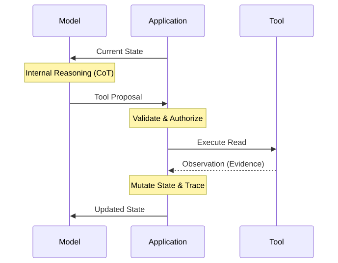

# 06 — Building Your First Complete Agent

**Level:** Beginner · **Primary notebook:** [`06_building_your_first_agent.ipynb`](06_building_your_first_agent.ipynb) 

**Scenario:** We are bringing together everything learned in Modules 01–05. Northstar, our fictional SaaS company, needs an agent to handle a complex customer support escalation: a customer was charged twice for their subscription and requires a refund.

## The Objective

This module is **not** another comparison of framework syntaxes. Our goal is to build **one complete, bounded, testable agent correctly**.

You will learn how to build the hybrid architecture that powers real enterprise systems:
- A non-deterministic reasoning model...
- ...operating within a strict, deterministic application boundary.

## The Hybrid Architecture

In a production system, the LLM does not own the agent's identity, authorization, or budgets. The Application does. The execution loop looks like this:

1. **Trusted Execution Context:** The application defines who is running the agent (User ID, Tenant ID, Roles).
2. **Agent State:** The application maintains the agent's memory, accumulated evidence, and remaining budgets (tool calls, steps).
3. **Model Proposal:** The LLM receives the State and proposes a Tool Call.
4. **Validation:** The application validates the LLM's proposal against strict JSON Schemas and semantic business rules.
5. **Authorization:** The application checks if the Execution Context has permission to run the requested tool.
6. **Approval:** For sensitive actions, the application pauses execution and requests Human Approval.
7. **Execution & Trace:** The tool executes, and the application logs an observable trace before updating the State.

## Autonomous vs. Approval-Gated Tools

A core principle of bounded autonomy is distinguishing between read-only actions and consequential writes.

Our agent is initially granted autonomous access *only* to read-only tools:
- `get_ticket_details`
- `get_billing_status`
- `get_recent_transactions`
- `get_refund_policy`

When the agent decides a refund is necessary, it produces a **RefundProposal**. The runtime intercepts this proposal, halts autonomous execution, and demands human approval before executing the consequential `issue_refund` tool.

## The Role of Evidence and Idempotency

- **Evidence Provenance:** Agent conclusions must be traceable to facts fetched from tools, not hidden in the LLM's Chain of Thought.
- **Idempotency:** When the `issue_refund` tool is executed, it uses an Idempotency Key. If the agent (or a retrying worker) accidentally calls the tool twice for the same logical refund, the system ensures only one actual refund occurs.

## The Notebook Lab

The Jupyter notebook is broken down into a massive 20-part lab.
To ensure every learner can complete this course regardless of API keys or budgets, the core lab uses a **Deterministic Model Stub** (`MockDecisionModel`). This allows you to rapidly test validation failures, authorization denials, and human approval flows locally.

**Optional Real OpenAI Section:** At the very end of the notebook, you can optionally supply an `OPENAI_API_KEY`. The lab will swap out the Mock Model for the official OpenAI Responses API, plugging the real GPT-4o model into the *exact same* secure application runtime.

## Production Checklist

Before deploying an agent to production, verify:
- [ ] Is the goal explicit and tracked in a structured state?
- [ ] Is trusted identity separate from model arguments?
- [ ] Are tools narrow and strictly validated (e.g. using Pydantic)?
- [ ] Are read and write tools clearly distinguished?
- [ ] Are consequential actions approval-gated?
- [ ] Is human approval digest-bound to the exact action?
- [ ] Are write actions idempotent?
- [ ] Are execution budgets (max steps, max tool calls) enforced by the runtime?
- [ ] Is "no-progress" (repeated identical tool calls) detected and terminated?
- [ ] Are terminal conditions explicit (e.g., SUCCESS, POLICY_BLOCK)?
- [ ] Can the core system logic be tested deterministically without a live model?
- [ ] Can a real model plug into the exact same runtime controls as the test suite?

## Checkpoint

**1. The model asks to refund $500 on a $100 duplicate charge. Which layer rejects it?**
- Business Validation. The application's semantic rules enforce that the refund amount cannot exceed the eligible transaction amount, regardless of what the LLM generates.

**2. The model proposes `issue_refund` but the caller lacks refund permission. Should the model be asked to try again?**
- No. Authorization failures are terminal or require escalation. The LLM cannot "reason" its way into gaining permissions.

**3. Why is message history insufficient as the full agent state?**
- Message history is just the conversation context. Real state includes execution budgets, structured evidence, idempotency keys, and explicit terminal reasons.

**4. Why should `issue_refund` use an idempotency key?**
- If a network request times out but the payment provider processes it, a naive retry would issue a second refund. Idempotency guarantees exactly-once execution.

**5. The model calls `get_billing_status(C-55)` repeatedly with the same result. Which runtime control should activate?**
- No-Progress Detection. The application should terminate the agent loop (Terminal Reason: `NO_PROGRESS`) rather than wasting tokens infinitely.

**6. What is the difference between a `RefundProposal` and actually issuing a refund?**
- A Proposal is a structured intent generated by the LLM. It has no side effects. Issuing a refund requires the application to authorize and execute that intent via a Tool.

**7. Why does human approval need to bind to the exact proposal?**
- If approval is generic ("approved"), a confused agent might apply it to a different customer or a modified amount. Approval must authorize a specific proposal digest.

## Watch For

- **Assuming "System Prompts" are security boundaries.** Telling an LLM "do not issue refunds over $100" is an instruction, not a boundary. The application runtime must physically block refunds over $100.
- **Testing in Production.** If your agent loop cannot be tested with a mock deterministic model, your business logic is too tightly coupled to the LLM provider.

## Exercises

1. Modify `get_refund_policy` to return a rule that refunds require approval only if over $50.00.
2. Trigger an Authorization Failure by changing the `ExecutionContext`.
3. Lower the `max_steps` budget and observe the agent terminating early.
4. Supply an OpenAI API Key and run the optional final section. Compare the real LLM's trajectory to the mock's trajectory.
