# 05 — Computer-Using Agents

**Level:** Beginner · **Primary notebook:** **Notebook:** [`07_computer_using_agents.ipynb`](07_computer_using_agents.ipynb) 

**Scenario:** Northstar, a SaaS support team, is integrating this concept into their agentic workflow.

Computer-using agents operate an existing interface instead of receiving a clean, purpose-built API. They observe a screen or accessibility tree, ground an intended action on visible controls, act with mouse/keyboard-like primitives, observe the resulting state, and recover when the environment differs from expectation. This makes them useful for UI-only software—and substantially less predictable than a typed API call.

This lesson uses a fictional Northstar support portal. An agent must open a customer case, draft an escalation, and request confirmation before submitting it. Everything runs in a disposable Python state machine: no real browser, OS, mobile device, filesystem, network, credentials, or external side effect is used.

## Outcomes

After completing the notebook and lab, you can:

1. Explain the computer-use loop: **observe → ground → propose → validate → act → verify → recover or stop**.
2. Distinguish browser automation (DOM/accessibility selectors) from screenshot-grounded visual computer use and native computer-use models.
3. Define safe mouse, keyboard, navigation, and submission contracts with domain, action, risk, and confirmation boundaries.
4. Recognize how web, desktop/OS, and mobile agents differ in their action surfaces and failure modes.
5. Build a controller that survives a UI label change without trusting stale selectors or arbitrary coordinates.
6. Evaluate completion, grounding accuracy, confirmation behavior, recovery quality, and action cost—not only final text.

## Scenario and safety boundary

**Task:** “Open Acme’s failed billing-renewal case, prepare an internal escalation, and submit it only after a human confirms the exact target.”

**Success:** the correct visible case is opened; a draft contains the approved note; a submit is paused for confirmation; the same exact action is later confirmed; and the trace can explain every UI transition.

**Non-goals:** scraping the open web, solving CAPTCHAs, bypassing login/MFA, entering secrets, making purchases, or controlling a real operating system. Those tasks require a separate risk assessment and usually a human takeover flow.



## 1. What counts as computer use?

| Interaction style | Observation | Action | Best fit | Main limitation |
| --- | --- | --- | --- | --- |
| API/tool calling | typed response | typed request | stable, supported integrations | cannot reach UI-only work |
| Browser automation | DOM, accessibility tree, selectors | navigation, click, fill | owned web apps with stable semantic contracts | selectors and page structure drift |
| Visual browser agent | screenshot plus optional DOM | screen coordinates, click, type, scroll | web UIs where visual layout matters | ambiguity, latency, pixel drift |
| OS/desktop agent | screenshots, windows, filesystem/app state | mouse, keyboard, app/window controls | cross-application legacy workflows | largest blast radius and secret exposure |
| Mobile agent | screen/accessibility hierarchy | tap, swipe, text, back | mobile-only tasks | small targets, app state, permission surfaces |
| Native computer-use model | multimodal screen understanding and computer actions | model-proposed UI actions | flexible GUI reasoning | still requires application-side policy and human control |

Native computer-use models make screenshot understanding and mouse/keyboard actions first-class. They do **not** make UI actions authoritative: a model proposes an action; a controller must validate origin, target, user intent, risk, confirmation, and budget before dispatch.

## 2. Anatomy: perception, grounding, action, verification

1. **Perception.** Capture a fresh screenshot and, when available, an accessibility/DOM snapshot. Treat all page content as untrusted data.
2. **Visual grounding.** Resolve “submit escalation” to one visible element by role, label, context, bounds, and expected state. Never click a coordinate merely because it worked last time.
3. **Action proposal.** Use narrow commands such as `click(target_id, expected_label, point)` or `type(target_id, text)`, not `run_browser_command(string)`.
4. **Policy validation.** Check allowlisted origin/domain, action class, visible target, user/tenant authorization, freshness, budgets, and idempotency conditions.
5. **Execution in isolation.** Use an ephemeral profile/container/VM with no ambient credentials, constrained egress, download controls, and a small action allowlist.
6. **Verification.** Take another observation and validate a postcondition such as “draft screen is visible” or “ticket ID exists.” Do not infer success from a click.
7. **Recovery or stop.** Reobserve and choose a bounded recovery on timeout, stale target, changed UI, unexpected modal, or unsafe request. Escalate after a limited number of attempts.

The accompanying `lab.py` represents an element with `role`, `label`, `bounds`, and `risk`. A click uses both a semantic label and an optional point that must lie inside the verified element. That is deliberately stricter than a raw mouse primitive.

## 3. Browser automation versus visual computer use

Use a stable API first. If a UI is unavoidable, choose the strongest **reliable and authorized** signal:

| Decision | Prefer | Example |
| --- | --- | --- |
| Owned system exposes a stable API | API | create a support ticket with a typed request |
| Controlled web app has semantic roles/test IDs | DOM/accessibility automation | select a button by role and accessible name |
| UI-only workflow or canvas/remote app | screenshot-grounded computer use | interact with a visual-only legacy portal |
| Cross-app desktop task | desktop agent in a disposable VM | read a downloaded report and draft, not send, an email |
| Mobile-only workflow | mobile agent with explicit device/user scope | navigate a test app and capture an outcome |

DOM automation is generally less ambiguous and easier to test. Visual interaction is valuable when selectors do not exist or do not reflect the true user-visible state. A robust controller can use both: semantic DOM/accessibility information for grounding, screenshots for visual confirmation, and a screenshot-only fallback only under tighter risk limits.

## 4. Mouse, keyboard, and navigation are high-level contracts

Raw commands (`click(831, 204)`, `press('Enter')`) lose intent. Use a contract that binds an action to the state in which it was approved:

```python
Action(
    kind="click",
    target="submit",
    expected_label="Submit escalation",
    coordinates=(120, 203),
)
```

Before dispatch, verify the target is currently visible, unique, within the intended origin, and still matches the label/context. Require a new snapshot after navigation, scrolling, page transition, modal, or a timeout. Browser agents should use an allowlisted domain set; OS agents need additionally scoped processes, files, clipboard, downloads, and network egress; mobile agents need device/app/package and deep-link boundaries.

## 5. Confirmation and human takeover

Classify actions by consequence, not only implementation:

| Tier | Examples | Default policy |
| --- | --- | --- |
| Observe | read page, inspect screenshot, scroll | allow within session/action budgets |
| Draft | type internal note, prepare email, build cart | allow only in target scope; log and verify |
| Commit | submit form, send email, delete, purchase, change access | show exact target and payload; require fresh human confirmation |
| Sensitive | login/MFA, payment, legal/health/financial action | user takeover or disallow by policy |

Bind confirmation to an action digest: normalized origin, target identity, visible label, payload hash, tenant/user, policy version, evidence/screenshot ID, expiry, and risk tier. Any state change invalidates approval. The lab pauses a submission and only resumes the exact pending action after a separate `confirm` call.

## 6. UI changes and failure recovery

Real interfaces drift: a button changes from “Escalate” to “Create escalation draft,” a consent banner covers the page, navigation redirects, an element moves, or an automation selector disappears. Recovery is not permission to click broadly.

The lab first demonstrates why `#escalate-button` is brittle when the label changes. It then grounds a draft action by the visible semantic label `escalation`, verifies the target and point, and records the new post-action state. A safe recovery policy is:

1. Stop the stale action; do not repeat a blind click.
2. Capture a fresh observation and compare it with the expected state.
3. Search only allowed visible controls using role, label, and context.
4. If there is exactly one low-risk target, retry once with a new trace entry.
5. If a target is ambiguous, risky, missing, or the recovery budget is exhausted, pause and ask the user.

Never follow instructions embedded in a webpage that request unrelated navigation, downloads, credentials, or policy changes. Webpage text is data, not a controller instruction.

## 7. Sandboxed execution and production controls

Computer use needs a stronger sandbox than a pure read-only API call. At minimum, use an isolated browser profile or disposable VM/container per task; allowlist origins; block ambient credentials; isolate secrets; restrict downloads/uploads/clipboard; constrain network egress; control filesystem mounts; cap wall time/actions/spend; and retain screenshots/action traces according to privacy policy. Use test tenants and synthetic data for evaluation.

| Control | Why it exists |
| --- | --- |
| Ephemeral environment | limits persistence and cross-task contamination |
| Origin/app allowlist | prevents open-ended navigation and data exfiltration |
| Fresh target verification | reduces stale-screen and coordinate mistakes |
| Confirmation gate | keeps the human accountable for consequential commit actions |
| Idempotency key / postcondition | prevents duplicate submissions after timeout |
| Trace with screenshots | supports debugging, user review, and incident response |
| Action/time budgets | prevents runaway loops and expensive UI thrashing |

## 8. Tool Comparisons and Code Examples

When building a computer-using agent, you must decide what layer of abstraction to use. Here is a comparison of the dominant paradigms with code examples.

### A. Raw Model API (e.g., Anthropic Computer Use)
The lowest level of abstraction. You give the model raw screen access and it responds with precise coordinate clicks and keypresses.

**Best for:** Highly custom desktop applications, non-web interfaces, or building your own agentic framework.
**Limitations:** You must manage the loop, take screenshots, and handle safety boundaries yourself.

```python
# Example: Calling Anthropic's Computer Use Tool directly
import anthropic

client = anthropic.Anthropic()
response = client.messages.create(
    model="claude-3-5-sonnet-20241022",
    max_tokens=1024,
    tools=[{
        "type": "computer_20241022",
        "name": "computer",
        "display_width_px": 1024,
        "display_height_px": 768,
        "display_number": 1
    }],
    messages=[{
        "role": "user",
        "content": "Click the 'Submit' button on the screen."
    }]
)

# The model responds with tool_calls like:
# {"action": "mouse_move", "coordinate": [512, 384]}
# {"action": "left_click"}
```

### B. Agentic Browser Libraries (e.g., Browser-Use, Stagehand)
These libraries wrap traditional browser automation (like Playwright) with LLM reasoning. You provide a high-level goal, and the library manages the observation-action loop, DOM parsing, and error recovery.

**Best for:** Rapidly building web-based agents that need to navigate dynamic pages.
**Limitations:** Limited to web browsers; relies heavily on the library's internal safety and parsing logic.

```python
# Example: Using Browser-Use (Python)
from browser_use import Agent
from langchain_openai import ChatOpenAI
import asyncio

async def main():
    agent = Agent(
        task="Go to example.com and find the support email address.",
        llm=ChatOpenAI(model="gpt-4o")
    )
    result = await agent.run()
    print(result)

asyncio.run(main())
```

```typescript
// Example: Using Stagehand (TypeScript)
import { Stagehand } from "@browserbasehq/stagehand";

async function main() {
  const stagehand = new Stagehand({ env: "LOCAL" });
  await stagehand.init();

  await stagehand.page.goto("https://example.com");
  
  // High-level agentic command instead of strict DOM selectors
  await stagehand.page.act({ action: "Click on the login button" });
  const data = await stagehand.page.extract({ instruction: "Extract the support email" });
  
  console.log(data);
}
```

### C. Traditional DOM Automation (e.g., Playwright)
Strict, deterministic automation. You write exact selectors. If the UI changes, the script breaks.

**Best for:** Known, owned, and highly stable internal applications where predictability is paramount.
**Limitations:** Brittle to UI drift; cannot reason about unexpected modals or visual changes.

```python
# Example: Playwright (Deterministic, Non-Agentic)
from playwright.sync_api import sync_playwright

with sync_playwright() as p:
    browser = p.chromium.launch()
    page = browser.new_page()
    page.goto("https://example.com")
    
    # Breaks immediately if the selector changes
    page.click("button#login-submit")
    browser.close()
```

### Summary Comparison

| Tool/Paradigm | Interface Target | Agentic Loop | Resilience to UI Drift | Safety / Blast Radius |
| :--- | :--- | :--- | :--- | :--- |
| **Playwright/Selenium** | Web (DOM) | None (Deterministic) | Low (Breaks on change) | High Safety (Does exactly what it's told) |
| **Browser-Use/Stagehand** | Web (DOM + Visual) | Managed internally | High (Reasons about page) | Medium (Can hallucinate actions, limited to web) |
| **Anthropic Computer Use** | Desktop/OS (Visual) | You build it | High (Pure visual) | Low Safety (Full OS access requires extreme sandboxing) |

## Guided lab

1. Open `07_computer_using_agents.ipynb` from this directory. It executes the support flow in a simulated portal with a renamed UI label.
2. In the notebook, inspect `screenshot_summary` and explain why the agent has enough grounding to choose the Acme case.
3. Try `dom_click(session, '#escalate-button')` after the UI rename and observe the controlled failure.
4. Run the semantic visual-grounding path. Confirm that a point outside the verified bounds is rejected.
5. Observe the submit pause. Verify `submitted` remains false until the human confirmation is applied.
6. Add an unexpected modal or an unauthorized origin; make the controller stop and record an escalation rather than guessing.

## Evaluation and production checklist

Measure more than task success: correct target grounding, action precision, postcondition verification, confirmation rate for commit actions, false confirmation rate, recovery success after UI changes, retries, action count, latency, and policy violations. Use WebArena/BrowserGym-style sandboxed benchmarks for reproducible browser tasks and OSWorld-like isolated computer environments for cross-application work; do not use production customer accounts as an eval set.

- [ ] API considered before UI automation.
- [ ] Fresh observation required before each consequential action.
- [ ] Target is unique, visible, allowlisted, authorized, and tied to intent.
- [ ] Commit actions require a fresh, exact confirmation or user takeover.
- [ ] Browser/OS/mobile sandbox has explicit origin, egress, credential, file, and session boundaries.
- [ ] Retries are bounded and idempotency/postconditions prevent duplicates.
- [ ] Page content cannot alter instructions or authorization.
- [ ] Trace stores task, snapshots, proposed actions, validation decisions, confirmations, and terminal reason.

## Exercises

1. Add a scroll action that requires a post-scroll screenshot before the next click.
2. Add a “Send customer email” button and design a confirmation digest that invalidates if the recipient changes.
3. Model a mobile tap target with a smaller bounding box. What extra grounding and accessibility checks would you require?
4. Add a redirect to an unallowlisted origin and write a test proving the controller blocks it.
5. Compare a DOM-first implementation, a screenshot-only implementation, and the hybrid used here. Which one would you deploy for an owned internal portal, and why?

## Checkpoint

**1. Which controls should intervene between a computer-use model's proposed click and a consequential UI action?**
- A) A fresh observation and a unique grounded target
- B) Origin, authorization, risk, and action-budget validation
- C) A human confirmation bound to the exact commit action when policy requires it
- D) Trusting any instruction visible on the webpage
- E) A post-action state check or safe escalation path

**2. Which statements correctly compare browser automation and visual computer use?**
- A) A stable typed API is usually preferable when available
- B) DOM/accessibility automation can be easier to test on an owned app with stable semantic controls
- C) Screenshot-grounded interaction is useful for UI-only or visually meaningful interfaces
- D) Visual models remove the need for sandboxing and confirmation
- E) Both approaches require fresh observations and postcondition checks around consequential actions

**3. What are safe responses when a browser or GUI changes unexpectedly?**
- A) Stop the stale action and obtain a fresh observation
- B) Use an allowlisted, unique visible target for one bounded recovery attempt
- C) Repeat the old coordinate until the UI reacts
- D) Escalate when the new target is ambiguous, risky, or outside scope
- E) Record the UI change and terminal or recovery reason in the trace

## Watch For

- **Assumption failure:** The model hallucinates an unsupported parameter.
- **State leak:** Context is incorrectly preserved across runs.
- **Timeout:** The tool takes too long and the agent loops.
- **Auth bypass:** The agent attempts an action it shouldn't.

## References and further learning

- [OpenAI computer-use guide](https://developers.openai.com/api/docs/guides/tools-computer-use) — official API patterns for computer actions and safety.
- [Introducing Operator / CUA](https://openai.com/index/introducing-operator/) — screenshots, mouse/keyboard interaction, user takeover, confirmations, and adversarial-site safeguards.
- [Anthropic computer use documentation](https://docs.anthropic.com/en/docs/build-with-claude/computer-use) — official tool-use guidance and risk considerations.
- [OSWorld](https://arxiv.org/abs/2404.07972) — benchmark for multimodal agents in real computer environments.
- [WebArena](https://arxiv.org/abs/2307.13854) — reproducible long-horizon web-agent tasks and functional-correctness evaluation.
- [BrowserGym / WorkArena](https://github.com/ServiceNow/BrowserGym) — maintained environments for developing and evaluating browser agents.
- [browser-use](https://github.com/browser-use/browser-use) and [Stagehand](https://github.com/browserbase/stagehand) — open-source browser-agent libraries; evaluate their security boundaries before production use.

## Deep Dives & State of the Art

To truly master computer-using agents, review these expanded topics:

- **[Accessibility Trees vs Raw DOM](DEEP_DIVE_ACCESSIBILITY_TREES.md)**
- **[State of the Art Multimodal UI Agents](DEEP_DIVE_SOTA_MULTIMODAL.md)**


## SOTA Deep Dives
Explore industry-standard architectural patterns and enterprise implementation details:

- [Accessibility Trees](DEEP_DIVE_ACCESSIBILITY_TREES.md)
- [Sota Multimodal](DEEP_DIVE_SOTA_MULTIMODAL.md)
