# 01 — Tool engineering

**Level:** Intermediate · **Prerequisites:** [the agent loop](../../beginner/02-agent-loop/README.md), [workflow or agent](../../beginner/03-workflow-or-agent/README.md), and [agent development frameworks](../../beginner/05-agent-development-frameworks/README.md)

**Scenario:** Northstar, a SaaS support team, is integrating this concept into their agentic workflow.
**Notebook:** [`01_tool_engineering.ipynb`](01_tool_engineering.ipynb) 

## The conceptual shift

> A tool is not a prompt feature. It is a capability boundary.

A model tool call is only a proposal. Application code must validate the schema, actor, tenant, permission, budget, idempotency key, result, and approval before any capability executes. Tool engineering is interface design, distributed-systems design, and security engineering—not merely writing tool descriptions.



## Outcomes

After this module you can design function/tool schemas, route a small capability catalog, compose sequential and parallel reads, constrain browser/code/database/API capabilities, and enforce least privilege, result validation, retry, idempotency, and approval.

## Step-by-step training map

| Step | Key question | What you build |
| --- | --- | --- |
| 1 | What is a tool call? | strict request/result contracts with source IDs |
| 2 | Which tool is available? | deterministic routing by actor, tenant, intent, and risk |
| 3 | What execution shape fits? | sequential dependencies and bounded parallel reads |
| 4 | What does the tool touch? | search, database, API, code, browser/computer boundaries |
| 5 | Can the action happen? | scopes, approval tokens, and idempotency keys |
| 6 | What if it fails? | typed errors, retry classification, escalation, and stop |
| 7 | Can the result be trusted? | schema/provenance checks and poisoned-content rejection |
| 8 | Is it ready to release? | trajectory, policy, and regression evaluation |

## 1. Function calling and structured contracts

Function calling lets a model request external functionality through a named tool and arguments; the application executes it and returns a correlated observation. Current [OpenAI function-calling guidance](https://developers.openai.com/api/docs/guides/function-calling) describes JSON-schema function tools, tool-call outputs, and tool search for large catalogs.

A production tool contract needs:

| Component | Why | Example |
| --- | --- | --- |
| Purpose | prevents ambiguous routing | query_checkout_errors, not admin_command |
| Typed inputs | bounds values before execution | service enum, time range maximum |
| Typed outputs | stabilizes downstream use | source ID, count, timestamp |
| Typed errors | separates retry from stop | timeout, rate limit, permission denied |
| Risk metadata | drives policy | read, propose, execute |
| Provenance | supports citations/audit | query parameters and freshness |
| Idempotency | makes writes replay-safe | action key bound to normalized arguments |

Use short action-oriented names, explicit required fields and enums, compact result payloads, and schema versioning. Keep tenant IDs and principal identity in trusted request context whenever possible rather than allowing a model to invent them.

## 2. Tool selection, discovery, and routing

Tool selection is constrained routing, not a free-form model capability. Filter a catalog deterministically by actor, tenant, environment, and task before the model can choose from it.



For large catalogs, use namespaced capabilities, progressive disclosure, and dynamic discovery with allowlists. Every capability should describe purpose, risk tier, required scopes, cost/latency class, and result schema. The [MCP tools specification](https://modelcontextprotocol.io/specification/2025-11-25/server/tools) standardizes discovery, but it does not authorize calls for you.

## 3. Composition and execution

**Sequential calls** are appropriate when later calls depend on earlier observations:

~~~text
get_service_status → query_error_logs → get_recent_deployment → create_incident_draft
~~~

**Parallel calls** are appropriate only for independent, read-only calls:

~~~text
query_metrics ─┐
query_tickets ─┼→ normalize findings → synthesize proposal
get_deployment ─┘
~~~

Use concurrency limits, per-tool timeouts, and partial-result policies. Never parallelize writes unless transaction and rollback semantics have been designed and tested. Compose typed intermediate artifacts rather than ad-hoc strings, and make a coordinator consume findings instead of raw write tools.

## 4. Tool classes and their controls

| Class | Good use | Required controls | Common failure |
| --- | --- | --- | --- |
| Search/retrieval | current evidence | domain allowlist, result cap, citations | treating retrieved text as instructions |
| Database | authorized facts | parameterized queries, row limits, trusted tenant filter | cross-tenant leakage |
| API | bounded product capability | scoped token, schema, timeout, idempotency | broad token/side effect |
| Code execution | calculation or file analysis | isolated sandbox, resource/file/network limits | arbitrary code/data exfiltration |
| Browser/computer | UI-only task | domain allowlist, trace, confirmation before submit | UI prompt injection/unintended click |
| Write action | change state/notify | approval, audit, idempotency, rollback | replayed/unauthorized action |

Prefer a stable API over browser automation. Browser and computer outputs are untrusted page content and UI actions are usually hard to make idempotent.

## 5. Permission models and least privilege

| Level | Example | Execution |
| --- | --- | --- |
| READ | metrics, logs, tickets, runbooks | automatic within scoped budget |
| PROPOSE | incident draft, rollback plan, notification draft | creates a non-executing artifact |
| EXECUTE WITH APPROVAL | restart, rollback, send notification | authenticated human approval bound to exact arguments |
| BREAK-GLASS | emergency recovery | named operator, time limit, full audit |

Authorization lives in the tool or service behind it. A model never grants itself a role, tenant, or approval.

## 6. Failure, retry, and idempotency

| Failure | Default response |
| --- | --- |
| timeout/transient network | bounded exponential backoff with jitter |
| rate limit | wait/retry under a global budget |
| invalid arguments | stop and repair |
| permission denied | escalate; retry cannot create authority |
| conflict/stale version | re-read state and re-plan |
| unknown write outcome | query idempotency record |
| poisoned/malformed result | quarantine and stop |

Bind a single-use idempotency key to normalized intent, target, actor, and approval. Store and replay the original outcome; never blindly repeat an uncertain write.

## 7. Tool hallucination and result validation

A model can invent a tool, fabricate arguments, or claim a result never returned. Mitigate this with an allowlisted catalog, strict dispatch validation, correlated call IDs, stable source IDs, and abstention when evidence is absent. Tool results can be stale, malformed, or adversarial. Treat search, browser, retrieved documents, and remote tool output as data—not authority.

## 8. Deep dive — design a tool contract

A schema is an interface agreement between four parties: the model, the runtime, the service owner, and the operator. Treat it like a public API rather than a convenience wrapper.

```python
class QueryLogsRequest(BaseModel):
    service: Literal["checkout", "payments", "catalog"]
    region: Literal["eu-west", "us-east"]
    minutes: int = Field(ge=1, le=240)

class EvidenceResult(BaseModel):
    source_id: str
    observed_at: datetime
    data: dict[str, JsonValue]
    freshness_seconds: int = Field(ge=0)
    tenant_id: str
```

The model should supply only task parameters such as service and time window. The server should inject identity, tenant, locale, budget, approval token, and credential scope from trusted request context. Never let a model choose its own principal or a raw connection string.

Version schemas deliberately (`query_logs.v2`) when changing semantics. Make errors typed and predictable: `InvalidArguments`, `PermissionDenied`, `NotFound`, `Conflict`, `RateLimited`, `Timeout`, and `Unavailable`. This lets the orchestrator choose repair, retry, re-plan, escalation, or stop rather than treating every failure as generic text.

## 9. Deep dive — choose, discover, and compose tools

### Selection and discovery

Tool selection has two stages. First, deterministic code computes the eligible catalog from actor scopes, tenant, environment, risk tier, feature flags, and budget. Second, an agent may choose *within that catalog*. This is the difference between constrained routing and delegated authority.

For a large catalog, disclose tools progressively: start with a namespace such as `observability.*`; load a detailed schema only after a read-only discovery step; impose an allowlist and a maximum number of disclosed tools. A discovery protocol such as MCP can describe tools, but remote metadata is still untrusted until the application approves it.

### Composition patterns

| Pattern | Use it when | Guardrails |
| --- | --- | --- |
| Sequential | each observation narrows the next query | propagate source IDs and stop if a prerequisite fails |
| Parallel reads | calls are independent and read-only | concurrency cap, deadlines, partial-result policy |
| Fan-out / fan-in | multiple scoped sources need normalization | merge typed facts, not raw prompt text |
| Planner/executor | a plan is useful but action is bounded | validate every planned call at dispatch time |
| Evaluator/optimizer | output can be checked against explicit criteria | limit iterations; do not make evaluators grant authority |

Example: checkout status can determine whether log retrieval is needed (sequential); customer ticket count and deployment history can be gathered at the same time (parallel); an incident draft is produced only after validated evidence is merged (fan-in).

## 10. Deep dive — controls for each execution surface

### Search and retrieval tools

Use source IDs, domains or corpus allowlists, result caps, time filters, and citation-ready metadata. Search snippets may contain indirect prompt injection; separate them from system instructions and require the final answer to cite the returned source IDs.

### Database tools

Prefer narrowly scoped stored procedures or query builders over unrestricted SQL. Bind tenant filters server-side, use parameterized queries, enforce row and execution-time limits, use read replicas where possible, and log a query fingerprint rather than sensitive parameters. An agent should not be able to choose another tenant ID or issue `DROP`, `UPDATE`, or arbitrary joins.

### API tools

Use per-tool credentials, short-lived scoped tokens, request/response schemas, deadlines, rate limits, circuit breakers, and a compatibility/version policy. Convert provider-specific failures to the typed error contract your agent runtime understands. For writes, use an idempotency key and capture an immutable receipt.

### Code execution tools

Run code in an isolated sandbox with CPU, memory, wall-clock, filesystem, package, and egress limits. Mount only required inputs read-only; collect a limited artifact set; never expose host credentials or production networks. A notebook or calculator tool is useful for analysis, not a bypass around policy.

### Browser and computer tools

Use only when an API is unavailable. Restrict domains and navigation, capture a reviewable trace, treat page content and screenshots as untrusted input, and pause for confirmation before form submission, purchase, deletion, or account changes. UI automation has weak idempotency: a timeout after clicking “submit” may leave the world changed.

## 11. Deep dive — permission, approval, retries, and idempotency

Least privilege means each tool receives only the scope required for one job, for one tenant, for a bounded period. Separate *read*, *propose*, and *execute* capabilities. The most useful default is that an agent can observe and prepare artifacts but cannot mutate production.

An approval should bind an action digest containing the target, normalized arguments, actor, tenant, risk tier, evidence IDs, policy version, and expiry. If any field changes, invalidate the approval. Authenticate the reviewer in the application; never accept an approval identity supplied by a model or browser form without server-side verification.

Retry only failures likely to become successful without changing intent. Use exponential backoff with jitter, a small attempt limit, a deadline, and a global budget. Do not retry permission failures, malformed arguments, policy denials, or poisoned results. For uncertain write outcomes, query by idempotency key before retrying. Return the first durable receipt for duplicate requests.

## 12. Deep dive — result validation and tool hallucinations

Validate a result at several layers:

1. **Correlation:** result matches a known call ID and eligible tool.
2. **Schema:** required fields, types, ranges, and explicit null semantics are valid.
3. **Provenance:** source ID, query parameters, tenant, owner, and observed-at timestamp exist.
4. **Freshness:** the result meets the task’s staleness limit.
5. **Content safety:** retrieved text is data, not a command; detect and quarantine instruction-like payloads.
6. **Business semantics:** evidence actually supports the proposed conclusion; a schema-valid object can still be wrong.

Never send a model an invented tool result just to continue a conversation. If a tool is unavailable, return a typed observation that says so and route to a bounded fallback or escalation. Evaluate against adversarial fixtures: invented tool names, extra arguments, cross-tenant IDs, stale records, injected results, rate limits, duplicate keys, and post-write response loss.

## 13. Worked design: Northstar checkout investigation

1. An authenticated support operator opens incident `INC-482` for tenant `northstar`.
2. The application filters to four read tools and one propose-only tool; `restart_service` is absent.
3. The graph runs `get_service_status` first. If checkout is healthy, it stops with an evidence gap.
4. If degraded, it reads logs and deployment history sequentially; ticket search runs in parallel with a regional metric query.
5. A validation node checks source IDs, tenant, freshness, and injection signals before facts become model observations.
6. The model returns a structured `IncidentPlan` containing evidence IDs and a *proposal only*.
7. Deterministic policy checks risk, approval requirement, and idempotency. It may create an incident draft; it cannot restart service.
8. An approval workflow, outside the agent, can later authorize an exact restart action and record the receipt.

This is the practical rule: **the shortest reliable trajectory to a safe outcome wins**. A complex multi-tool plan is not better if a known workflow could have produced the same evidence more cheaply and predictably.

## Technologies and references

| Need | Prominent options |
| --- | --- |
| Function calling | [OpenAI](https://developers.openai.com/api/docs/guides/function-calling), [Anthropic](https://platform.claude.com/docs/en/agents-and-tools/tool-use/overview), Google Gemini |
| Agent tool runtimes | [OpenAI Agents SDK](https://openai.github.io/openai-agents-python/tools/), [Pydantic AI](https://ai.pydantic.dev/tools/), [LangChain tools](https://python.langchain.com/docs/concepts/tools/) |
| Tool discovery | [Model Context Protocol](https://modelcontextprotocol.io/) |
| Validation | [Pydantic](https://docs.pydantic.dev/) and JSON Schema |
| Observability | OpenTelemetry-compatible traces plus redacted audit records |

## Production readiness checklist

- [ ] owner, purpose, schemas, risk tier, and tests exist for every tool
- [ ] identity, tenant, environment, and catalog filters are deterministic
- [ ] read/write capabilities are separate and writes require approval
- [ ] results preserve source IDs, freshness, and validated fields
- [ ] retry is bounded and side effects are idempotent
- [ ] untrusted content cannot become instructions or authorization
- [ ] evaluations test wrong tool, malformed args, timeout, rate limit, denial, replay, tenant escape, and poisoned result
- [ ] kill switch and escalation route exist

## Further reading

- [OpenAI Agents SDK tools](https://openai.github.io/openai-agents-python/tools/)
- [MCP tools specification](https://modelcontextprotocol.io/specification/2025-11-25/server/tools)
- [OWASP Top 10 for LLM Applications](https://genai.owasp.org/)
- [ReAct paper](https://arxiv.org/abs/2210.03629)


## Watch For

- **Assumption failure:** The model hallucinates an unsupported parameter.
- **State leak:** Context is incorrectly preserved across runs.
- **Timeout:** The tool takes too long and the agent loops.
- **Auth bypass:** The agent attempts an action it shouldn't.


## Checkpoint

**1. Which are good practices for a routing workflow?**
- A) Evaluate routing accuracy separately
- B) Include an unknown or human-escalation route
- C) Give every route identical tools and policies regardless of need
- D) Use specialist paths when categories need different controls
- E) Log the selected route for diagnosis

**2. When is an evaluator-optimizer loop a strong fit?**
- A) Success criteria are explicit
- B) Feedback can guide a concrete revision
- C) Iteration is bounded
- D) There is no way to assess whether the output improved
- E) Deterministic graders can supplement model judgment

**3. Which statements correctly compare an agent-as-tool with a handoff?**
- A) An agent-as-tool lets the orchestrator retain ownership
- B) A handoff transfers control to a specialist
- C) Both patterns remove the need for scoped permissions
- D) The choice should reflect who owns the next interaction
- E) Both introduce a context and evaluation boundary

**4. Which controls improve parallel worker orchestration?**
- A) Non-overlapping worker contracts
- B) A clear aggregation rule
- C) Provenance on worker outputs
- D) Unlimited delegation breadth and depth
- E) Per-worker budgets


## Deep Dives & State of the Art

To build enterprise-grade tool integrations, review these expanded topics:

- **[Schema Contracts & Pydantic Validation](DEEP_DIVE_SCHEMA_CONTRACTS.md)**
- **[Narrow Capabilities (Preventing Confused Deputies)](DEEP_DIVE_NARROW_CAPABILITIES.md)**
- **[Typed Errors (Self-Healing Agents)](DEEP_DIVE_TYPED_ERRORS.md)**


## SOTA Deep Dives
Explore industry-standard architectural patterns and enterprise implementation details:

- [Narrow Capabilities](DEEP_DIVE_NARROW_CAPABILITIES.md)
- [Schema Contracts](DEEP_DIVE_SCHEMA_CONTRACTS.md)
- [Typed Errors](DEEP_DIVE_TYPED_ERRORS.md)
