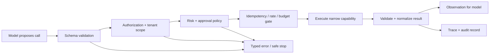
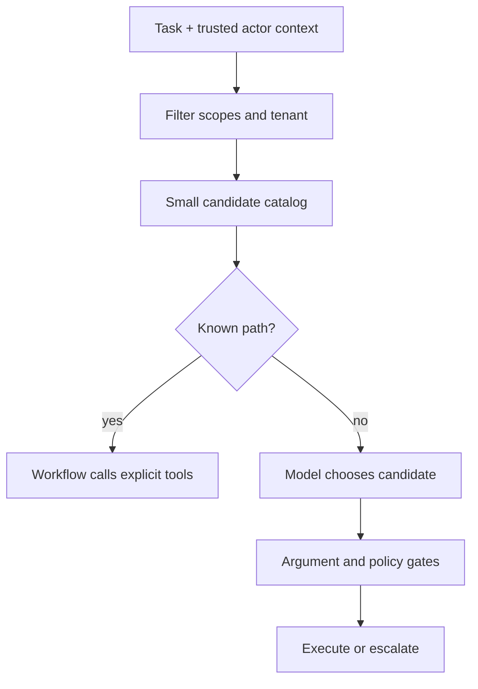

# 01 — Tool engineering

**Level:** Intermediate · **Prerequisites:** [the agent loop](../../beginner/02-agent-loop/README.md), [workflow or agent](../../beginner/03-workflow-or-agent/README.md), and [agent development frameworks](../../beginner/04-agent-development-frameworks/README.md)
**Notebook:** [tool_engineering.ipynb](tool_engineering.ipynb) · **Run:** [lab.py](lab.py)

## The conceptual shift

> A tool is not a prompt feature. It is a capability boundary.

A model tool call is only a proposal. Application code must validate the schema, actor, tenant, permission, budget, idempotency key, result, and approval before any capability executes. Tool engineering is interface design, distributed-systems design, and security engineering—not merely writing tool descriptions.

## Outcomes

After this module you can design function/tool schemas, route a small capability catalog, compose sequential and parallel reads, constrain browser/code/database/API capabilities, and enforce least privilege, result validation, retry, idempotency, and approval.

## Step-by-step training map

| Step | Key question | What you build |
| --- | --- | --- |
| 1 | What is a tool call? | strict request/result contracts with source IDs |
| 2 | Which tool is available? | deterministic routing by actor, tenant, intent, and risk |
| 3 | What execution shape fits? | sequential dependencies and bounded parallel reads |
| 4 | What does the tool touch? | search, database, API, code, browser/computer boundaries |
| 5 | Can the action happen? | scopes, approval tokens, and idempotency keys |
| 6 | What if it fails? | typed errors, retry classification, escalation, and stop |
| 7 | Can the result be trusted? | schema/provenance checks and poisoned-content rejection |
| 8 | Is it ready to release? | trajectory, policy, and regression evaluation |

## 1. Function calling and structured contracts

Function calling lets a model request external functionality through a named tool and arguments; the application executes it and returns a correlated observation. Current [OpenAI function-calling guidance](https://developers.openai.com/api/docs/guides/function-calling) describes JSON-schema function tools, tool-call outputs, and tool search for large catalogs.

A production tool contract needs:

| Component | Why | Example |
| --- | --- | --- |
| Purpose | prevents ambiguous routing | query_checkout_errors, not admin_command |
| Typed inputs | bounds values before execution | service enum, time range maximum |
| Typed outputs | stabilizes downstream use | source ID, count, timestamp |
| Typed errors | separates retry from stop | timeout, rate limit, permission denied |
| Risk metadata | drives policy | read, propose, execute |
| Provenance | supports citations/audit | query parameters and freshness |
| Idempotency | makes writes replay-safe | action key bound to normalized arguments |

Use short action-oriented names, explicit required fields and enums, compact result payloads, and schema versioning. Keep tenant IDs and principal identity in trusted request context whenever possible rather than allowing a model to invent them.

## 2. Tool selection, discovery, and routing

Tool selection is constrained routing, not a free-form model capability. Filter a catalog deterministically by actor, tenant, environment, and task before the model can choose from it.

For large catalogs, use namespaced capabilities, progressive disclosure, and dynamic discovery with allowlists. Every capability should describe purpose, risk tier, required scopes, cost/latency class, and result schema. The [MCP tools specification](https://modelcontextprotocol.io/specification/2025-11-25/server/tools) standardizes discovery, but it does not authorize calls for you.

## 3. Composition and execution

**Sequential calls** are appropriate when later calls depend on earlier observations:

~~~text
get_service_status → query_error_logs → get_recent_deployment → create_incident_draft
~~~

**Parallel calls** are appropriate only for independent, read-only calls:

~~~text
query_metrics ─┐
query_tickets ─┼→ normalize findings → synthesize proposal
get_deployment ─┘
~~~

Use concurrency limits, per-tool timeouts, and partial-result policies. Never parallelize writes unless transaction and rollback semantics have been designed and tested. Compose typed intermediate artifacts rather than ad-hoc strings, and make a coordinator consume findings instead of raw write tools.

## 4. Tool classes and their controls

| Class | Good use | Required controls | Common failure |
| --- | --- | --- | --- |
| Search/retrieval | current evidence | domain allowlist, result cap, citations | treating retrieved text as instructions |
| Database | authorized facts | parameterized queries, row limits, trusted tenant filter | cross-tenant leakage |
| API | bounded product capability | scoped token, schema, timeout, idempotency | broad token/side effect |
| Code execution | calculation or file analysis | isolated sandbox, resource/file/network limits | arbitrary code/data exfiltration |
| Browser/computer | UI-only task | domain allowlist, trace, confirmation before submit | UI prompt injection/unintended click |
| Write action | change state/notify | approval, audit, idempotency, rollback | replayed/unauthorized action |

Prefer a stable API over browser automation. Browser and computer outputs are untrusted page content and UI actions are usually hard to make idempotent.

## 5. Permission models and least privilege

| Level | Example | Execution |
| --- | --- | --- |
| READ | metrics, logs, tickets, runbooks | automatic within scoped budget |
| PROPOSE | incident draft, rollback plan, notification draft | creates a non-executing artifact |
| EXECUTE WITH APPROVAL | restart, rollback, send notification | authenticated human approval bound to exact arguments |
| BREAK-GLASS | emergency recovery | named operator, time limit, full audit |

Authorization lives in the tool or service behind it. A model never grants itself a role, tenant, or approval.

## 6. Failure, retry, and idempotency

| Failure | Default response |
| --- | --- |
| timeout/transient network | bounded exponential backoff with jitter |
| rate limit | wait/retry under a global budget |
| invalid arguments | stop and repair |
| permission denied | escalate; retry cannot create authority |
| conflict/stale version | re-read state and re-plan |
| unknown write outcome | query idempotency record |
| poisoned/malformed result | quarantine and stop |

Bind a single-use idempotency key to normalized intent, target, actor, and approval. Store and replay the original outcome; never blindly repeat an uncertain write.

## 7. Tool hallucination and result validation

A model can invent a tool, fabricate arguments, or claim a result never returned. Mitigate this with an allowlisted catalog, strict dispatch validation, correlated call IDs, stable source IDs, and abstention when evidence is absent. Tool results can be stale, malformed, or adversarial. Treat search, browser, retrieved documents, and remote tool output as data—not authority.

## Technologies and references

| Need | Prominent options |
| --- | --- |
| Function calling | [OpenAI](https://developers.openai.com/api/docs/guides/function-calling), [Anthropic](https://platform.claude.com/docs/en/agents-and-tools/tool-use/overview), Google Gemini |
| Agent tool runtimes | [OpenAI Agents SDK](https://openai.github.io/openai-agents-python/tools/), [Pydantic AI](https://ai.pydantic.dev/tools/), [LangChain tools](https://python.langchain.com/docs/concepts/tools/) |
| Tool discovery | [Model Context Protocol](https://modelcontextprotocol.io/) |
| Validation | [Pydantic](https://docs.pydantic.dev/) and JSON Schema |
| Observability | OpenTelemetry-compatible traces plus redacted audit records |

## Production readiness checklist

- [ ] owner, purpose, schemas, risk tier, and tests exist for every tool
- [ ] identity, tenant, environment, and catalog filters are deterministic
- [ ] read/write capabilities are separate and writes require approval
- [ ] results preserve source IDs, freshness, and validated fields
- [ ] retry is bounded and side effects are idempotent
- [ ] untrusted content cannot become instructions or authorization
- [ ] evaluations test wrong tool, malformed args, timeout, rate limit, denial, replay, tenant escape, and poisoned result
- [ ] kill switch and escalation route exist

## Further reading

- [OpenAI Agents SDK tools](https://openai.github.io/openai-agents-python/tools/)
- [MCP tools specification](https://modelcontextprotocol.io/specification/2025-11-25/server/tools)
- [OWASP Top 10 for LLM Applications](https://genai.owasp.org/)
- [ReAct paper](https://arxiv.org/abs/2210.03629)
