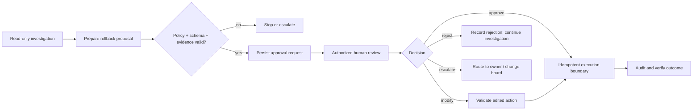
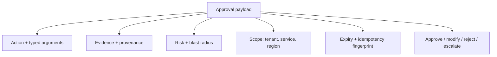

# 03 — Human approval and permissions

**Level:** Intermediate · **Time:** 2–3 hours · **Primary lesson:**
[`human_approval_permissions.ipynb`](human_approval_permissions.ipynb) ·
**Runnable implementation:** [`lab.py`](lab.py)

## Scenario: a rollback that must not happen by itself

Northstar Cloud’s checkout conversion has dropped in `eu-west` after
`deploy-1842`. An agent gathers health, log, and deployment evidence and
prepares a rollback. It must **not** execute the rollback. Instead, it creates a
complete review request for the authorized incident commander, who can approve,
modify, reject, or escalate it.

Success is not “the rollback ran.” Success is: the right person saw the exact
scoped action, evidence, risk, and expiry; the decision is durable and
auditable; no duplicate action occurs on replay; and a rejected action stays
rejected.



## Learning outcomes

After completing this topic, you can:

1. Separate **authentication**, **authorization**, **approval**, and
   **execution**—they solve different problems.
2. Design least-privilege tool permissions for READ, PROPOSE, and
   EXECUTE-WITH-APPROVAL actions.
3. Build an approval request with action scope, evidence, risk, expiration,
   reviewer identity, tenant boundary, and a durable audit record.
4. Implement approve, modify, reject, and escalate paths without allowing a
   reviewer to silently broaden an action.
5. Use idempotency, timeouts, retries, and validation to make resumes and
   network failures safe.

## 1. Mental model: humans are a control boundary, not a decorative button

A model may recommend an action. It does not gain authority by recommending it.
The application enforces capability and identity at the tool boundary; a human
approval is an additional decision gate for a specific consequential action.

| Concept | Question it answers | Example in this lesson |
| --- | --- | --- |
| Authentication | Who is making the request? | `incident_commander` identity |
| Authorization | Is this identity allowed this capability? | may approve a rollback, not a customer notice |
| Approval | Does this specific action have informed consent? | approve rollback of `deploy-1842` in `eu-west` |
| Execution | Can the system safely carry it out once? | executor accepts one idempotency key |
| Audit | Can we reconstruct what happened? | evidence, original/final action, reason, actor, time |

Do not replace any of these with a prompt such as “ask for approval before
dangerous actions.” The prompt can influence a model’s suggestion; it cannot
enforce access control against a compromised model, poisoned document, or buggy
integration.

## 2. Permission design: capabilities, not job titles alone

Start with narrow tool capabilities. A generic `admin(command)` gives an agent
more power than the policy can meaningfully review. Split read, proposal, and
execution tools, validate their typed arguments, and make the default deny.

| Level | Agent can do | Examples | Human interaction |
| --- | --- | --- | --- |
| READ | inspect evidence | health, logs, deployments, runbooks | none, but tenant/access filters still apply |
| PROPOSE | create reviewable artifacts | rollback plan, ticket, customer-notice draft | reviewer can inspect/edit later |
| EXECUTE-WITH-APPROVAL | create external change | rollback, restart, send notice | named authorized reviewer required |

```python
TOOL_PERMISSIONS = {
    "query_region_logs": "READ",
    "prepare_rollback": "PROPOSE",
    "rollback_deployment": "EXECUTE_WITH_APPROVAL",
}
REQUIRED_REVIEWER = {"rollback_deployment": "incident_commander"}
```

This is capability-based design. Roles can be mapped to capabilities, but use
the narrow action (`rollback deployment X in region Y`) as the thing being
approved—not a broad role grant that lasts indefinitely.

## 3. What an approver needs to see

“Approve?” is a harmful approval UI. A decision payload should show:

- the exact tool name and typed arguments, including region/tenant scope;
- expected effect, risk classification, and blast radius;
- evidence IDs, timestamps, and provenance—not just a model summary;
- alternatives considered, policy reason, and expiry;
- original action fingerprint and the reviewer’s allowed choices;
- a visible statement that approval authorizes this exact request once.



Modification is powerful but risky. Treat an edited action as a new action:
revalidate arguments, recompute risk and its idempotency key, verify the editor
can make that change, and potentially require a second review if the scope
increases.

## 4. Persist, interrupt, resume

An approval may take minutes or hours. Persist the paused request with an opaque
`run_id` and enforce tenant authorization when it is loaded. In LangGraph, an
`interrupt()` can pause a node and the graph resumes with `Command(resume=...)`
using the same `thread_id`; this requires a checkpointer and a durable one in
production. A resumed node starts from the beginning, so every pre-interrupt
side effect must be idempotent ([LangGraph interrupts](https://docs.langchain.com/oss/python/langgraph/interrupts)).

```python
from langgraph.types import Command, interrupt

def approval_node(state):
    decision = interrupt({"action": state["action"], "evidence": state["evidence"]})
    return {"approval": decision}

# Reuse the same authenticated thread_id:
# graph.invoke(Command(resume={"decision": "approve"}), config=config)
```

Never place a `while True` loop around `interrupt()` inside a node. Store a
failed validation state, route back through a graph edge, and interrupt once per
node invocation. The official guidance explains why repeated inline interrupts
can replay work unexpectedly.

## 5. Idempotency, expiry, and recovery

Approval does not remove distributed-systems failure modes. The executor may
time out after a provider has already performed the operation. Protect it:

1. generate an action fingerprint from the approved typed arguments and
   evidence/version;
2. record it durably before dispatch;
3. pass it as the external system’s idempotency key where supported;
4. on retry, query the action status rather than re-dispatching blindly;
5. expire and re-review stale requests when evidence, deployment state, or
   authorization has changed.

The lab’s `ApprovalStore.executed_fingerprints` is a tiny deterministic
demonstration. A real system would use a transactional database/outbox and an
immutable audit sink.

## 6. Two practical experiments

### Experiment A — approve versus reject

Run `propose_rollback`, then call `decide(..., "approve", ...)`. Inspect the
action, evidence, audit event, and idempotency key. In a second store, reject
the same proposal; confirm it records a decision but never creates an execution
record. Discuss why “reject” should be a terminal state or a deliberate route
back to investigation, not an implicit retry.

### Experiment B — unsafe edit and duplicate replay

Create a modified action that changes `region` from `eu-west` to `global` or
changes the deployment ID. The lab rejects it because its schema only accepts
the validated target. Then call `decide` a second time after approval: it
rejects the non-paused request / duplicate fingerprint. Explain how this guards
against a repeated API request after a UI refresh.

## 7. Production checklist

- Authenticate reviewer identity in the application, not in a model message.
- Authorize per tenant, action, environment, time window, and risk tier.
- Require fresh, attributable evidence and an explicit expiry.
- Redact secrets and personal data from review UIs and audit logs.
- Separate draft/proposal from execution tools; default unknown tools to deny.
- Revalidate a human-edited action and record both original and final forms.
- Use idempotency keys, outbox/reconciliation, and an execution status query.
- Record decision latency, approval/rejection rates, overrides, stale approvals,
  duplicate blocks, and post-action outcomes.
- Test authorization bypass, cross-tenant loads, prompt injection, stale state,
  reviewer-role confusion, and executor retries before release.

## Exercises

1. Add `send_customer_notice` and require a `communications_reviewer`, even if
   the incident commander approved a rollback.
2. Add a two-person rule for production rollbacks in the payment service.
3. Implement expiry validation and show a request cannot execute after a new
   deployment arrives.
4. Create a test for a `tenant-b` reviewer attempting to load Northstar’s
   approval request.
5. Design an approval UI that allows an operator to edit a draft customer notice
   but not alter a rollback target.

## References

- [LangGraph interrupts](https://docs.langchain.com/oss/python/langgraph/interrupts)
- [LangGraph persistence](https://docs.langchain.com/oss/python/langgraph/persistence)
- [LangChain human-in-the-loop middleware](https://docs.langchain.com/oss/python/langchain/human-in-the-loop)
- [NIST AI Risk Management Framework](https://www.nist.gov/itl/ai-risk-management-framework)
- [OWASP GenAI Security Project](https://genai.owasp.org/)
- [OWASP: LLM Top 10 (2025)](https://genai.owasp.org/llmrisk/)
