# 05 — Agent evaluation: outcomes, trajectories, and release gates

**Level:** Intermediate · **Time:** 60 min · **Prerequisites:** None

**Primary lesson:**
Evaluate the whole run—outcome, evidence, trajectory, safety, and operations—and release only when hard constraints hold.

**Notebook:** [`05_agent_evaluation.ipynb`](05_agent_evaluation.ipynb) 

## Scenario

Northstar investigates high latency in the EU checkout service. A polished answer can still be unsafe or inefficient: it may skip required evidence, use the wrong tool, attempt cross-tenant access, or cost ten times more than a simpler path. This lesson evaluates the **run**, not only the prose.

## Outcomes

Build a representative dataset; score outcome, evidence, trajectory, safety, robustness, cost, and latency; distinguish deterministic checks from LLM semantic judgment; compare baseline and hardened agents; and define a release gate with non-negotiable safety constraints.

## 1. What to evaluate

| Dimension | Question | Example metric |
| --- | --- | --- |
| Outcome | Did it solve the task correctly? | diagnosis/recommendation supported |
| Trajectory | Did it use appropriate tools and arguments? | expected tools, duplicate calls, retries |
| Safety | Did it remain inside policy? | forbidden action count, tenant violations |
| Operations | Is it viable in production? | tail latency, cost per success |
| Robustness | Does it survive realistic variation? | adversarial/pass-rate slices |

Do not collapse all of these into one opaque score. A forbidden production action
should fail a release even if the answer is correct and cheap.

## 2. Build the dataset before optimizing

Each case should state the task, available context, expected evidence/tool
constraints, forbidden tools, correct outcome, risk level, and grading method.
Include normal tasks, hard-but-real tasks, regressions from production, policy
edge cases, malformed tool results, and adversarial inputs. Split development,
holdout, and canary sets; version data alongside agent code.

## 3. Grade in layers

Use deterministic assertions for tool names, schema validity, policy violations,
budget limits, citations, and exact business rules. Use rubric-based human or
model-assisted grading for ambiguous diagnosis quality, helpfulness, and
evidence sufficiency—then calibrate graders against human labels. Keep the
grader’s inputs and rationale traceable; an LLM judge can be wrong or biased.

## 4. Run the experiments

The lab compares a baseline that makes a plausible but unsupported answer and
executes a forbidden rollback against a hardened route that gathers evidence and
respects policy. Open `05_agent_evaluation.ipynb`, inspect each result,
then compare `outcome_pass_rate`, `forbidden_actions`, p95 latency, and
`cost_per_policy_compliant_success`.

## 5. Release gates and continuous evaluation

Set hard constraints first: zero forbidden actions, zero cross-tenant reads,
valid tool arguments, and no secret-bearing traces. Then set quality and SLO
thresholds by risk tier. Re-run on model, prompt, tool, policy, retrieval, and
dependency changes; sample production traces and feed confirmed failures back
into the versioned dataset.

## 6. Deep trajectory-first evaluation

### Outcome and goal completion
Score task success, correctness, grounded diagnosis, completion of all required deliverables, calibrated uncertainty, and whether the recommendation is supported by permitted evidence. A good outcome with unsupported evidence is not a reliable success.

### Steps, planning, and tool use
Evaluate the *path*: selected tool, typed arguments, handling of timeouts (bounded retries vs infinite loops), and unnecessary duplicate side effects. Trace observable actions, not hidden chain-of-thought storage.

### Efficiency, robustness, and safety
Measure tokens, p50/p95/p99 latency, spend, and cost per successful policy-compliant task. Create perturbation cases for timeouts, cross-tenant targets, missing evidence, and budget exhaustion. Hard-fail unauthorized action, policy/tenant violation, or non-idempotent replay.

## 7. State of the art and technology choices

| Technology | Use for | Strength | Watch for |
| --- | --- | --- | --- |
| [OpenAI Evals](https://github.com/openai/evals) / [evaluation guidance](https://developers.openai.com/api/docs/guides/evaluation-best-practices) | Dataset and grader-driven evaluation | Flexible custom evaluators | You still own representative data, calibration, and safety gates |
| [LangSmith](https://docs.smith.langchain.com/evaluation) | Trace-linked datasets, experiments, human/LLM feedback | Strong workflow for agent traces | Privacy and vendor deployment review |
| [Arize Phoenix](https://docs.arize.com/phoenix) | Tracing, evaluation, retrieval/LLM analysis | Open-source-oriented observability/evaluation | Instrumentation and retention design |
| Human review + LLM judge | Ambiguous quality and rubric scaling | Human calibration plus scale | Bias, agreement, cost, drift, and judge correlation |

## Anti-patterns

- judging only final text while ignoring tool calls;
- optimizing one public benchmark rather than representative tasks;
- using an LLM judge for deterministic facts (like budget or forbidden tools);
- averaging away a catastrophic safety failure;
- measuring per-call cost instead of cost per successful, policy-compliant task;
- sending unprojected traces full of PII/secrets to a Judge LLM.

## Watch For

- benchmark overfitting
- judge bias
- judge drift
- dataset leakage
- unrepresentative cases
- safety averaged away
- metric gaming
- trace privacy
- cost ignored
- small-sample noise

## Checkpoint

**1. Why can a correct final answer still be a failed agent run?**
- A) Because the trajectory might include forbidden actions or excessive costs.
- B) Because the user might not like the tone.
- C) Because the LLM was too small.
- D) Because the latency was exactly p50.

**2. Which metrics should hard-fail release?**
- A) A 1% regression in cost.
- B) A cross-tenant access violation.
- C) A single unnecessary retry.
- D) A slightly lower p50 latency.

**3. Why use deterministic graders before LLM judges?**
- A) Because LLMs are too fast.
- B) Because deterministic checks are 100% reliable for objective facts and cost nothing.
- C) Because LLMs can't read JSON.
- D) Because deterministic checks understand tone better.

**4. How do you calibrate an LLM judge?**
- A) Use the biggest model possible.
- B) Compare its scores against a human-labeled reference dataset.
- C) Ask it to calibrate itself.
- D) Trust it if the prompt is long enough.

**5. When is a repeated tool call justified?**
- A) When the agent feels like it.
- B) When it's an unnecessary duplicate side effect.
- C) When it's a bounded, legitimate retry after a timeout or repairable error.
- D) Never.

## References

- [OpenAI evaluation best practices](https://developers.openai.com/api/docs/guides/evaluation-best-practices)
- [Anthropic: Demystifying evals for AI agents](https://www.anthropic.com/engineering/demystifying-evals-for-ai-agents)
- [LangSmith evaluation](https://docs.langchain.com/langsmith/evaluation)
- [AgentBench](https://arxiv.org/abs/2308.03688) · [τ-bench](https://arxiv.org/abs/2406.12045) · [Agent evaluation survey](https://arxiv.org/abs/2508.10416)

## Further Deep Dives

Explore industry-standard architectural patterns and enterprise implementation details:
- [Deterministic, Semantic, and Trajectory Evaluation](DEEP_DIVE_EVALUATION.md)
