# 06 — Trajectory optimization: shortest reliable path

**Level:** Intermediate · **Time:** 60 min · **Prerequisites:** None

**Scenario:** Northstar investigates EU checkout latency.

**Notebook:** [`06_trajectory_optimization.ipynb`](06_trajectory_optimization.ipynb) 
**Policy Definitions:** [`policy.py`](policy.py)

**Primary lesson:**
Optimize unnecessary work while preserving the same safe, grounded outcome.

The shortest run is not automatically the best run. A one-step answer that invents a diagnosis is worse than a three-step evidence path. Optimize cost, latency, and unnecessary work subject to hard constraints: safety, policy compliance, correct supported outcome, tenant scope, and recovery behavior.

## What you learn

- Diagnose redundant model/tool calls, repeated retrieval, reflection loops, poor routing, and unnecessary context.
- Distinguish total work vs critical-path wall-clock latency.
- Preserve grounding, policy compliance, recovery, and abstention while reducing latency and cost.
- Choose sequential versus parallel execution from dependencies and rate limits.
- Set budgets, cache safely (respecting tenant, version, and policy scope).
- Prevent optimization regressions with strict evaluation gates.

## 1. Define the objective correctly

The best trajectory is the lowest-cost / lowest-latency path THAT STILL SATISFIES QUALITY, GROUNDING, POLICY, AND RECOVERY CONSTRAINTS.

## 2. Step-by-step method

1. Instrument every model call, tool call, retries, cached result, decision, latency, cost estimate, and policy block.
2. Build a baseline on representative tasks.
3. Classify each step as required evidence, justified recovery, duplicate read, speculative reflection, or side effect.
4. Remove duplication, constrain tool choice, cache safe deterministic reads, parallelize only independent allowed reads, and replace open-ended reflection with an evaluator/threshold.
5. Re-run outcome, trajectory, safety, and operations evals; reject any optimization that harms accuracy, grounding, or safety.

## Watch For

- premature stopping
- over-parallelization
- stale caching
- duplicate retrieval
- reflection loops
- retry storms
- optimizer metric gaming
- removing safety controls
- critical-path mismeasurement
- cost/latency trade-offs

## Checkpoint

1. Why isn't the shortest trajectory always best?
2. Difference between total work and critical path?
3. When may two tools run in parallel?
4. What must safe cache keys bind?
5. When is a repeated call a justified retry?
6. Why can't an optimizer remove approval checks?
7. How do you detect premature stopping?
8. What is cost per successful compliant task?
9. What is a Pareto-optimal trajectory?
10. How should Course 05 evaluation gate Course 06 optimization?

## Further Deep Dives

- **[DSPy & LM Program Optimization](DEEP_DIVE_PROGRAM_OPTIMIZATION.md)**
