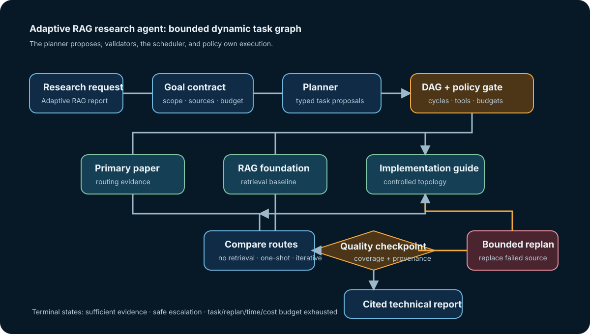

# 08 — Planning and task decomposition

**Level:** Intermediate · **Notebook:** [`08_planning_task_decomposition.ipynb`](08_planning_task_decomposition.ipynb) · **Reusable lab:** [`lab.py`](lab.py)

Planning is the difference between a model that can select a tool and a system that can safely pursue a multi-step objective. A plan is not a chain-of-thought transcript. It is a **validated, bounded, inspectable proposal** for work: tasks, dependencies, constraints, milestones, and terminal conditions.

This module builds a research agent for the request: **“Research adaptive RAG and produce a technical report.”** It starts with a static task graph, detects an unavailable source, creates a bounded replacement task, revalidates the graph, and produces a cited report. The default lab uses deterministic fixtures so every learner can run it locally without model credentials or live web access.

**Success criteria:** a typed `technical-report` artifact covers foundations, routing strategies, and security implications; cites primary and official evidence; and passes a coded quality checkpoint. **Non-goals:** live web research, production deployment, and hidden model reasoning. The lab never performs an external side effect.

## Outcomes

By the end, you can:

1. Turn a vague objective into a goal contract and a hierarchy of verifiable deliverables.
2. Represent independent and dependent work as a directed acyclic graph (DAG), identify parallel work, and reject cycles.
3. Separate a planner that **proposes** typed tasks from an executor that enforces policy and runs them.
4. Use milestones, quality checkpoints, constraints, budgets, and state snapshots for long-horizon work.
5. Replan only from explicit evidence—missing coverage, a failed task, a conflict, or a changed constraint—not from an unbounded “try harder” instruction.
6. Explain when a deterministic workflow is safer than an agentic plan, and when hierarchical or dynamic planning earns its complexity.

## Prerequisites and route

Complete [the agent loop](../../beginner/02-agent-loop/README.md), [workflow or agent](../../beginner/03-workflow-or-agent/README.md), and [tool engineering](../01-tool-engineering/README.md) first. This lesson assumes a planner may use an LLM, but it deliberately keeps authorization, validation, scheduling, retries, and termination in application code.



## Step 1 — Convert a request into a goal contract

“Research adaptive RAG” is not executable. Before decomposition, fix what counts as done and what is forbidden.

| Contract field | Research-agent decision |
| --- | --- |
| Objective | Explain adaptive RAG, its routing choices, trade-offs, and an implementation topology. |
| Audience | Technical builders who need a defensible design, not a literature dump. |
| Deliverable | A report with sections, source URLs, and claims tied to retrieved evidence. |
| Evidence rule | Prefer primary papers and official documentation; label uncertainty and disagreement. |
| Constraints | Maximum tasks, replan budget, allowed tools, citation policy, deadline/cost limit. |
| Stop rule | Required sections are supported, the checkpoint passes, or the system escalates a known gap. |

This contract is a constraint-satisfaction problem. A plan that uses an unauthorized browser tool, has no evidence task for a required section, exceeds its budget, or contains a dependency cycle is invalid even if it sounds plausible. The application must validate it before anything runs.

## Step 2 — Decompose goals without pretending every task is independent

Use **goal decomposition** to translate an outcome into deliverables, then subdeliverables, then executable tasks. A useful task has one owner, a measurable output, an allowed tool scope, dependencies, and an attempt budget.

```text
Goal: technical report on adaptive RAG
├── establish evidence
│   ├── read the Adaptive-RAG primary paper
│   ├── read a RAG foundation source
│   └── inspect controlled implementation guidance
├── reason over evidence
│   └── compare no-retrieval, one-shot, and iterative routes
├── verify quality
│   └── check coverage, provenance, and unresolved gaps
└── synthesize
    └── write a cited report for the declared audience
```

Avoid both extremes. A single task called `research_everything` hides reasoning and cannot be measured. Fifty tiny tasks create coordination overhead and context fragmentation. Split at a meaningful **artifact boundary**: a task should leave an output another task can consume without redoing the work.

## Step 3 — Model task graphs and DAG planning

A task graph has directed edges from a prerequisite to a dependent task. A DAG is useful when work has an order but not a single linear path: evidence gathering can fan out; comparison waits for evidence; synthesis waits for a quality gate. A topological scheduler executes tasks only after their prerequisites complete and can run a ready layer in parallel.

| Graph concept | Why it matters | Research example |
| --- | --- | --- |
| Node | A typed work item with a contract | `read_adaptive_rag_paper` |
| Edge | A dependency, not a suggestion | `compare_routes` requires evidence tasks |
| Ready set | Tasks whose dependencies are complete | independent source reads |
| Critical path | Longest dependent path | comparison → checkpoint → report |
| Cycle | Unschedulable mutual dependency | report needs review; review needs final report |
| Join | A task consumes several artifacts | comparison reconciles sources |

The lab uses Kahn-style topological layers to reject cycles. In production, keep the graph and all task outputs in durable state; a retry after a worker crash must not silently re-run a side effect.

## Step 4 — Choose a planning architecture

| Pattern | Shape | Choose it when | Main risk |
| --- | --- | --- | --- |
| Deterministic workflow | code-owned fixed path | inputs and steps are known | brittle at genuine ambiguity |
| Plan-and-execute | planner creates a bounded task list; executor runs it | moderate ambiguity with inspectable work products | stale plan if the world changes |
| DAG planner | independent branches plus explicit joins | research, analysis, or collection work can fan out | accidental cycles and hidden dependencies |
| Hierarchical plan | strategy → workstreams → tasks | long objectives need an executive summary and local details | losing constraints between levels |
| Dynamic/replanning agent | plan changes after observations | a failed source or evidence conflict changes the next best action | runaway expansion and repeated work |
| Plan-and-reflect | executor plus structured evaluator | quality can be tested against clear criteria | self-critique without an external rubric |

The **planner/executor separation** is a safety and engineering boundary. The planner can propose `Task` records. The executor validates task identity, dependencies, tool permissions, attempt limits, idempotency key, and result schema. A model should not grant itself tools, erase checkpoints, or turn a retrieval failure into a production action.

## Step 5 — Plan-and-execute, hierarchical planning, and dynamic replanning

Plan-and-execute follows a simple loop:

1. Create a goal contract.
2. Generate a small typed plan, often with a structured-output schema.
3. Validate graph, resource, tool, and policy constraints.
4. Execute ready tasks; record immutable task outputs and provenance.
5. Evaluate the milestone against explicit coverage and quality checks.
6. If a specific gap is present, produce the smallest safe graph patch; revalidate it.
7. Stop at a completion, escalation, or budget terminal state.

Hierarchical planning places stable intent at the top and volatile work at the leaves. For the scenario, the top-level plan commits to a cited technical report; a workstream owns evidence; individual retrieval tasks can be swapped when a source is unavailable. This avoids re-planning the entire goal for a single failed source.

In the lab, `read-implementation-guidance` deliberately fails. The replanner adds `read-replacement-guidance`, rewires only the comparison dependency, preserves unaffected state, and fully validates the new graph. It does not add tasks forever, retry an unavailable source indefinitely, or erase the failure trace.

## Step 6 — Constraints, dependencies, and milestones

Constraints make planning operational rather than rhetorical.

```python
GoalContract(
    allowed_capabilities=("source-library", "compare-evidence", "quality-check", "synthesize-report"),
    max_tasks=10,
    max_replans=2,
    max_attempts_per_task=2,
    max_total_attempts=16,
    max_total_cost_usd=1.0,
    deadline_ms=60_000,
)
```

Use milestones/checkpoints at natural decision boundaries: after source collection, after comparison, before an external action, and before final publication. A checkpoint should return a structured result such as `PASS`, `missing_primary_evidence`, `unresolved_conflict`, or `budget_exhausted`; a vague “looks good” cannot drive a reliable replan.

For long-horizon work, persist: the goal contract, plan version, task states, source handles, output hashes, retry count, cost/time budget, and the reason for each graph mutation. Compact older context into source-backed summaries rather than appending every raw observation to the model context.

## Step 7 — Failure recovery and stopping conditions

| Failure | Unsafe reaction | Controlled recovery |
| --- | --- | --- |
| Source timeout | retry forever | retry only if the error is transient and budget remains; otherwise replace or escalate |
| Missing evidence | write a confident conclusion | mark gap, request a constrained evidence task, or abstain |
| Conflicting sources | choose the latest text | preserve both claims, check source authority/scope, and state uncertainty |
| DAG cycle | execute in arbitrary order | reject graph; require planner patch |
| Duplicate work | launch the same task again | use task IDs/output hashes and idempotency keys |
| Plan injection in retrieved text | follow instructions embedded in a source | treat sources as data; only trusted policy can create or authorize tasks |
| Budget exhaustion | silently drop quality checks | stop safely with a trace and a human escalation request |

Set multiple terminal conditions: all required report sections are evidenced; an evaluator accepts the report; a policy blocks a task; no ready task exists; task/replan/cost/time budget is exhausted; or a human stops the run. “Keep researching until certain” is not a valid terminal condition.

## Guided lab

1. Open `08_planning_task_decomposition.ipynb` from this folder. It imports the tested implementation in `lab.py`, simulates a missing implementation source, and shows the typed event trace.
2. Open the notebook and inspect the initial topological layers. Which source tasks can run in parallel?
3. Run the dynamic scenario. Identify the exact observation that triggered a replan and the dependency edge that changed.
4. Add a required section such as “security implications.” Observe why a valid graph alone is not enough: the checkpoint must verify coverage.
5. Intentionally add a cycle, then use `validate_plan` to prove it is rejected before execution.
6. Replace the deterministic planner with an LLM only after you preserve the typed `Task` schema, constraint validator, tool allowlist, output validation, trace, and termination rules.

## Production checklist

- [ ] Version the goal contract and plan schema.
- [ ] Validate task IDs, DAG acyclicity, dependencies, tool scopes, budgets, and idempotency before dispatch.
- [ ] Keep planner, executor, evaluator, and authorization responsibilities distinct.
- [ ] Record plan versions, task outputs, source provenance, mutations, and reasons for replan.
- [ ] Evaluate outcome **and** trajectory: coverage, correct dependencies, unnecessary tasks, retry rate, latency, cost, and escalation quality.
- [ ] Separate retrieved content from control instructions; never let it create authority.
- [ ] Test cycles, unavailable tools, conflicting sources, duplicate tasks, exhausted budgets, and interrupted/resumed runs.

## Further reading

- [ReAct: Synergizing Reasoning and Acting in Language Models](https://arxiv.org/abs/2210.03629) — interleaved reasoning/actions and observations.
- [Plan-and-Solve Prompting](https://arxiv.org/abs/2305.04091) — a plan-then-execute approach to missing-step errors.
- [Tree of Thoughts](https://arxiv.org/abs/2305.10601) — deliberate search over intermediate reasoning states; use it only when its added search cost is justified.
- [Adaptive-RAG](https://arxiv.org/abs/2403.14403) — the scenario’s primary source on routing retrieval strategies by question complexity.
- [LangGraph workflows and agents](https://docs.langchain.com/oss/python/langgraph/workflows-agents) — official patterns for predetermined workflows, dynamic agents, parallelization, routing, and evaluator-optimizer flows.
- [LangGraph persistence](https://docs.langchain.com/oss/python/langgraph/persistence) — official guidance for checkpoints, durable execution, and thread state.
- [OpenAI Structured Outputs](https://developers.openai.com/api/docs/guides/structured-outputs) — optional Pydantic-structured plan proposals; deterministic validation still decides whether a proposal may run.
- [OpenAI Agents SDK and Responses API comparison](https://developers.openai.com/api/docs/guides/agents#compare-the-responses-api-and-agents-sdk) — manager-style agents-as-tools, handoffs, state, approvals, and tracing as an optional orchestration comparison.

## Checkpoint questions

1. Why is task identity different from execution order?
2. What exact conditions make a task `READY`?
3. Why can an acyclic graph still be an invalid plan?
4. Which evidence justifies replanning in this lab?
5. Why patch the smallest affected graph region instead of regenerating the plan?
6. What happens to downstream tasks when a prerequisite fails?
7. Why does an empty ready queue not prove completion?
8. Which plan properties must be checked deterministically before dispatch?
9. Why version plans and preserve immutable task outputs?
10. When is a fixed workflow preferable to an LLM-generated plan?


## Watch For

- **Over-decomposition:** Creating a task for every function call instead of meaningful artifact boundaries.
- **Missing dependencies:** Forgetting to explicitly link `synthesize` to `read_paper`.
- **Cycles:** Designing a process where step A requires B, and B requires A.
- **Unauthorized task creation:** The model granting itself tools via task generation.
- **Stale plan:** Continuing a plan after a prerequisite fails instead of replanning.
- **Unbounded replanning:** Retrying or replanning indefinitely without a budget.
- **Failed prerequisite propagation:** Running a dependent task when its prerequisite failed.
- **Premature completion:** Assuming an empty ready queue means success when tasks are actually blocked.
- **Coverage gaps:** A plan completing without producing the required evidence.
- **Planner metric gaming:** Planner splitting work into too many small chunks to inflate task counts.

## Further Deep Dives

- [Plan-and-Execute Architecture](DEEP_DIVE_PLAN_AND_EXECUTE.md)
