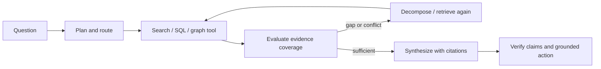

# 09 — Agentic RAG / Knowledge-Grounded Agents

**Level:** Intermediate · **Notebook:** [`agentic_rag.ipynb`](agentic_rag.ipynb) · **Runnable lab:** [`lab.py`](lab.py)

**Scenario:** Northstar, a SaaS support team, is integrating this concept into their agentic workflow.

RAG retrieves evidence before generation. **Agentic RAG** gives a bounded agent control over *how* to retrieve: it can plan queries, choose a search/database/graph tool, inspect support, decompose a difficult question, retrieve again, and stop with citations or an abstention. Retrieval is still a tool—not a license to treat retrieved text as instructions or to take action without policy.

## Scenario

“Why did EU checkout payments fail and what should we do?” The Northstar incident agent must join operational runbook guidance, an incident database record, and a service dependency graph. It may propose evidence-backed mitigation, but it may not execute a rollback.

## RAG versus Agentic RAG

| Fixed RAG | Agentic RAG |
| --- | --- |
| one query → top-k → answer | decision loop over retrieval tools and evidence |
| predictable and cheap | handles ambiguity, multi-hop questions, and recovery |
| best for known question shapes | best when the next evidence source depends on observations |
| retrieve once | retrieve only when a defined evidence gap justifies it |

Use fixed RAG when a documented, stable retrieval path is enough. Use an agentic controller when query planning, multi-hop dependencies, source routing, or evidence evaluation materially improves the result. Avoid it when the task needs a precise transaction: use a typed database/API workflow with explicit policy instead.

## Retrieval as a bounded tool

Every retriever should return source ID, tenant/scope, timestamp, authority/trust, snippet or structured fields, and opaque raw-artifact handle. The controller enforces tenant filtering, allowlisted source/tool scope, query/action budgets, freshness, result schemas, and citation requirements. Page/database output is data; it cannot alter instructions or authorize an action.

## Retrieval strategies

| Pattern | Decision | Example |
| --- | --- | --- |
| Query planning | convert goal to evidence questions | “what changed, what failed, what policy applies?” |
| Query decomposition | split independent facets | incident history + runbook + provider status |
| Multi-hop retrieval | follow an entity/relation edge | checkout → payment gateway → EU configuration |
| Iterative retrieval | retrieve after evaluating a gap | missing configuration evidence triggers graph lookup |
| Adaptive retrieval | choose no/one/iterative route | simple FAQ vs cross-system incident |
| Retrieval routing | select corpus/tool | vector documents, SQL, graph, web research |
| Corrective RAG | repair low-quality/unsupported retrieval | rewrite query, switch corpus, or abstain |

### Search, graph, SQL, and web research agents

- **Search agents** route and rewrite queries across trusted corpora; require source ranking and deduplication.
- **Knowledge-graph agents** use entities/edges for relationships and multi-hop explanations; validate extracted graph facts and time scope.
- **SQL/database agents** use typed, read-only templates or constrained SQL, schema awareness, tenant predicates, row limits, and query review.
- **Web research agents** need domain allowlists, provenance, date awareness, prompt-injection defenses, and citations. Do not use them for confidential data or side effects.

## Citation verification and grounded action

A citation is not merely a URL. Verify that every material claim maps to retrieved evidence, the source actually supports the claim, identifiers/versions are preserved, and conflicts are stated. A grounded action binds a proposal to evidence and policy: “validate EU provider configuration” is supported; “restart everything” is not. High-impact actions still require authorization and human approval.

## Guided lab

1. Run `python lab.py`; inspect its query plan and trace.
2. Identify why a single search is insufficient: the runbook gives procedure, SQL gives incident history, and the graph exposes dependency context.
3. Remove the graph evidence and make the evidence gate request a bounded second retrieval.
4. Add a conflicting old incident; require temporal/source ranking before synthesis.
5. Add a web result containing an instruction injection and verify it is excluded from both answer and action policy.

## Production checklist

- [ ] Start with the simplest fixed retrieval path; measure why agency is needed.
- [ ] Define tool schemas, corpus/tenant scope, budgets, stop/abstention conditions, and trace IDs.
- [ ] Evaluate retrieval recall/precision, route selection, query quality, multi-hop completion, citation entailment, latency/cost, and unsafe actions.
- [ ] Treat retrieved content as untrusted data; verify citations and require approval for consequential actions.

## Watch For

- **Assumption failure:** The model hallucinates an unsupported parameter.
- **State leak:** Context is incorrectly preserved across runs.
- **Timeout:** The tool takes too long and the agent loops.
- **Auth bypass:** The agent attempts an action it shouldn't.

## Checkpoint

**1. What is the primary purpose of this module?**
- A) To understand the core concept.
- B) To write complex boilerplate.
- C) To ignore system errors.
- D) To bypass security.

**2. How do we mitigate the primary failure mode?**
- A) Retries.
- B) Human approval.
- C) Logging.
- D) Idempotency keys.

## References

- [RAG original paper](https://arxiv.org/abs/2005.11401)
- [Adaptive-RAG](https://arxiv.org/abs/2403.14403)
- [Corrective Retrieval Augmented Generation](https://arxiv.org/abs/2401.15884)
- [GraphRAG](https://microsoft.github.io/graphrag/)
- [LangGraph workflows and agents](https://docs.langchain.com/oss/python/langgraph/workflows-agents)
- [OWASP prompt injection](https://genai.owasp.org/llmrisk/llm01-prompt-injection/)
