# 10 — LangGraph state, persistence, and memory

**Level:** Intermediate · **Time:** 2–3 hours · **Scenario:** Northstar Cloud's
incident investigator must diagnose European checkout failures, survive a worker
restart, pause before a proposed rollback, and avoid carrying an unverified
diagnosis into the next incident.

| Learn | Build | Test |
| --- | --- | --- |
| **Notebook:** [`10_langgraph_state.ipynb`](10_langgraph_state.ipynb)


## Why this topic matters

A plain tool loop holds its state in one process. That is often enough for a
short, read-only task. It fails as soon as the task must survive a restart, wait
for human approval, expose progress to a UI, or safely remember a preference
across separate conversations. LangGraph is a low-level orchestration runtime
for long-running stateful agents: it deliberately combines deterministic graph
steps with model-driven decisions rather than hiding both behind one agent
abstraction ([LangGraph overview](https://docs.langchain.com/oss/python/langgraph/overview)).

The key distinction is not "memory or no memory." It is **what information is
allowed to persist, under which identity and scope, for how long, and how it is
validated before it influences an action**.



## Learning outcomes

By the end you can:

1. Model an agent as a typed state machine: state schema, nodes, edges,
   conditional routes, and bounded loops.
2. Choose between a **checkpointer** (short-term, thread-scoped graph state) and
   a **store** (application-defined cross-thread data).
3. Resume safely after a failure or an approval interruption using a stable
   `thread_id` and idempotent side effects.
4. Stream state changes to an operator interface without exposing secrets or
   raw untrusted content.
5. Design long-term memory as a governed write → manage → retrieve subsystem,
   rather than a conversational transcript or vector database dump.

## The scenario and its boundaries

At 09:04, Northstar sees European checkout errors after `deploy-1842`. The
agent may read health, logs, and deployment facts. It may prepare a rollback
proposal, but it never restarts or rolls back production. A human operator is
the only actor permitted to authorize an external action.

**Non-goals:** this module does not teach model prompting, browser automation,
or persistent database setup. It teaches the execution substrate those systems
need once the task is stateful.

**Risk to design against:** a previous customer note says *"Checkout incidents
are usually Redis."* That is an unverified historical hunch, not evidence for a
new incident. The lab marks it unverified and excludes it from retrieval.

## 1. State is the contract between nodes

In a `StateGraph`, each node reads a state snapshot and returns a partial update.
The graph merges updates according to the state schema and its reducers. Keep
the schema deliberate:

| Field | Why it belongs in thread state | What not to put here |
| --- | --- | --- |
| `request`, `service` | identifies this investigation | unrelated user history |
| `evidence` | auditable inputs to the hypothesis | full raw logs indefinitely |
| `hypothesis`, `confidence` | makes routing inspectable | hidden chain-of-thought |
| `attempts`, budget | bounds looping and cost | a global mutable counter |
| `pending_approval` | makes pause/resume explicit | an implicit UI-only flag |

```python
from typing import TypedDict
from langgraph.graph import END, START, StateGraph

class IncidentState(TypedDict):
    request: str
    evidence: list[dict]
    confidence: float
    attempts: int
    recommendation: str | None

builder = StateGraph(IncidentState)
builder.add_node("triage", triage)
builder.add_node("collect_evidence", collect_evidence)
builder.add_node("analyze", analyze)
builder.add_node("recommend", recommend)
builder.add_edge(START, "triage")
builder.add_edge("triage", "collect_evidence")
builder.add_conditional_edges("analyze", route_after_analysis,
                              {"collect_evidence": "collect_evidence", "recommend": "recommend"})
builder.add_edge("recommend", END)
```

Use deterministic code for authorization, budgets, routing thresholds, and tool
input validation. Reserve an LLM for genuinely ambiguous interpretation. This
makes the graph reviewable and lets evaluators assert a trajectory rather than
only inspect a final answer.

## 2. Conditional routing, retries, and bounded recovery

An agentic graph has loops, but no production loop should be open-ended. The lab
routes back to `collect_evidence` only while confidence is below `0.80` **and**
the independent-evidence budget remains. A robust route function also considers:

- a deadline and max node/tool-call count;
- a retry class: transient timeout vs invalid request vs permission denial;
- idempotency keys for any external side effect;
- a fallback terminal state such as `needs_human_review`.



Do not retry a mutation blindly. If a node may be replayed, move its
non-idempotent side effect after the interrupt or record an idempotency key in
durable state. LangGraph's interrupt guidance specifically warns that code
before an interrupt runs again when the node resumes
([interrupt rules](https://docs.langchain.com/oss/python/langgraph/interrupts)).

## 3. Checkpoints are short-term memory, not a user profile

A checkpointer writes graph state snapshots under a `thread_id`. That gives a
run continuity, fault tolerance, inspection/time-travel capabilities, and a
place to resume an approval pause. A production run must use a durable backend:
the in-memory saver is useful for development but disappears on process restart
([persistence guide](https://docs.langchain.com/oss/python/langgraph/persistence)).

```python
from langgraph.checkpoint.memory import InMemorySaver

checkpointer = InMemorySaver()  # development only
graph = builder.compile(checkpointer=checkpointer)
config = {"configurable": {"thread_id": "incident-eu-1842"}}
graph.invoke({"request": "Investigate EU checkout"}, config=config)
```

For production, use a persistent checkpointer, bound checkpoint retention, and
make `thread_id` an opaque, authorization-checked identifier. The persistence
documentation distinguishes SQLite for local development and durable
alternatives such as PostgreSQL for production. Never derive it directly from
an email address, tenant name, or other exposed identifier.

### Recovery experiment

1. Run `run_investigation(..., fail_after="collect_evidence")` in the notebook.
2. Inspect `checkpointer.history(thread_id)`; the health evidence is already
   saved.
3. Call `resume_investigation(checkpointer, thread_id)`.
4. Confirm that the resumed trace does not call the completed health tool again.

This is the difference between recovering a state machine and simply starting a
fresh chat with a pasted summary.

## 4. Long-term memory needs a write policy

LangGraph separates checkpointers from **stores**. A store holds
application-defined data across threads; it is appropriate for user preferences,
verified facts, or shared knowledge, not for every message or transient
hypothesis ([checkpointer vs store](https://docs.langchain.com/oss/python/langgraph/persistence)).

| Memory class | Example | Write rule | Retrieval rule |
| --- | --- | --- | --- |
| Working / short-term | evidence gathered today | graph node | current `thread_id` only |
| Episodic | approved incident postmortem | reviewed, retention-limited | semantic + temporal match |
| Semantic | customer's incident-update preference | user confirmed or trusted source | tenant namespace + relevance |
| Procedural | verified rollback checklist version | change-controlled artifact | explicit version and access policy |



The lab’s `MemoryStore.read_verified()` excludes an unverified Redis hunch. Try
removing that filter only as an adversarial experiment; the lesson is that a
plausible, stale memory can distort a decision without being a data leak.

### Memory experiment

1. Store a verified Acme preference: “prioritize clear impact updates.”
2. Store an unverified claim: “Checkout problems are usually Redis.”
3. Run the same evidence collection twice—once with the verification gate, once
   after deliberately bypassing it.
4. Explain why the evidence-backed deployment hypothesis should win, and add a
   policy test that prevents the hunch entering the prompt/context.

## 5. Human interrupts and stateful approval

An interrupt pauses a graph at a dynamic point, persists state, and resumes when
the caller supplies a JSON-serializable response. The resume call must use the
same `thread_id`. This is a control-flow feature, not authorization by itself:
your application must still enforce who can approve what.

```python
from langgraph.types import Command, interrupt

def approval_node(state: IncidentState):
    approval = interrupt({"action": "rollback deploy-1842", "evidence": state["evidence"]})
    return {"approved": bool(approval)}

# same thread_id that created the pause
graph.invoke(Command(resume=True), config=config)
```

The notebook simulates this with `pending_approval`; the code block above shows
the direct LangGraph equivalent. The correct production sequence is:

1. validate the proposal and required evidence;
2. checkpoint the proposal and a non-sensitive review payload;
3. authenticate and authorize the approver in the application layer;
4. resume with a signed decision and audit record;
5. perform an idempotent external action only after approval.

## 6. Streaming, observability, and evaluation

Streaming is useful for an operator console when it exposes intentional events:
node name, safe state projection, tool status, interrupt payload, timing, and
budget. Do not stream raw credentials, unredacted logs, or hidden reasoning.
LangGraph supports streamed updates, values, messages, and custom events; pair
that with trace/evaluation tooling to inspect the trajectory
([streaming guide](https://docs.langchain.com/oss/python/langgraph/streaming)).

For the Northstar system, test more than the final diagnosis:

| Dimension | Test |
| --- | --- |
| Outcome | diagnosis names the deployment only when independent evidence supports it |
| Trajectory | health → logs → deployment; no production action tool is invoked |
| Recovery | a restart resumes from the latest checkpoint without duplicate work |
| Memory | an unverified or cross-tenant item cannot alter the evidence set |
| HITL | approval/rejection is persisted, authenticated, and replay-safe |
| Operations | node count, latency, checkpoint size, retries, and cost remain within budget |

## Main LangGraph capabilities applied here

| Capability | What it solves in this scenario | Use it carefully |
| --- | --- | --- |
| `StateGraph`, nodes, edges | explicit, testable orchestration | keep state small and typed |
| conditional edges | evidence loop and terminal routing | add attempt/deadline caps |
| checkpointers | recovery and thread continuity | durable backend + retention policy |
| store | verified cross-thread preferences/facts | namespace, provenance, deletion |
| interrupts + `Command` | approval and review/edit pauses | idempotent pre-interrupt code |
| streaming | operator progress and UI | redact and project only safe fields |
| subgraphs | encapsulate a specialist workflow | define state/store boundary explicitly |

## Exercises

1. Add an `evidence_sources` reducer that de-duplicates evidence by source and
   prove that replaying a node cannot inflate confidence.
2. Create a `needs_human_review` terminal route when evidence conflicts rather
   than forcing a diagnosis.
3. Replace the in-memory checkpointer in the real-LangGraph translation with a
   local durable saver. Document the retention and deletion policy.
4. Add tenant identifiers to every store namespace and write a failing test for
   cross-tenant retrieval.
5. Stream only `{node, status, elapsed_ms}` to a mock UI and verify that raw log
   text is absent.

## Watch For

- **Assumption failure:** The model hallucinates an unsupported parameter.
- **State leak:** Context is incorrectly preserved across runs.
- **Timeout:** The tool takes too long and the agent loops.
- **Auth bypass:** The agent attempts an action it shouldn't.

## Checkpoint

**1. What is the primary purpose of this module?**
- A) To understand the core concept.
- B) To write complex boilerplate.
- C) To ignore system errors.
- D) To bypass security.

**2. How do we mitigate the primary failure mode?**
- A) Retries.
- B) Human approval.
- C) Logging.
- D) Idempotency keys.

## References

- [LangGraph overview](https://docs.langchain.com/oss/python/langgraph/overview)
- [LangGraph persistence: checkpointers and stores](https://docs.langchain.com/oss/python/langgraph/persistence)
- [LangGraph memory concepts](https://docs.langchain.com/oss/python/concepts/memory)
- [LangGraph interrupts and resume semantics](https://docs.langchain.com/oss/python/langgraph/interrupts)
- [LangGraph streaming](https://docs.langchain.com/oss/python/langgraph/streaming)
- [LangGraph workflows and agents](https://docs.langchain.com/oss/python/langgraph/workflows-agents)
- [MemGPT: Towards LLMs as Operating Systems](https://arxiv.org/abs/2310.08560) — useful context for tiered memory, not a substitute for access control or data governance.

## Deep Dives & State of the Art

- **[LangGraph Checkpointers & Time Travel](DEEP_DIVE_CHECKPOINTERS.md)**


## SOTA Deep Dives
Explore industry-standard architectural patterns and enterprise implementation details:

- [Checkpointers](DEEP_DIVE_CHECKPOINTERS.md)
