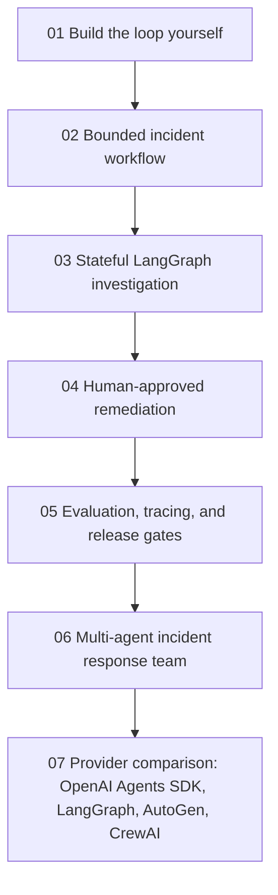

# AgentOps Lab: From tool calls to agent teams

AgentOps Lab is a scenario-based notebook track for learning AI agent design
through one evolving business problem: a fictional SaaS company is receiving
customer reports of checkout failures. The system begins as a simple
investigation assistant and gradually grows into a bounded agent, stateful
workflow, human-approved remediation assistant, and multi-agent incident team.

The track follows the central design argument in One+i's
[Building AI Agents: From Loops to Teams](https://www.linkedin.com/pulse/building-ai-agents-from-loops-teams-oneplusi-y3atc/):
use the least autonomous architecture that reliably solves the problem.
Frameworks are useful, but learners should first understand the loop they wrap.

## Scenario environment

The simulated company environment lives under [`labs/agentops_lab/`](../labs/agentops_lab/):

- [`data/incidents.json`](../labs/agentops_lab/data/incidents.json) contains active and historical incidents.
- [`data/services.json`](../labs/agentops_lab/data/services.json) contains service owners, health, dependencies, and deploy metadata.
- [`runbooks/checkout.md`](../labs/agentops_lab/runbooks/checkout.md) contains an operational response playbook.
- [`loop_yourself.py`](../labs/agentops_lab/loop_yourself.py) implements the first manual control loop.

Every external system starts as a deterministic Python function. That keeps the
training credential-free and lets learners test tool contracts, state, budgets,
and stopping behavior before connecting a real provider or infrastructure.

## Notebook roadmap

| Notebook | Architecture | Main library focus | What learners practice |
| --- | --- | --- | --- |
| [01 Build the loop yourself](../labs/notebooks/06_agentops_manual_loop.ipynb) | Manual control loop | Plain Python first | Tool calls, observations, state, stop conditions, and cost/tool budgets |
| 02 Bounded incident workflow | Deterministic workflow | Plain Python and typed contracts | Known paths, validation gates, and support-ready incident summaries |
| 03 Stateful investigation graph | Stateful agentic workflow | LangGraph | Graph state, conditional routing, checkpointing, replay, and interruption |
| 04 Human-approved remediation | Bounded agent with approval | OpenAI Agents SDK or provider adapter | Tool risk metadata, escalation, approval, and side-effect boundaries |
| 05 Evaluation and tracing | Release-gated agent | Inspect AI, Langfuse, or OpenTelemetry-style traces | Trajectory checks, regression datasets, cost/latency metrics, and failure diagnosis |
| 06 Multi-agent incident team | Manager and specialist agents | AutoGen, CrewAI, or LangGraph teams | Delegation contracts, shared evidence, synthesis, and bounded collaboration |
| 07 Provider comparison | Same scenario across frameworks | OpenAI Agents SDK, LangGraph, AutoGen, CrewAI | Choosing the simplest framework that matches the operational requirement |

## Notebook 01 learning objectives

By the end of the first notebook, learners should be able to:

- explain the anatomy of an agent: model, instructions, tools, state, loop,
  observations, and stopping conditions;
- implement a tool-calling loop without hiding it behind a framework;
- distinguish evidence-backed incident recommendations from unsupported claims;
- show why "keep investigating until completely sure" can create unbounded
  loops; and
- add `MAX_STEPS`, `MAX_TOOL_CALLS`, and `MAX_ESTIMATED_COST` as production
  control boundaries.

## References

- One+i, [Building AI Agents: From Loops to Teams](https://www.linkedin.com/pulse/building-ai-agents-from-loops-teams-oneplusi-y3atc/)
- OpenAI, [A practical guide to building AI agents](https://openai.com/business/guides-and-resources/a-practical-guide-to-building-ai-agents/)
- Anthropic, [Building effective agents](https://www.anthropic.com/engineering/building-effective-agents)
- Yao et al., [ReAct: Synergizing Reasoning and Acting in Language Models](https://arxiv.org/abs/2210.03629)
