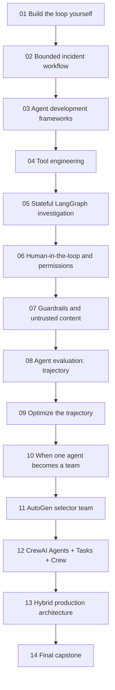

# AgentOps Lab: From tool calls to agent teams

AgentOps Lab is a notebook-first scenario track for learning AI agent design
through one evolving business problem: a fictional SaaS company is receiving
customer reports of checkout failures. The system begins as a simple
investigation assistant and gradually grows into a bounded agent, stateful
workflow, human-approved remediation assistant, and multi-agent incident team.

The track follows the central design argument in One+i's
[Building AI Agents: From Loops to Teams](https://www.linkedin.com/pulse/building-ai-agents-from-loops-teams-oneplusi-y3atc/):
use the least autonomous architecture that reliably solves the problem.
Frameworks are useful, but learners should first understand the loop they wrap.
The notebooks are the canonical training material: they contain concept
explanations, diagrams, implementation walkthroughs, deliberate failure cases,
evaluation outputs, and architecture questions. The Python modules under
[`curriculum/advanced/05-incident-response-capstone/agentops_lab/`](../curriculum/advanced/05-incident-response-capstone/agentops_lab/) are implementation units that the
notebooks explain and run.

## Scenario environment

The simulated company environment lives under [`curriculum/advanced/05-incident-response-capstone/agentops_lab/`](../curriculum/advanced/05-incident-response-capstone/agentops_lab/):

- [`data/incidents.json`](../curriculum/advanced/05-incident-response-capstone/agentops_lab/data/incidents.json) contains active and historical incidents.
- [`data/services.json`](../curriculum/advanced/05-incident-response-capstone/agentops_lab/data/services.json) contains service owners, health, dependencies, and deploy metadata.
- [`runbooks/checkout.md`](../curriculum/advanced/05-incident-response-capstone/agentops_lab/runbooks/checkout.md) contains an operational response playbook.
- [`loop_yourself.py`](../curriculum/advanced/05-incident-response-capstone/agentops_lab/loop_yourself.py) implements the first manual control loop.
- [`workflow_or_agent.py`](../curriculum/advanced/05-incident-response-capstone/agentops_lab/workflow_or_agent.py) compares deterministic workflows, bounded workflows, and dynamic agent investigations.
- [`agents_sdk_rebuild.py`](../curriculum/advanced/05-incident-response-capstone/agentops_lab/agents_sdk_rebuild.py) compares the manual loop with a framework-shaped OpenAI Agents SDK implementation.
- [`tool_engineering.py`](../curriculum/advanced/05-incident-response-capstone/agentops_lab/tool_engineering.py) refactors a broad admin tool into narrow, validated tools with predictable error handling.
- [`state_memory_langgraph.py`](../curriculum/advanced/05-incident-response-capstone/agentops_lab/state_memory_langgraph.py) models a stateful incident graph and demonstrates memory bias.
- [`human_permissions.py`](../curriculum/advanced/05-incident-response-capstone/agentops_lab/human_permissions.py) models human approval gates, permission levels, and resume decisions.
- [`guardrails_untrusted_content.py`](../curriculum/advanced/05-incident-response-capstone/agentops_lab/guardrails_untrusted_content.py) demonstrates poisoned retrieved content and tool-level guardrails.
- [`evaluation_trajectory.py`](../curriculum/advanced/05-incident-response-capstone/agentops_lab/evaluation_trajectory.py) scores agent runs across outcome, trajectory, and operations.
- [`trajectory_optimization.py`](../curriculum/advanced/05-incident-response-capstone/agentops_lab/trajectory_optimization.py) compares inefficient and optimized incident trajectories.
- [`multi_agent_team.py`](../curriculum/advanced/05-incident-response-capstone/agentops_lab/multi_agent_team.py) compares a single agent with a specialist incident-response team.
- [`autogen_selector_team.py`](../curriculum/advanced/05-incident-response-capstone/agentops_lab/autogen_selector_team.py) demonstrates selector-style coordination, ownership, and bounded team loops.
- [`crewai_team.py`](../curriculum/advanced/05-incident-response-capstone/agentops_lab/crewai_team.py) maps the same team to a CrewAI-style Agents + Tasks + Crew model.
- [`hybrid_production_architecture.py`](../curriculum/advanced/05-incident-response-capstone/agentops_lab/hybrid_production_architecture.py) routes tasks through a deterministic production wrapper.
- [`capstone_incident_response.py`](../curriculum/advanced/05-incident-response-capstone/agentops_lab/capstone_incident_response.py) combines architecture selection, tools, state, memory policy, permissions, HITL, guardrails, evaluation, traces, and cost/latency analysis.
- [`data/capstone_metrics.json`](../curriculum/advanced/05-incident-response-capstone/agentops_lab/data/capstone_metrics.json), [`data/capstone_tickets.json`](../curriculum/advanced/05-incident-response-capstone/agentops_lab/data/capstone_tickets.json), [`data/customers.csv`](../curriculum/advanced/05-incident-response-capstone/agentops_lab/data/customers.csv), and [`evaluations/capstone_tasks.json`](../curriculum/advanced/05-incident-response-capstone/agentops_lab/evaluations/capstone_tasks.json) provide the final capstone fixtures.
- [`data/deployments.json`](../curriculum/advanced/05-incident-response-capstone/agentops_lab/data/deployments.json) and [`data/region_logs.json`](../curriculum/advanced/05-incident-response-capstone/agentops_lab/data/region_logs.json) add evidence for regional checkout investigations.

Every external system starts as a deterministic Python function. That keeps the
training credential-free and lets learners test tool contracts, state, budgets,
and stopping behavior before connecting a real provider or infrastructure.

## Notebook roadmap

| Notebook | Architecture | Main library focus | What learners practice |
| --- | --- | --- | --- |
| [01 Build the loop yourself](../curriculum/beginner/02-agent-loop/02_agent_loop.ipynb) | Manual control loop | Plain Python first | Tool calls, observations, state, stop conditions, and cost/tool budgets |
| [02 Agent or workflow?](../curriculum/beginner/03-workflow-or-agent/03_workflow_or_agent.ipynb) | Deterministic workflow, bounded workflow, and bounded agent | Plain Python and typed contracts | Matching architecture to problem shape across status reports, runbook summaries, and regional checkout investigations |
| [03 Agent development frameworks](../curriculum/beginner/04-agent-development-frameworks/README.md) | Framework selection | OpenAI Agents SDK, Pydantic AI, LangGraph, Google ADK | Selecting a managed loop, typed output, durable approval graph, or bounded composition based on the scenario |
| [04 Tool engineering](../curriculum/beginner/05-tool-engineering/05_tool_engineering.ipynb) | Tool boundary design | Function tools and validation | Replacing broad admin APIs with narrow schemas, approval boundaries, and retry rules |
| [05 Stateful investigation graph](../curriculum/intermediate/01-langgraph-state-memory/01_langgraph_state_memory.ipynb) | Stateful agentic workflow | LangGraph | Graph state, conditional routing, confidence loops, thread state, and long-term memory risk |
| [06 Human-in-the-loop and permissions](../curriculum/intermediate/02-human-approval-permissions/02_human_approval_permissions.ipynb) | Bounded action with approval | LangGraph/LangChain HITL concepts | Permission levels, persisted pause state, approval, modification, rejection, and audit records |
| [07 Guardrails and untrusted content](../curriculum/intermediate/03-guardrails-untrusted-content/03_guardrails_untrusted_content.ipynb) | Trust-boundary enforcement | OpenAI Agents SDK guardrail concepts | Treating retrieved content as data, detecting poisoned instructions, and wrapping tools with approval guardrails |
| [08 Agent evaluation: trajectory](../curriculum/intermediate/04-agent-evaluation/04_agent_evaluation.ipynb) | Release-gated agent | Evaluation datasets and traces | Outcome, trajectory, operations, forbidden actions, and cost per successful task |
| [09 Optimize the trajectory](../curriculum/intermediate/05-trajectory-optimization/05_trajectory_optimization.ipynb) | Efficient bounded agent | Trajectory optimization | Shortening reliable paths while preserving correctness, evidence, and support |
| [10 When one agent becomes a team](../curriculum/advanced/01-single-vs-multi-agent/01_single_vs_multi_agent.ipynb) | Manager and specialist agents | Multi-agent design | Comparing a single-agent baseline with observability, deployment, customer impact, analyst, and risk-review specialists |
| [11 AutoGen selector team](../curriculum/advanced/02-autogen-selector-teams/02_autogen_selector_teams.ipynb) | Selector-based group chat | AutoGen AgentChat concepts | Dynamic speaker selection, shared context, ownership rules, turn budgets, and failure-loop prevention |
| [12 CrewAI team](../curriculum/advanced/03-crewai-teams/03_crewai_teams.ipynb) | Task-owned specialist crew | CrewAI concepts | Mapping roles to agents, deliverables to tasks, and specialist outputs to a crew-level incident plan |
| [13 Hybrid production architecture](../curriculum/advanced/04-hybrid-production-architecture/04_hybrid_production_architecture.ipynb) | Deterministic wrapper around agents | Production architecture | Routing simple lookups, investigations, and high-risk cases through the least autonomous reliable path |
| [14 Final capstone](../curriculum/advanced/05-incident-response-capstone/05_incident_response_capstone.ipynb) | Evaluated production design | Framework-independent harness | Justifying architecture choice with tools, state, permissions, HITL, guardrails, evaluation, traces, cost/latency, and single-vs-multi-agent comparison |

## Notebook 01 learning objectives

By the end of the first notebook, learners should be able to:

- explain the anatomy of an agent: model, instructions, tools, state, loop,
  observations, and stopping conditions;
- implement a tool-calling loop without hiding it behind a framework;
- distinguish evidence-backed incident recommendations from unsupported claims;
- show why "keep investigating until completely sure" can create unbounded
  loops; and
- add `MAX_STEPS`, `MAX_TOOL_CALLS`, and `MAX_ESTIMATED_COST` as production
  control boundaries.

## Notebook 02 learning objectives

By the end of the second notebook, learners should be able to:

- identify when a deterministic workflow is enough for known steps;
- design a bounded workflow when only one or two branches require judgment;
- explain why dynamic investigation can justify a single bounded agent;
- classify problems as workflow, agentic workflow, agent, or multi-agent based
  on problem shape rather than novelty; and
- compare trajectories by step count, evidence quality, cost, and failure modes.

## Notebook 03 learning objectives

By the end of the third notebook, learners should be able to:

- map the manual control loop to OpenAI Agents SDK concepts;
- explain what a framework owns: tool schemas, loop execution, tool dispatch,
  messages, stopping, tracing, and sessions;
- identify which safety and product boundaries still belong in application code;
- inspect a trace for model, tool, guardrail, and session events; and
- decide when the SDK is useful compared with owning the loop directly.

## Notebook 04 learning objectives

By the end of the fourth notebook, learners should be able to:

- explain why a broad `admin_api(command: str)` tool is unsafe for agents;
- split broad operations into narrow read and write tools;
- apply structured validation before tool execution;
- model predictable errors such as `ToolTimeout`, `RateLimit`,
  `InvalidService`, and `PermissionDenied`; and
- implement retry, escalation, and stop rules based on error type.

## Notebook 05 learning objectives

By the end of the fifth notebook, learners should be able to:

- represent an incident investigation as explicit state, nodes, and edges;
- explain why LangGraph is useful for stateful agentic workflows;
- distinguish thread-scoped short-term state from longer-term memory;
- use confidence thresholds and attempt limits to control investigation loops;
- demonstrate how stale or unverified memory can bias a new diagnosis; and
- define memory controls for scope, validation, auditability, and reversal.

## Notebook 06 learning objectives

By the end of the sixth notebook, learners should be able to:

- separate read, propose, and execute-with-approval tool permissions;
- design an approval policy for high-impact actions such as restart, rollback,
  and notification;
- pause execution before a selected tool action and persist review context;
- resume from approval, modification, or rejection; and
- explain why human approval should include evidence, exact action, risk, actor,
  and audit reason.

## Notebook 07 learning objectives

By the end of the seventh notebook, learners should be able to:

- explain why retrieved documents, external input, and tool responses are
  untrusted data;
- identify prompt-injection instructions inside retrieved operational content;
- harden system instructions so documents cannot authorize actions;
- add a tool-level guardrail that blocks restarts without explicit approval; and
- distinguish evidence extraction from instruction following.

## Notebook 08 learning objectives

By the end of the eighth notebook, learners should be able to:

- build an evaluation dataset with expected tools, forbidden tools, and expected
  outcomes;
- score outcome quality, trajectory quality, and operational behavior;
- detect unnecessary calls, bad arguments, forbidden actions, and poor recovery;
- track latency, cost, model calls, tool calls, trajectory length, and retry
  rate; and
- explain why cost per successful task is more useful than cost per model call.

## Notebook 09 learning objectives

By the end of the ninth notebook, learners should be able to:

- identify wasted planning, repeated searches, repeated log queries, and
  unnecessary reflection;
- compare successful trajectories by reliability, latency, cost, and length;
- calculate a simple efficiency score; and
- optimize toward the shortest reliable trajectory to a correct result.

## Notebook 10 learning objectives

By the end of the tenth notebook, learners should be able to:

- identify when one agent has too much context and a team may be justified;
- define specialist roles for observability, deployment, customer impact,
  incident analysis, and risk review;
- compare single-agent and multi-agent runs by accuracy, cost, latency, tool
  calls, tokens, and coordination overhead; and
- explain why the single agent should still win on simple incidents.

## Notebook 11 learning objectives

By the end of the eleventh notebook, learners should be able to:

- map the AgentOps incident team to AutoGen AgentChat concepts;
- explain how `SelectorGroupChat` makes next-speaker selection part of the
  system;
- define explicit ownership to prevent coordination loops; and
- enforce `MAX_TEAM_MESSAGES` and `MAX_AGENT_TURNS` when a team starts
  bouncing responsibility.

## Notebook 12 learning objectives

By the end of the twelfth notebook, learners should be able to:

- map observability, deployment, customer-impact, and analyst roles to a
  CrewAI-style crew;
- explain the difference between an agent role, a task deliverable, and the
  crew execution plan;
- compare CrewAI with LangGraph, AutoGen, and OpenAI Agents SDK for the same
  incident-response scenario; and
- decide where deterministic policy and side-effect controls should surround a
  crew.

## Notebook 13 learning objectives

By the end of the thirteenth notebook, learners should be able to:

- design a deterministic workflow that classifies tasks before selecting an
  architecture;
- route simple lookups to deterministic code, ambiguous investigations to a
  bounded single agent, and high-risk cases to a specialist team;
- keep policy checks, human approval, budgets, and audit logs outside the model;
  and
- explain why credible production systems are hybrids rather than one giant
  autonomous agent.

## Notebook 14 capstone objectives

By the end of the capstone, learners should be able to:

- select an architecture experimentally rather than defaulting to multi-agent;
- define read-only, propose-only, and approval-gated tools for an incident
  assistant;
- combine state, memory policy, permissions, HITL, guardrails, and termination
  conditions into one coherent design;
- evaluate expected tools, forbidden tools, recommendation support, trace
  quality, cost, latency, and budget compliance; and
- justify whether a single bounded agent or a specialist team is the better
  production choice for the incident.

## References

- One+i, [Building AI Agents: From Loops to Teams](https://www.linkedin.com/pulse/building-ai-agents-from-loops-teams-oneplusi-y3atc/)
- OpenAI, [A practical guide to building AI agents](https://openai.com/business/guides-and-resources/a-practical-guide-to-building-ai-agents/)
- OpenAI, [Agents SDK](https://openai.github.io/openai-agents-python/)
- OpenAI, [Agents SDK tools](https://openai.github.io/openai-agents-python/tools/)
- OpenAI, [Agents SDK tracing](https://openai.github.io/openai-agents-python/tracing/)
- OpenAI, [Agents SDK guardrails](https://openai.github.io/openai-agents-python/guardrails/)
- LangChain, [LangGraph persistence](https://langchain-ai.github.io/langgraph/concepts/persistence/)
- LangChain, [LangGraph memory](https://langchain-ai.github.io/langgraph/concepts/memory/)
- LangChain, [LangGraph human-in-the-loop](https://langchain-ai.github.io/langgraph/concepts/human_in_the_loop/)
- Anthropic, [Building effective agents](https://www.anthropic.com/engineering/building-effective-agents)
- Anthropic, [Demystifying evals for AI agents](https://www.anthropic.com/engineering/demystifying-evals-for-ai-agents)
- Microsoft, [AutoGen AgentChat agents](https://microsoft.github.io/autogen/stable/user-guide/agentchat-user-guide/tutorial/agents.html)
- Microsoft, [AutoGen SelectorGroupChat](https://microsoft.github.io/autogen/stable/user-guide/agentchat-user-guide/selector-group-chat.html)
- CrewAI, [Documentation](https://docs.crewai.com/)
- CrewAI, [Agents](https://docs.crewai.com/v1.15.10/en/concepts/agents)
- CrewAI, [Crews](https://docs.crewai.com/v1.15.6/en/concepts/crews)
- CrewAI, [Processes](https://docs.crewai.com/v1.15.5/en/concepts/processes)
- Yao et al., [ReAct: Synergizing Reasoning and Acting in Language Models](https://arxiv.org/abs/2210.03629)
