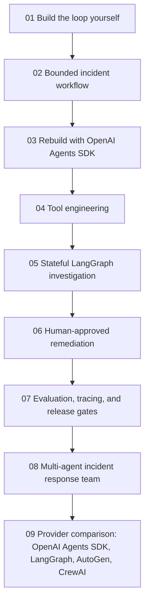

# AgentOps Lab: From tool calls to agent teams

AgentOps Lab is a scenario-based notebook track for learning AI agent design
through one evolving business problem: a fictional SaaS company is receiving
customer reports of checkout failures. The system begins as a simple
investigation assistant and gradually grows into a bounded agent, stateful
workflow, human-approved remediation assistant, and multi-agent incident team.

The track follows the central design argument in One+i's
[Building AI Agents: From Loops to Teams](https://www.linkedin.com/pulse/building-ai-agents-from-loops-teams-oneplusi-y3atc/):
use the least autonomous architecture that reliably solves the problem.
Frameworks are useful, but learners should first understand the loop they wrap.

## Scenario environment

The simulated company environment lives under [`labs/agentops_lab/`](../labs/agentops_lab/):

- [`data/incidents.json`](../labs/agentops_lab/data/incidents.json) contains active and historical incidents.
- [`data/services.json`](../labs/agentops_lab/data/services.json) contains service owners, health, dependencies, and deploy metadata.
- [`runbooks/checkout.md`](../labs/agentops_lab/runbooks/checkout.md) contains an operational response playbook.
- [`loop_yourself.py`](../labs/agentops_lab/loop_yourself.py) implements the first manual control loop.
- [`workflow_or_agent.py`](../labs/agentops_lab/workflow_or_agent.py) compares deterministic workflows, bounded workflows, and dynamic agent investigations.
- [`agents_sdk_rebuild.py`](../labs/agentops_lab/agents_sdk_rebuild.py) compares the manual loop with a framework-shaped OpenAI Agents SDK implementation.
- [`tool_engineering.py`](../labs/agentops_lab/tool_engineering.py) refactors a broad admin tool into narrow, validated tools with predictable error handling.
- [`data/deployments.json`](../labs/agentops_lab/data/deployments.json) and [`data/region_logs.json`](../labs/agentops_lab/data/region_logs.json) add evidence for regional checkout investigations.

Every external system starts as a deterministic Python function. That keeps the
training credential-free and lets learners test tool contracts, state, budgets,
and stopping behavior before connecting a real provider or infrastructure.

## Notebook roadmap

| Notebook | Architecture | Main library focus | What learners practice |
| --- | --- | --- | --- |
| [01 Build the loop yourself](../labs/notebooks/06_agentops_manual_loop.ipynb) | Manual control loop | Plain Python first | Tool calls, observations, state, stop conditions, and cost/tool budgets |
| [02 Agent or workflow?](../labs/notebooks/07_agentops_workflow_or_agent.ipynb) | Deterministic workflow, bounded workflow, and bounded agent | Plain Python and typed contracts | Matching architecture to problem shape across status reports, runbook summaries, and regional checkout investigations |
| [03 Rebuild with OpenAI Agents SDK](../labs/notebooks/08_agentops_openai_agents_sdk.ipynb) | Managed agent runtime | OpenAI Agents SDK concepts | Comparing manual ownership with framework-managed turns, tool dispatch, sessions, and traces |
| [04 Tool engineering](../labs/notebooks/09_agentops_tool_engineering.ipynb) | Tool boundary design | Function tools and validation | Replacing broad admin APIs with narrow schemas, approval boundaries, and retry rules |
| 05 Stateful investigation graph | Stateful agentic workflow | LangGraph | Graph state, conditional routing, checkpointing, replay, and interruption |
| 06 Human-approved remediation | Bounded agent with approval | OpenAI Agents SDK or provider adapter | Tool risk metadata, escalation, approval, and side-effect boundaries |
| 07 Evaluation and tracing | Release-gated agent | Inspect AI, Langfuse, or OpenTelemetry-style traces | Trajectory checks, regression datasets, cost/latency metrics, and failure diagnosis |
| 08 Multi-agent incident team | Manager and specialist agents | AutoGen, CrewAI, or LangGraph teams | Delegation contracts, shared evidence, synthesis, and bounded collaboration |
| 09 Provider comparison | Same scenario across frameworks | OpenAI Agents SDK, LangGraph, AutoGen, CrewAI | Choosing the simplest framework that matches the operational requirement |

## Notebook 01 learning objectives

By the end of the first notebook, learners should be able to:

- explain the anatomy of an agent: model, instructions, tools, state, loop,
  observations, and stopping conditions;
- implement a tool-calling loop without hiding it behind a framework;
- distinguish evidence-backed incident recommendations from unsupported claims;
- show why "keep investigating until completely sure" can create unbounded
  loops; and
- add `MAX_STEPS`, `MAX_TOOL_CALLS`, and `MAX_ESTIMATED_COST` as production
  control boundaries.

## Notebook 02 learning objectives

By the end of the second notebook, learners should be able to:

- identify when a deterministic workflow is enough for known steps;
- design a bounded workflow when only one or two branches require judgment;
- explain why dynamic investigation can justify a single bounded agent;
- classify problems as workflow, agentic workflow, agent, or multi-agent based
  on problem shape rather than novelty; and
- compare trajectories by step count, evidence quality, cost, and failure modes.

## Notebook 03 learning objectives

By the end of the third notebook, learners should be able to:

- map the manual control loop to OpenAI Agents SDK concepts;
- explain what a framework owns: tool schemas, loop execution, tool dispatch,
  messages, stopping, tracing, and sessions;
- identify which safety and product boundaries still belong in application code;
- inspect a trace for model, tool, guardrail, and session events; and
- decide when the SDK is useful compared with owning the loop directly.

## Notebook 04 learning objectives

By the end of the fourth notebook, learners should be able to:

- explain why a broad `admin_api(command: str)` tool is unsafe for agents;
- split broad operations into narrow read and write tools;
- apply structured validation before tool execution;
- model predictable errors such as `ToolTimeout`, `RateLimit`,
  `InvalidService`, and `PermissionDenied`; and
- implement retry, escalation, and stop rules based on error type.

## References

- One+i, [Building AI Agents: From Loops to Teams](https://www.linkedin.com/pulse/building-ai-agents-from-loops-teams-oneplusi-y3atc/)
- OpenAI, [A practical guide to building AI agents](https://openai.com/business/guides-and-resources/a-practical-guide-to-building-ai-agents/)
- OpenAI, [Agents SDK](https://openai.github.io/openai-agents-python/)
- OpenAI, [Agents SDK tools](https://openai.github.io/openai-agents-python/tools/)
- OpenAI, [Agents SDK tracing](https://openai.github.io/openai-agents-python/tracing/)
- Anthropic, [Building effective agents](https://www.anthropic.com/engineering/building-effective-agents)
- Yao et al., [ReAct: Synergizing Reasoning and Acting in Language Models](https://arxiv.org/abs/2210.03629)
